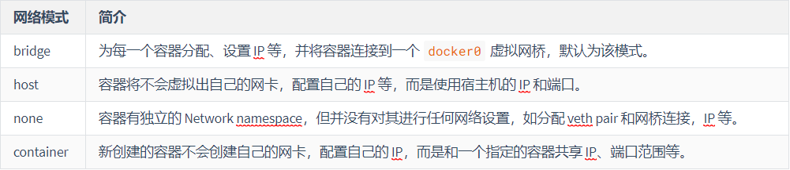
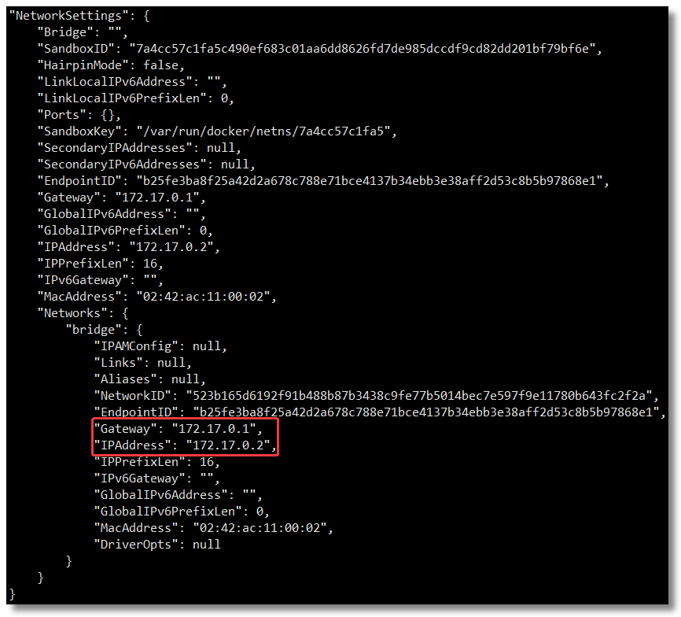
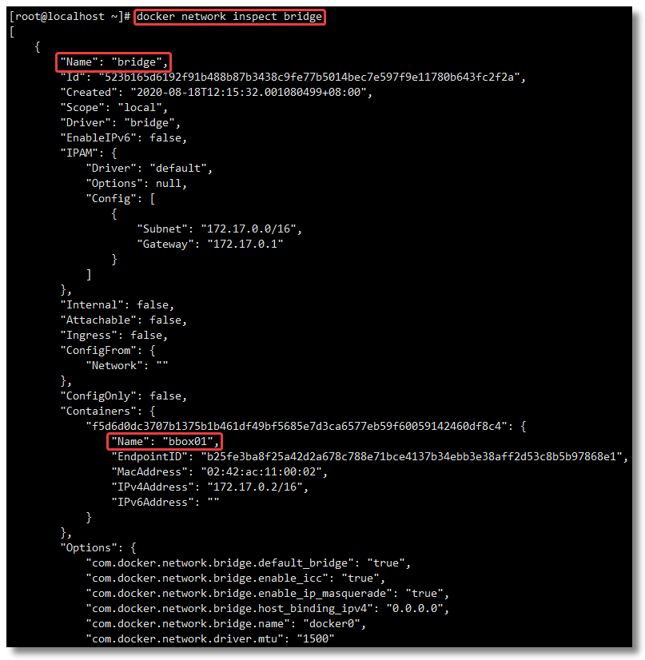
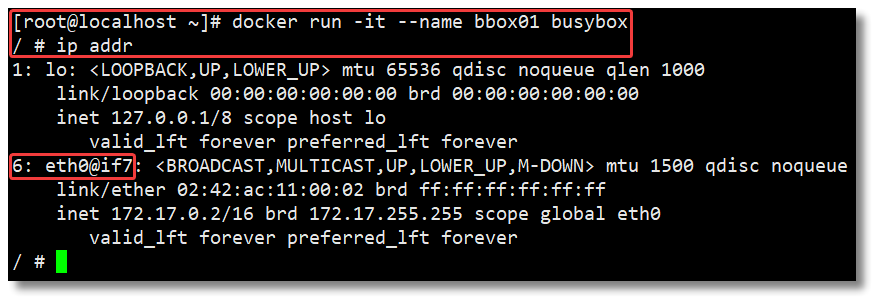
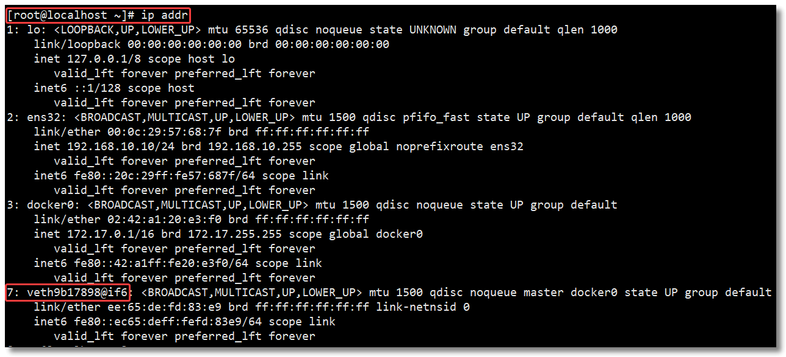
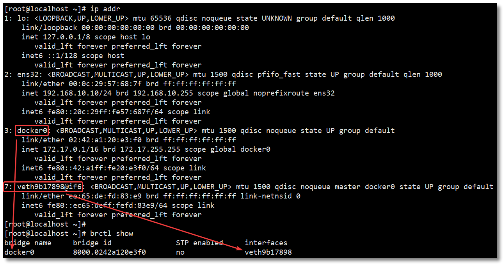
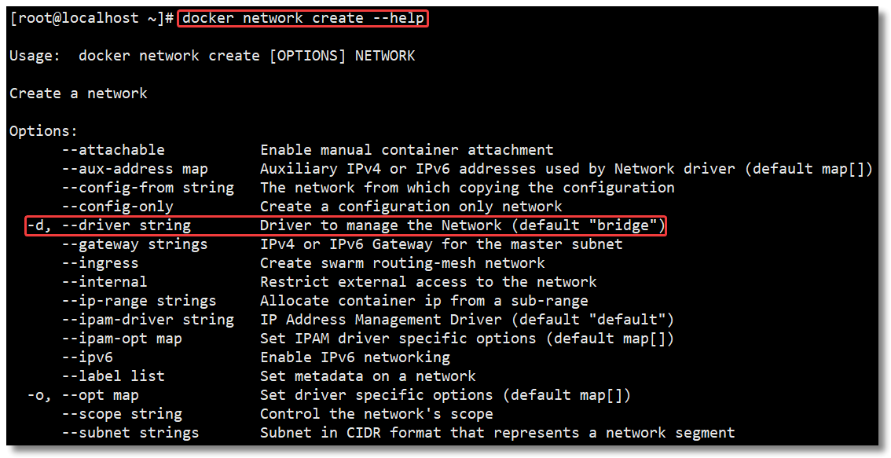

## 网络模式

安装docker之后，会默认创建三种网络：bridge/host/none，可通过`docker network ls`指令查看

- 可使用`docker network inspect 网络模式`查看docker某个网络模式下的所有容器对应网络信息；
- 可使用`docker inspect 容器名称|ID`查看某个容器的网络信息；
- 可以通过`docker network connect 网络名称 容器名称`为已有容器新增一个网络模式

## bridge网络模式

1. Docker守护进程创建一个虚拟以太网桥`docker0`，新建容器会自动桥接到这个网桥上，附加其上的任何网卡都可以自动转发数据包；
2. 对每一个使用该模式的容器，守护进程会创建一对虚拟设备接口`veth pair`，将其中一个接口设置为容器的`eth0`接口（容器网卡），另一个放置在宿主机的命名空间中，以类似 `vethxxx` 这样的名字命名，从而将宿主机上的所有容器都连接到这个内部网络上。
3. 对于每个容器的IP地址和Gateway信息，可以通过`docker inspect 容器名称|ID` 进行查看，在 `NetworkSettings` 节点中可以看到详细信息。

4. 我们可以通过 `docker network inspect bridge` 查看所有 `bridge` 网络模式下的容器，在 `Containers` 节点中可以看到容器名称。

5. 关于 `bridge` 网络模式的使用，只需要在创建容器时通过参数 `--net bridge` 或者 `--network bridge` 指定即可，当然这也是创建容器默认使用的网络模式，也就是说这个参数是可以省略的。

其余知识点：

比如我运行一个基于 `busybox` 镜像构建的容器 `bbox01`，查看 `ip addr`：

> busybox 被称为嵌入式 Linux 的瑞士军刀，整合了很多小的 unix 下的通用功能到一个小的可执行文件中。

　　然后宿主机通过 `ip addr` 查看信息如下：

　　通过以上的比较可以发现，证实了之前所说的：守护进程会创建一对对等虚拟设备接口 `veth pair`，将其中一个接口设置为容器的 `eth0` 接口（容器的网卡），另一个接口放置在宿主机的命名空间中，以类似 `vethxxx` 这样的名字命名。

　　同时，守护进程还会从网桥 `docker0` 的私有地址空间中分配一个 IP 地址和子网给该容器，并设置 docker0 的 IP 地址为容器的默认网关。也可以安装 `yum install -y bridge-utils` 以后，通过 `brctl show` 命令查看网桥信息。

Bridge 桥接模式的实现步骤主要如下：

- Docker Daemon 利用 veth pair 技术，在宿主机上创建一对对等虚拟网络接口设备，假设为 veth0 和 veth1。而

​	veth pair 技术的特性可以保证无论哪一个 veth 接收到网络报文，都会将报文传输给另一方。

- Docker Daemon 将 veth0 附加到 Docker Daemon 创建的 docker0 网桥上。保证宿主机的网络报文可以发往 veth0；
- Docker Daemon 将 veth1 添加到 Docker Container 所属的 namespace 下，并被改名为 eth0。如此一来，宿主机的网络报文若发往 veth0，则立即会被 Container 的 eth0 接收，实现宿主机到 Docker Container 网络的联通性；同时，也保证 Docker Container 单独使用 eth0，实现容器网络环境的隔离性。

## host模式

1. host 网络模式需要在创建容器时通过参数 `--net host` 或者 `--network host` 指定；
2. 使用host模式之后，容器可使用宿主机的IP地址与外界直接进行通信，与宿主机共用同一个网络，容器使用的端口也是和宿主机对应的；

## none模式

​	该模式是指容器禁用网络功能，不为容器配置任何网络IP等功能信息，创建容器时，使用参数 `--net none` 或者 `--network none` 指定；

## container网络模式

1. 容器B如果想设置这种网络模式，必须先要有一个正在运行的容器A，因为该模式是让容器B使用容器A的网络；即容器B不创建自己的网卡和IP，和容器A共享IP以及端口范围等；**相当于容器B的网络是依赖容器A的**
2. 在创建容器时通过参数 `--net container:已运行的容器名称|ID` 或者 `--network container:已运行的容器名称|ID` 指定；
3. 注意，容器B依赖的容器A，其网络模式是任意的，可以为none/bridge/host/自定义；

## 自定义网络模式-user-defined模式

1. 一般为了保证应用安全性，开发推荐使用自定义网络进行管理，还可以通过启动容器名称到IP地址的自动DNS解析

   > 从 Docker 1.10 版本开始，docker daemon 实现了一个内嵌的 DNS server，使容器可以直接通过容器名称通信。方法很简单，只要在创建容器时使用 `--name` 为容器命名即可。

   > 　　但是使用 Docker DNS 有个限制：**只能在 user-defined 网络中使用**。也就是说，默认的 bridge 网络是无法使用 DNS 的，所以我们就需要自定义网络。

2. 通过 `docker network create 网络名` 命令可以创建自定义网络模式；通过 `docker network create --help` 可发现自定义网络的默认网络模式实际上是`bridge`模式；

3. 创建容器时，使用参数 `--net 自定义网络名` 或者 `--network 自定义网络名` 指定；

4. 可以通过 `docker network rm 网络名称` 命令移除自定义网络模式，但如果是**通过自定义网络模式创建的就不可以删除**。

   

## 参考：

Docker 网络模式详解及容器间网络通信-https://xie.infoq.cn/article/97355a6e7ac01bce8532d5ff5

CIDR地址块及其子网划分（内含原始IP地址分类及其子网划分的介绍）-https://blog.csdn.net/luoqiang616477607/article/details/122874440

Docker 搭建 Redis Cluster 集群环境-https://cloud.tencent.com/developer/news/688466