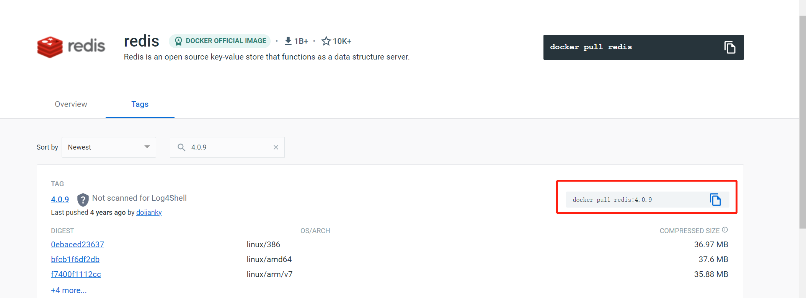
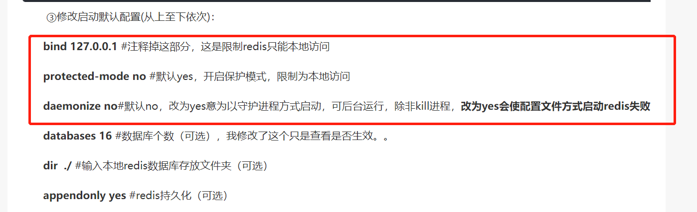
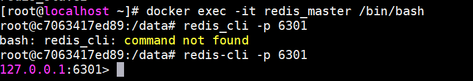

### 一、下载对应redis镜像

安装好docker之后，到docker官网可下载对应不同版本的镜像文件；https://hub.docker.com/



这里下载4.0.9（因为参考的博客使用的是该版本）。

### 二、配置redis.conf

- 方法一：自己建一个redis.conf，配置相应简单的配置信息即可；
- 方法二：下载redis压缩包，然后解压获取对应redis.conf文件再做修改；

**注意：需要修改以下配置文件内容，不然redis会启动失败，日志显示读取配置失败**



### 三、配置docker网络端，用于固定IP以及网段

```
docker network create --subnet=172.172.0.0/24 --gateway 172.172.0.1 docker-mynet
```

### 四、启动redis容器

使用指令：

```shell
# 容器名：redis_master
# 端口映射，将宿主机的6371端口提供给容器的6301，这里我是改了redis.conf配置的端口为6301
# 将容器中/etc/redis/redis.conf挂载成/opt/redis_config/redis01.conf（宿主机中自定义的配置）文件
# 同理将data文件也修改挂载
# -d 后台启动
# --restart=always自重启
# --ip 172.172.0.11 --network docker-mynet 限定IP以及docker网络模式
# redis:4.0.9 redis-server /etc/redis/redis.conf 纯粹redis启动指令
docker run --name redis_master -p 6371:6301 -v /opt/redis_config/redis01.conf:/etc/redis/redis.conf -v /mydata/redis/data1:/data -d --restart=always --ip 172.172.0.11 --network docker-mynet redis:4.0.9 redis-server /etc/redis/redis.conf
```

### 五、 验证

- 进入到`redis_master容器`中使用`redis-cli`连接redis；

  

- 由于我自定义修改redis端口，所以使用`-p 端口号`参数进行链接。

### 六、 主从服务器搭建

- 多复制几个`redis_conf`文件，修改对应接口配置（可以不修改，docker启动时接口映射做修改即可，但为了模拟多服务器并做区分就改了）；

- 往从服务器的redis的`redis.conf`文件中添加如下配置

  ```
  slaveof redis_master 6301
  ```

- 由于分配到同一个`docker`网段：`docker-mynet`，所以可以直接使用容器名来做地址映射。6301是对应docker容器的端口。
- 或者以上`redis_master`的IP地址可以直接用该主节点启动指令中规定的IP地址，或者使用`docker inspect redis_master`获取对应IP地址。

- 启动指令（启动了两个redis节点）：

````
docker run --name redis_slave0 -p 6372:6302 -v /opt/redis_config/redis02.conf:/etc/redis/redis.conf -v /mydata/redis/data2:/data -d --restart=always --ip 172.172.0.12 --network docker-mynet redis:4.0.9 redis-server /etc/redis/redis.conf

docker run --name redis_slave1 -p 6373:6303 -v /opt/redis_config/redis03.conf:/etc/redis/redis.conf -v /mydata/redis/data3:/data -d --restart=always --ip 172.172.0.13 --network docker-mynet redis:4.0.9 redis-server /etc/redis/redis.conf
````

### 七、 启动哨兵

注意：同样需要将哨兵配置文件`sentinel.conf`中`daemoniz`属性设置成no，才可以启动成功

启动指令：

```
docker run --name redis_sentinel -p 26379:26379 -v /opt/redis_config/sentinel.conf:/etc/redis/sentinel.conf -v /mydata/redis/data_sentinel:/data -d --restart=always --ip 172.172.0.14 --network docker-mynet redis:4.0.9 redis-sentinel /etc/redis/sentinel.conf
```


