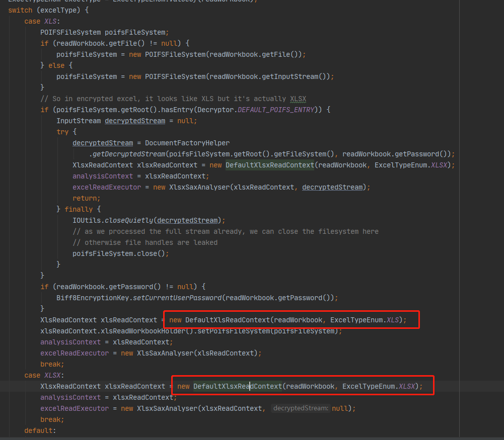

## 源码跟踪

#### 1. header标题初始化的源码跟踪比较复杂，因为原本有很多builder，而且实际读写设置实体类参数都是继承同一个`Param`类的，所以下面只取读的时候初始化场景，可能有误；

#### 2. 从sheet方法进入

直到这里，我们能找到`ExcelReadHeadProperty`初始化的代码，因为这个类的实例就是程序匹配excel标题时用到的。

#### 3. 进入到`ExcelHeadProperty`类的构造方法（读写都是继承该类的）

注意这里`headKind`，如果你是通过字符串数组的方式设置header（标题）的话，则这里的headKind就是`HeadKindEnum.STRING`；如果是通过实体类，则走`initColumnProperties(holder, convertAllFiled);`方法

#### 4. 看具体如何解析实体类（`@ExcelProperty`注解）

主要看这两个方法，首先说明一下参数：

- `sortedAllFiledMap`：是最终排序好的标题与实体类中`File`对应；
- `indexFiledMap`：是注解中加了index属性的File集合；
- `ignoreMap`：应该是`@ExcelIgnore`标签的File集合（没具体研究了）。

以上参数都在`ClassUtils.declaredFields`方法中解析后赋值；

主要看`ClassUtils.declaredFields`方法，主要跟踪Clazz对象：

#### 5. 上面遍历其导入类中File，调用`declaredOneField`方法，解析导入类中easyexcel注解内容。

#### 6. 解析完之后会进行对上面map进行排序，即对标题进行排序。

#### 7. 由上面源码可知，正如官网介绍的，`@ExcelProperty`标签中index和order是不能同时定义，index属性会把order属性无效化。