## 一、读取excel源码指引

1. 从调用`easyexcel读取的`doRead()`方法入手

   ```java
   EasyExcel.read(fileName, new NoModelDataListener()).sheet().doRead();
   ```

   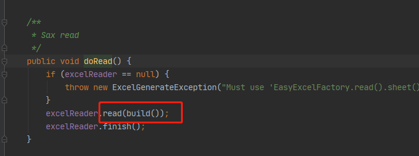

   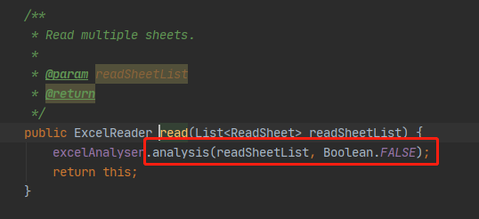

   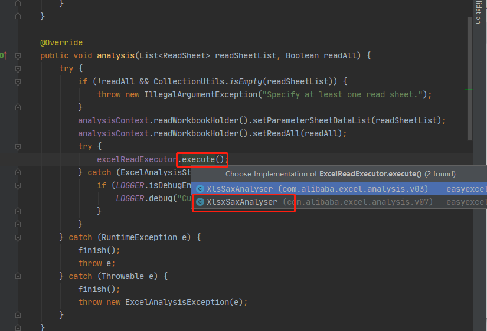

   (随便先选一个查看，这里我测试用xlsx格式文件，所以点击XlsxSaxAnalyser类)

   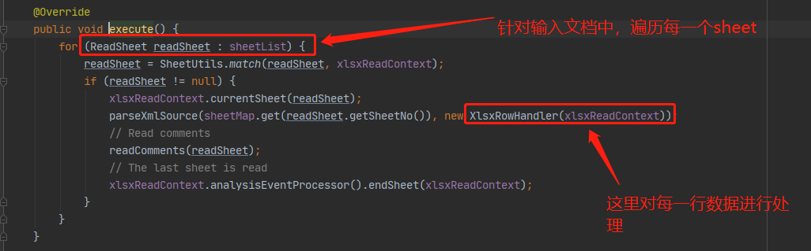

2. 会调用这个`RowHandler`的`startElement`方法

   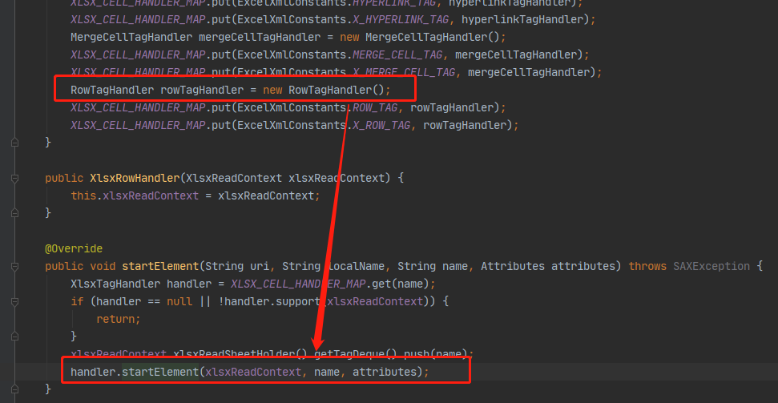

3. 这里的`rowTagHandler`会调用一个默认的`analysisEventProcessor`对excel中数据进行识别处理，

   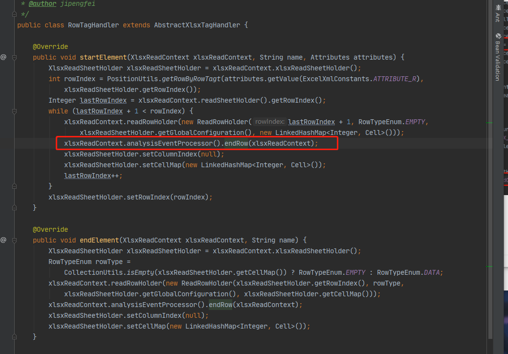

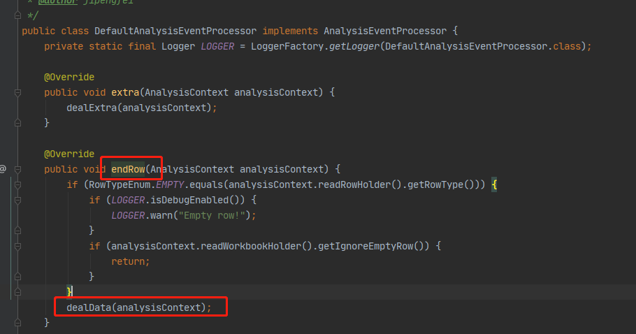

4. 这里invoke调用的就是我们自定义的`listener`中方法。

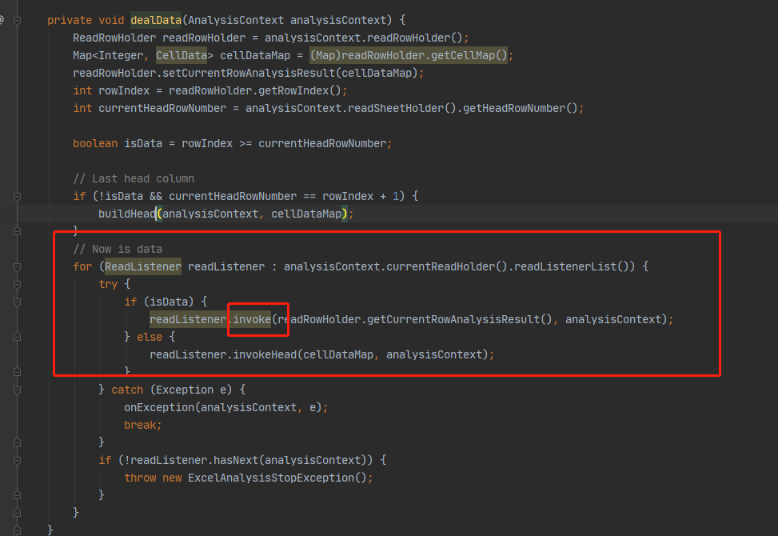


## 二、问题描述

	1. 工作中偶然发现导入excel和导出excel使用同一个类的时候，带`@ExcelProperty`注解会导致excel导入时部分字段的值获取失败；

	2. 导入excel模板标题头为：

    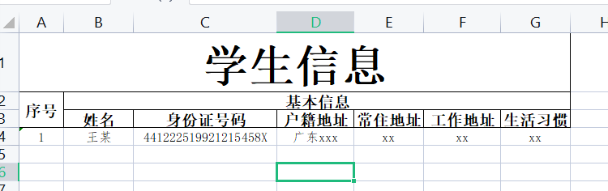

	3. 代码使用实体类：

    ```java
    @Data
    public class StudentInfo {
        @ExcelProperty({"学生信息", "序号"})
        private Integer number;
        @ExcelProperty({"学生信息", "基本信息", "姓名"})
        private String personName;
        @ExcelProperty({"学生信息", "基本信息", "身份证号码"})
        private String personIdentityId;
        @ExcelProperty({"学生信息", "基本信息", "户籍地址"})
        private String personHukouAddr;
        @ExcelProperty({"学生信息", "基本信息", "常住地址"})
        private String personPermanentAddr;
        @ExcelProperty({"学生信息", "基本信息", "工作地址"})
        private String personWorkAddr;
        @ExcelProperty({"学生信息", "基本信息", "生活习惯"})
        private String personLifeStyle;
    }
    
    //执行测试代码
    public static void main(String[] args) {
            EasyExcel.read("C:\\Users\\4\\Desktop\\人员信息.xlsx", StudentInfo.class,
                new StudentListener()).sheet(0)
                .headRowNumber(3).doRead();
    }
    ```

    

4. 其中测试发现，`number`字段（序号）获取不到具体值。

## 三、排查

1. debug跟踪到`DefaultAnalysisEventProcessor`类的`dealData`中

   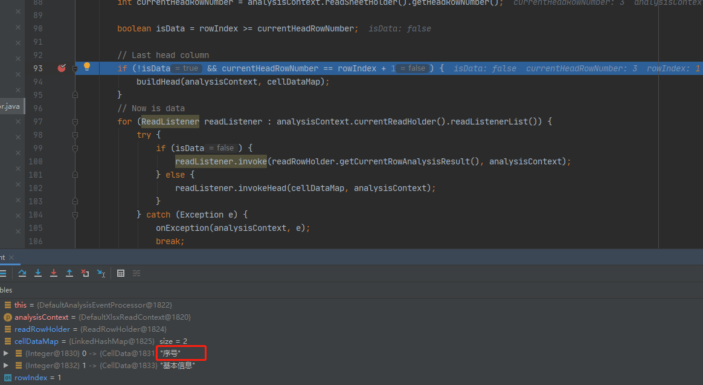

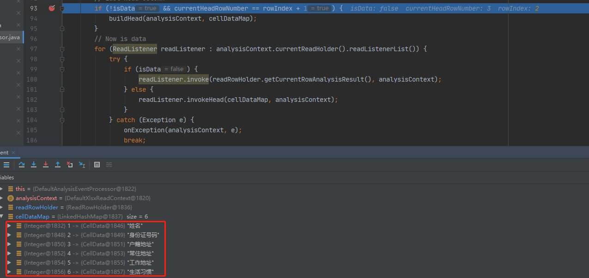

​	根据debug可以看到在解析过程中，标题头解析时，`序号`由于是合并单元格的原因（第2行和第3行合并的），只有解析第2行的时候才有`序号`，解析第3行的时候是没有`序号`这一标题的。

3. 往下查看`buildHead`方法

   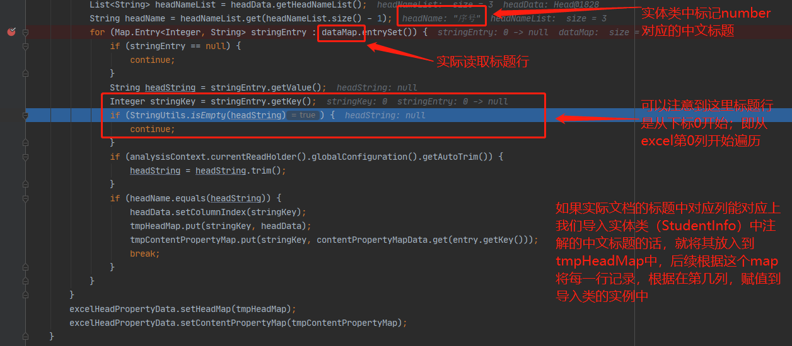

4. 由此可见，由于`序号`该标题在excel中是合并的，程序读取到对应列为null，所以将excel中数据映射到导入类实例中的时候就找不到对应的成员变量。

## 四、解决方法：

​	观察到在遍历读取实际excel文件标题行之前，会针对导入类中注解的标题先进行判断的操作

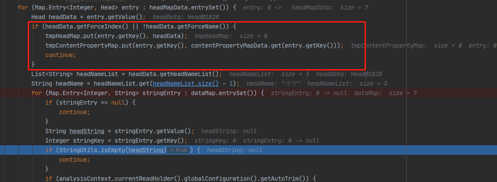

再根据header的获取原理，最后在`序号`标题对应注解上加上index=0说明位置即可。

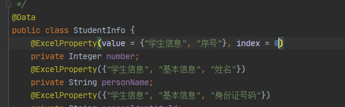

