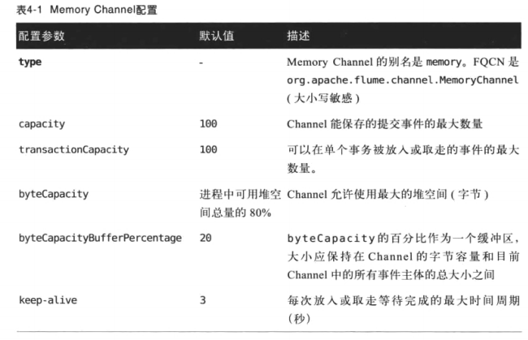

##Channel
* Channel作为缓冲区，Source写入在队尾，Sink读取在队头；
* Channel本质上是事务性的，**一个sink读取了一个事件A，则其他sink就不能在读该事件A；**

###Channel中的事务
1. 事务：是指Channel批量写入或者被读取数据的操作（原子性写入Channel的批量事件）；一个事务可以有一个或者多个事件；
2. 只有事务被提交了，事务中的事件才能被channel移除；
3. Source通过Channel处理器对Channel进行操作，与sink的操作方式基本相同；
4. Sink通过调用Channel的getTransaction方法，获取一个Transaction（事务）实例来开启事务；该实例可以设置队列的创建用来托管事件等事务所需的内部状态；
5. 调用Channel的take方法（Source是用put方法）去读取（写入）事件；->完成批量读取或者写入任务后，Sink对事务调用commit方法，然后事务被提交，**事务中的事件被channel标记为删除**->**提交或者回滚事务后**调用close方法关闭事务
6. 一旦事件发生错误（如sink写入目的系统时失败后），sink在事务中使用rollback方法回滚**整个事务**，channel会重新存储事件；
7. **Channel事务不能同时进行写入与读取；**

###Flume自带的Channel
**都是线程安全的**
####Memory Channel
1. **将数据存放在内存中的堆中**；应该用于不关心数据丢失的场景中，因为程序死亡，机器宕机重启都会丢失数据；
2. 为每一个事务维护了一个单独的队列，当**事务被提交后，该队列的事件被自动移入Channel主队列中**；每读取一个**事件**，就会将该事件移入该事务的队列中；当事务成功后，队列会被废弃等待垃圾回收；当事务失败后需要回滚，**事件从事务队列的队尾开始插入到channel的头部，保证了回滚后的事务读取的顺序与之前一致**；
3. Flume不保证事件顺序性，但是保证了**一个事务中所有事件都按其写入顺序读取**；
4. 配置
    
    >1. capacity和byteCapacity两个参数都是用来限定Channel中事件的容量，前者是通过事件数量来限制，后者是限制了容量；
    >2. transactionCapacity是一个很好防御大量事件输入攻击导致内存溢出的设置，是一个简单拒绝服务(DoS)攻击的防御。
    >3. byteCapacityBufferPercentage参数，是由于事件是由头部header和主体组成的，所以需要设置预留给存放事件头部的空间占比；
    >4. keep-alive参数一般不需要配置，是设置插入事件失败之前或者取走事件成功的等待事件；

####File Channel
1. 持久化Channel，将所有事件写到磁盘中，支持高并发并可以同时处理多个Source和Sink，保证程序关闭等情况下不会丢失数据；由于是在硬盘所以可存储空间很大；
2. 可以配置多个磁盘给一个file channel，file channel使用一个检查点机制记录当前写入到哪个磁盘的哪个位置，建议留一个单独的磁盘记录检查点信息，方便快速重新启动，无需重新读取所有文件；连续两个检查点之间间隔默认为30S；
3. 配置参数：
    .jpg )
    .jpg )
    >1. dataDirs参数可以用逗号分隔以配置多个磁盘存储目录；也可以设置同一个磁盘不同的目录，也会增加性能；
    >2. 因为有可能channel在写入检查点的时候停止，所以checkpointDir设置的检查点信息可能是不完整或者损坏的，所以建议使用useDualCheckpoints参数设置备用检查点；
    >3. File Channel的**一个存储文件中包含一个或者多个事件**，只有文件中所有事件被读取，该文件才会被删除；channel总是只在每个数据目录保存两个文件；
    >4. minimumRequiredSpace参数是为了防止Channel写入低空间的磁盘；Channel**不会在每次写入时检查空间，而是周期性检查，维护了一个内部的计数器来计算磁盘空间**；
    >5. keep-alive参数指明了事务写入或读取成功后等待下一次事务提交的时间间隔（等待容量可用的时间），或完成检查点写入的时间；
    >6. file channel会在磁盘之间顺序写入；

####File Channel的设计与实现
1. File  Channel维护了两个数据结构：Flume事件队列和write-ahead日志。
2. 每一次操作都作为一次记录，操作包含：事件写入和读取，事务的提交和回滚；所以即使事务未提交，事件写入就会产生一条记录；
3. 对于读取操作：每个事件读取记录都有一个唯一的、递增的记录ID，代表这条记录什么时候写入日志的；还有这个事件所在事务的ID；即**每条读取记录有一个递增ID（组员ID），也有一个事务ID（小组ID）**；
4. 对于写入操作：会对每一条记录根据存入的文件的ID和偏移值生成一个为一个Flume事件指针。？？？疑问点：本地队列，本地内存队列？
5. 全回放：Channel通过读取所有数据文件被完整重构的过程；必须读取所有数据文件，而且执行所有日志中的操作；
6. 在启动时，会开始一个叫**回放**的程序，该程序会加载检查点文件，加载flume事件队列，**检查点会记录flume事件队列的偏移量，以此来恢复事件队列**；所有代表当前时刻不完整的事务称为inflight，在检查点时刻，事件有几种情况：
    * 已完成的事件；
    * 运行中未提交的事件；
    * 已提交但是未被写入事件队列的事件；
其中第二种会被重新恢复与加载，第三种不会，因为检查点没有该事件的偏移量；
7. 当启动后队列不完整时，会进行全回放。
    
，每个事务的所有事件都会加载到内存中
写入channel与写入磁盘，每个记录有一个flume事件指针，这个指针：本地内存队列存储的记录（记录事件存放的文件位置与偏移量？），然后这个事务队列的指针会放到flume队列中