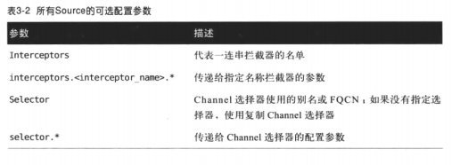

##Source
1. 定义：从其他产生数据的应用中接收数据的活跃组件；
2. **每一个Source至少连接一个Channel**；一个Source可以写入几个Channel，**复制事件到所有或者某些Channel中**；

###生命周期
当启动一个agent时，配置系统会按配置自动启动Source，只有agent自身停止或者被杀死，被重新配置，Source才停止；**每一个Source都是无状态的**，即agent如果被重启或者重新配置，则之前的Source实例会销毁不能重用；

###Source配置信息
1. 必须配置的属性：type：Source的类型；channels：当有多个channel时，**用空格分隔**；Source通过选择器选择channel，病案配置文件中的顺序将事件写入到channel中；
如：
```
    agent1.sources = userSource
    agent1.channels = memory
    agent1.sources.userSource.type = avro
    agent1.sources.userSource.channels = memory
```
2. 可选参数列表：
<<<<<<< HEAD

=======
>>>>>>> parent of ffe19e9... 2020-06-24 PCIcomputer
    >拦截器是相对特殊的属性，可以对不同的拦截器进行进一步参数的设置，有多个拦截器时，**之间用空格分隔开来**；如：
    ```
    //设置两个拦截器i1和i2
    agent1.sources.userSource.Interceptors = i1 i2   //空格分隔
    agent1.sources.userSource.Interceptors.i1.type = host
    ```
    >**Source中设置Channel选择器selector（不用加s）**

###Source对事件的处理
1. Source将外部传到Agent的数据流，转化成统一的数据格式，再将这种数据格式写入到Channel中；所以书中写：**Source"生成"事件，并将事件转发到Channel处理器中**；
2. Source使用两种方法来将事件提交到Channel处理器中；
    * 使用Channel处理器的processEvent()方法将事件提交；
    * 使用Channel处理器的processEventBatch()方法将一批事件提交；
    >一般使用后者，因为批次提交节约资源开销，除非一次事件很大；
3. 由于提交需要Channel处理器的方法，所以**需要Source调用AbstractSource类中定义的getChannelProcessor方法来获取Channel处理器**；
4. 一种特殊情况：来自外部的数据流需要认证后被发送，则只在procssEventBatch方法返回后被发送；
5. 如果channel提交失败，则**需要通知原始数据源再次发送数据**；为了做到通知的功能，可以再processEventBatch()方法返回后发送ACK来实现，如果提交失败，方法会抛出ChannelExceptions异常，可以被捕获报告给数据源；

###Source的分类
Source主要分为两种Event-driven Source和Pollable Source；**每个Source都会有一个SourceRunner（Source运行器）负责进行操作与运行；这个Source运行器都是Flume框架自动创建的；**

Pollable Source
1. Pollable Source**继承了AbstractPollableSource类并实现了process方法**；
2. 还需要**实现Configurable接口**，来通过配置系统接收用户配置；
3. Pollable Source一般是生成自己的数据或者是轮训外部系统来获取数据的这类Source；
4. Pollable Source的运行器通过重复调用process方法，启动一个个线程去调用Source；每一次调用Source都是为了生成数据，生成成功则返回PollableSource.Status.READY给调用他的线程，**该线程接收到后又会去调用process方法**；
5. 如果生成失败，则会返回PollableSource.Status.BACKOFF,这时候会发起一个补救措施：增加1/2的超时时间（最大超时是5秒），超时时间是两个process方法调用之间间隔；
6. 如果提交Channel的方法processEvenBatch抛出异常（**上面说的是生成数据，这里说的是提交数据**），Source可以捕获并报告错误给提供数据的系统；

自定义一个Pollable Source
1. 自定义一个类，继承AbstractPollableSource类；AbstractPollableSource类的父类BasicSourceSemantics类**已经实现了Configurable接口**
2. 几个重写的方法：doConfigure(),doProcess(),doStart(),doStop();
3. 当Agent启动时，doConfigure()被调用，通过读取配置文件来配置创建这个Source；-->doStart()被调用，可用于建立任何网络客户端(?)；-->Source运行器调用Process()方法，则实际上调用了我们自定义类中重写的doProcess()方法；-->然后通过channel处理写入数据到channel中；-->Agent停止时，doStop()方法被调用，做清理的工作；

Event-driven Source
1. 这类Source是用来控制自己启动的线程写数据到Channel的速率；
2. 实现了EventDrivenSource接口，这个接口仅仅是向flume说明选择一个Source选择器来运行的Source的**标记接口**；
3. Event-driven Source会在运行器调用start方法时**运行自己的线程或者线程池**来进行数据处理。例如Flume自带的HTTP Source就是这类Source，它是运行了一个web监听特定端口的服务器；
4. 这类Source的运行器是EeventDrivenSourceRunner,工作就是调用start方法启动Source和在停止时调用stop方法，允许Source自己管理；
5. Event-driven Source通过响应外部事件来产生事件，大部分接收外部实体的数据都用这类Source；**不借助Flume框架处理传入的数据（？）**

自定义：
1. 需要继承AbstractEventDrivenSource类，该类也实现了Configurable接口，同样重写doConfigure(),doStart(),doStop()，**transactionCompleted()**;（**不包含doProcess()**）
2. 这种Source一旦启动就自行工作，直到被框架停止；
3. 启动器调用doConfigure()和doStart()方法来配置启动Source；-->在doStart()方法中Source启动了自身的线程，并不再与框架交互；-->transactionCompleted()启动并自行运行；-->被关闭调用doStop()方法；
