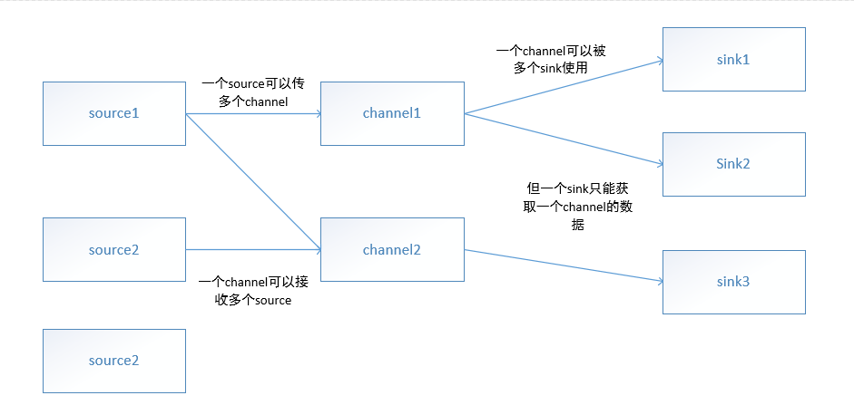

## 分布式文件系统HDFS
1. hadoop的核心，是一个高度分布式的、容错的文件系统；可以通过简单地增加多的服务器，将数据复制到不同的机器上保证了数据不会丢失；
2. HDFS将数据写入块这个概念中；**将一个文件分成多个块**，每个块会被自动复制成多个副本存放在不同的机器上（默认一个块有三个副本，即分配到三个不同的机器上）；大小在128MB到512MB之间。
3. 两种服务器：NameNode和DataNode,一般是有**两个NameNode**和多个DataNode;DataNode用来存放数据，即存放块，**一个DataNode可以存放多个块**；任何时候只能有一个活跃的NameNode和备用的NameNode（副本），NameNode是负责存储文件系统中文件和块的元数据（？），将文件进行映射，还记录文件和块的对应关系以及块的位置；
4. HDFS文件写入后不能修改，只能追加或者删除。

## HBase
1. 是Hadoop生态系统中的键值对存储。建立在HDFS上并依赖其副本机制；
2. 可以看做是一个表，其键key对应表的主键，值value相当于属性列表；
3. HBase可以对写入的数据进行修改；

## Flume
1. 简介：是一个高效可靠的海量日志收集，聚合和传输的系统；
2. 为什么需要Flume?
    因为当有海量的数据流写入到集群服务器上时，由于服务器上的存储和副本机制会使写入有一组复杂的操作，庞大的数据量写入会给服务器带来巨大的操作负担，而且对连接服务器的网络也会造成严重的延迟；
    为了确保大量数据写入不会产生数据丢失或者缓冲很多数据，需要一个隔离数据生产和存储的系统很重要；因此我们需要Flume；
3. flume的**最简单部署单元为：agent**，一个agent可以连接数据源或者另一个agent，实现数据从一个位置移动到另一个位置；
4. flume将数据表示成为事件，事件分为**主体和一个报头集合**，主体是一个字节数组，通常是flume传送的负载；报头集合是一个map，记录路由的意图和跟踪发送事件的优先级和严重性，也可以用于给事件增加事件ID或者UUID；
5. agent由三个组件组成：Source、Channel、Sink；Source负责获取事件到agent中，Sink负责从agent将事件移走到另一个数据源（数据库、另一个agent等），Channel是Source和Sink之间的缓冲区；
6. 一个Source可以写入多个Channel中，多个source可以写入同一个channel中，多个sink可以从相同的channel中读取数据，但一个sink只能从一个channel中读数据；即**Source和Channel是n:n的关系，Sink和Channel是n:1的关系**


## 配置Flume Agent
1. agent使用纯文本配置文件来配置（即properties文件），使用属性文件格式，使用**换行符来分隔各种键值对的纯文本文件**；
    ```
    key1 = value1
    key2 = value2
    ```
2. agent配置文件中必须对活跃组件（Source、Channel、Sink）列出其键值对，而其相关组件（拦截器等）会随着活跃组件自动创建激活；
3. 配置格式：
```
<agent-name>.<组件类型component-type（如Source或者Channel）>.<组件名称>.<组件属性> = <value>
    //一般需要配置的组件为：
    agent1.sources = 
    agent1.channels = 
    agent1.sinks =
    agent1.sinkgroups =
    //都是小写，并加上s
```
4. 每个组件在启动并加载配置文件时，会将配置文件中组件名称钱的前缀都去掉，只有属性参数名和值传入到一个Context类中，该类是一个类似map的键值存储；
5. 在对组件的type属性值进行赋值时，可以通过制定其完整类别名称或者内置组件别名来赋值；如：
```
    agent1.sources.Source1.type = kafkaSource
```
6. 需要从Flume配置文件中获取配置的任何组件，我们在写其组件处理逻辑代码时，都必须使其是实现Configurable接口；
```
    public interface Configurable{
        public void configure(Context context);
    }
```
7. 子组件可以通过是实现Configurable接口，并通过使用Context类的getSubProperties方法来将指定给子组件的紫属性传递给子组件；


## Flume agent之间的通信
1. 从一个agent发送数据到另一个agent，flume有内置专门的RPC sink-source对，首选是RPC sink - RPC source对是Avro Sink - Avro Source
2. Avro Source必须配置Avro Sink发送数据；Avro Source除了接收agent数据还可以接收使用了客户端API的自定义程序中发送的数据；

## 动态路由
1. 指使用多路复用Channel选择器对各种事件的特定报头的值进行检查和分配；

## Flume的无数据丢失保证
1. Flume的持久性保证依赖于使用的持久性Channel的保证，flume自带两类Channel：Memory Channel和File Channel,前者是内存缓冲区，如果jvm或者机器重启就丢失数据；后者是写入磁盘的。
2. 事务：一批待操作的数据（事件）；Channel本质上是事务性的，即写入写出都是以事务为单位进行操作；
3. Flume保证事件至少有一次被正确写入到目的地中，即如果**该事件**写入失败，则会不断**回滚事务**，直到该事件成功写入，所以可能会产生重复；

## agent的失败和数据丢失 
    当一个agent失败或者存储系统不可达时，Sink会利用Channel回滚事务，使Channel缓存增加，直到满时会通知Source抛出异常被客户端接收到并进行处理；

## 运行Flume Agent
    每个agent使用flume -ng命令行进行启动；

## flume的配置系统
1. 是配置文件的一些规则；
2. 关于Source：验证一个Source的配置和屏蔽错误的配置；如果缺少必要的配置，则这个Source会被屏蔽掉；

Channel
1. Channel是被动组件，用于缓冲Agent已经接受到的，但还没有写出的数据；
2. Source写入，Sink从其中读入数据；如果多个sink从同一个Channel中读数据，则可以保证只有一个Sink可以从Channel读取特定的一个事件；
3. Channel处理器、拦截器、选择器可通过配置将事件赋值到多个目的地；
4. Source收集到的事件先传给Channel处理器，处理器再将事件分配到Source配置的一个或多个拦截器中；
5. 拦截器就是一段代码，用于处理数据，或者添加新的报头或移除现有的报头等；责任链：Source配置多个拦截器，并按定义的顺序被调用，即为责任链；
6. 拦截器将数据交给选择器，选择器决定每个事件必须写入到Source附带的哪个Channel组件中。
7. 对于写入**必须的**Channel中时失败操作会产生ChannelException异常，表明Source必须重试该事件，对**可选的**Channel可忽略它；

Sink
1. 连续轮询各自的Channel来读取和删除事件；Sink只要确保数据传输后，在其目的载体中是安全的，则通过事务提交Channel，从Channel中删除这些事件；
2. Sink会分成组，每个Sink组都有一个运行器（一个线程）来进行问询是否处理下一批事件；处理器选择Sink组中一个sink来处理下一个**事件组合**；