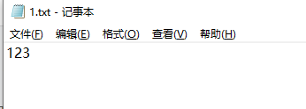
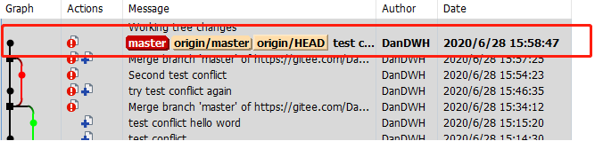
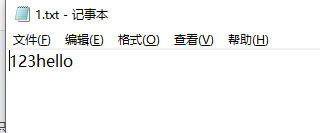
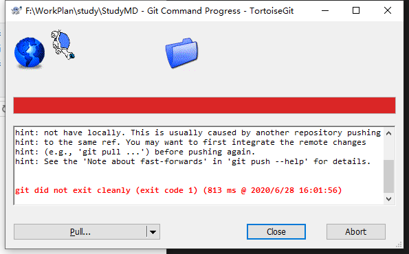
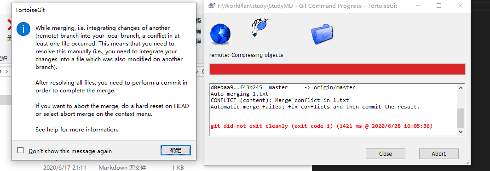
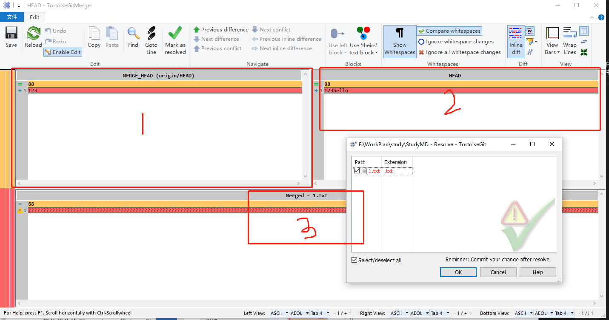
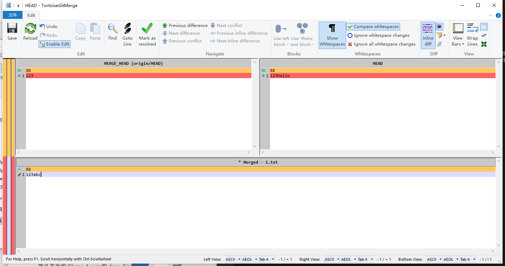

示例：
1. 在一个仓库A中编写了1.txt文件中内容为：
    
2. 然后上传到远程仓库中
    
3. 修改另一个仓库B中的1.txt文件内容为（在没有同步A仓库的修改下）：
    
4. commit到仓库B都是可以的，但是在push到远程仓库时就会报错：
    
    >原因是与远程仓库有同一个文件修改记录不一致（本质上是日志上的指针不一致）；
5. 这时候需要pull远程仓库中的文件，因为pull包含合并merge操作，所以会报错，原因是拉取到本地仓库的文件（即与远程仓库一致firstChange文件内容）与工作区的文件（SecondChange的文件内容）不相同，不能直接合并；
    
6. 根据提示进行resole（解决冲突）：
    
    >1区域是远程仓库上的文件内容；2区域是本地工作区的文件内容；3区域是为解决冲突你编写的的文件内容；
    
7. 修改完成后，可进行正常的commit与push了，这样为解决冲突的全过程； 