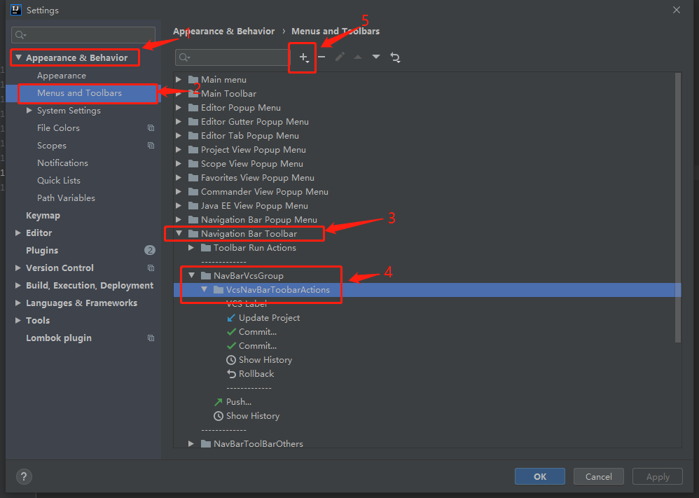

### 配置git
    >在idea的File->Settings中寻找git配置，将本地的git.exe路径配置上去；

### git操作（提交、更新、上传）
1. 提交commite
    * 快捷键：ctrl + k
2. 更新操作pull:
    * 快捷键：ctrl + T
3. 上传push：
    * 快捷键：ctrl + shift + K
4. 添加操作：看下图进入点击对应配置后,点击第五步的加号，进入选择Version Controller Systems可挑选对应工具添加到编辑页面中（具体可见下方常用git工具展示图中第一点位置）

5. idea编辑页面中的常用git工具展示

* 第1点就是上面添加操作中可操作添加的图标；
* 第2点可以查看代码的提交状态和分支情况；
* 第三点可以操作分支，切换和合并都可以

### 解决冲突
在处理冲突的时候，选择merge,即可进入冲突解决界面，如下图

* **左边是本地版本，中间是解决后冲突后的版本，右边是远程仓库的版本**，只需按需求修改中间代码即可