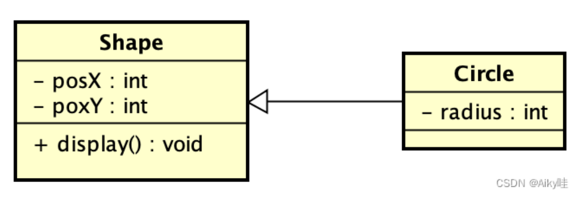
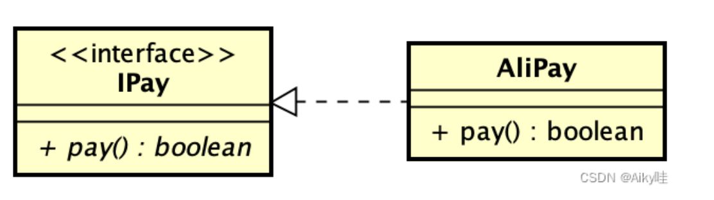
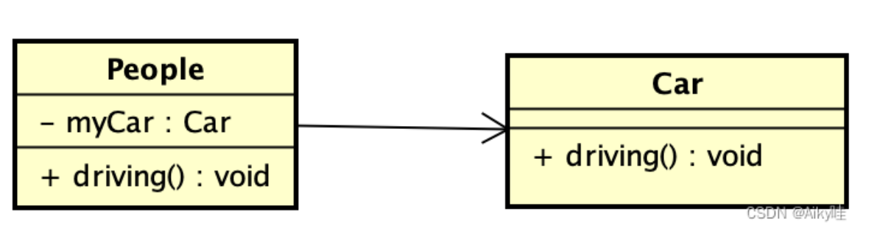

## 类图

表示类、接口以及直接静态结构和关系。

### 1. 泛化关系-即继承关系

- 箭头标识：带三角箭头的实线，箭头指向父类；

### 2. 实现关系

- 箭头标识：带三角箭头的虚线，箭头指向接口。

  

### 3. 关联关系（成员变量）

- 箭头标识：带普通箭头的实线，指向被拥有者。双向的关联可以有两个箭头，或者没有箭头。单向的关联有一个箭头。

  

## 参考

https://blog.csdn.net/qq_35423190/article/details/125069834