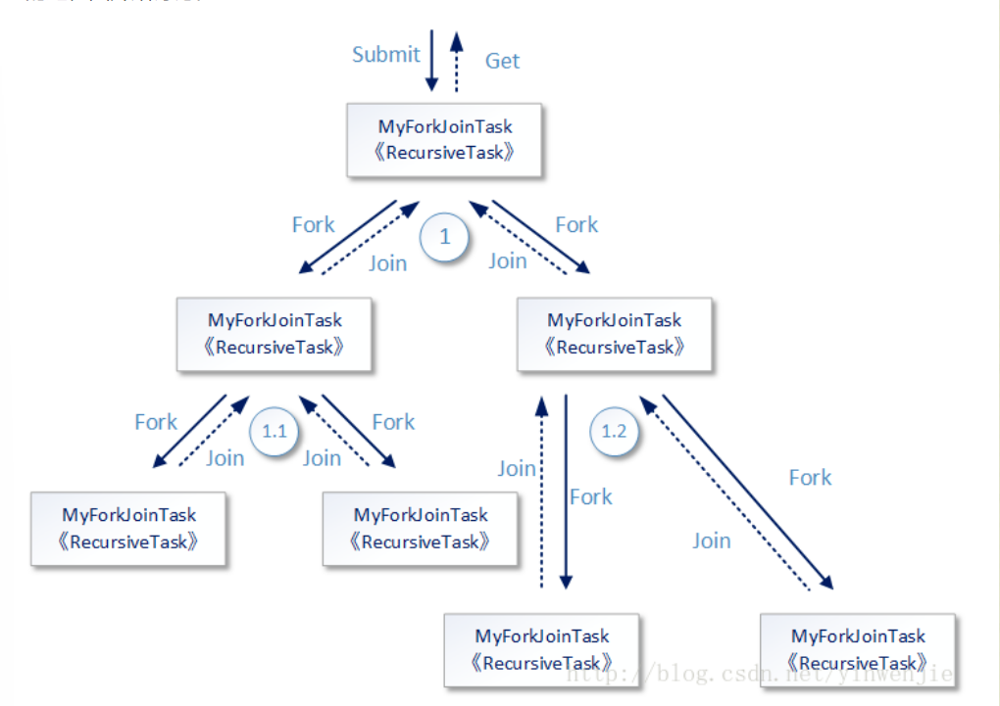

## java8-Fork/Join框架

1. 作用：将一个大任务拆分成多个小任务并行的执行处理，最后合并小任务结果；

2. 框架使用设计图：

   

3. 涉及的类：

   `ForkJoinPool`，`RecursiveTask`，`ForkJoinTask`

4. 以上三种类使用步骤：

   ```java
   class MyTask extend RecursiveTask<T>{
   	//自定义拆分大任务和合并小任务步骤
   	@Override
       protected Boolean compute() {....}
   }
   
   public static void main(String[] args){
       //生成对应任务线程池
       ForkJoinPool pool = new ForkJoinPool();
       MyTask task = new MyTask();
       //将自定义任务放入到任务进程池中执行
       //并获取ForkJoinTask作为任务结果获取
       ForkJoinTask<T> forkTask = pool.submit(task);
       //获取结果
       T value = forkTask.get();
   }
   ```

   

## 一、 `ForkJoinPool`--类似线程池

1. 作用：类似于线程池，用于分配每一个任务所需的线程队列以及管理线程队列；

   2. 一共有四个构造函数，其中参数最多的为：

      ```java
      public ForkJoinPool(int parallelism,
       					ForkJoinWorkerThreadFactory factory,
       					UncaughtExceptionHandler handler,
       					boolean asyncMode)
      ```

      * `parallelism`：可并行级别，Fork/Join框架将依据这个并行级别的设定，决定框架内并行执行的线程数量。并行的每一个任务都会有一个线程进行处理，但是千万不要将这个属性理解成Fork/Join框架中最多存在的线程数量，也不要将这个属性和`ThreadPoolExecutor`线程池中的`corePoolSize`、`maximumPoolSize`属性进行比较，因为`ForkJoinPool`的组织结构和工作方式与后者完全不一样。Fork/Join框架中可存在的线程数量和这个参数值的关系并不是绝对的关联（有依据但并不全由它决定）
      * `factory`：当Fork/Join框架创建一个新的线程时，同样会用到线程创建工厂。只不过这个线程工厂不再需要实现`ThreadFactory`接口，而是需要实现`ForkJoinWorkerThreadFactory`接口。后者是一个函数式接口，只需要实现一个名叫`newThread`的方法。在Fork/Join框架中有一个默认的`ForkJoinWorkerThreadFactory`接口实现：`DefaultForkJoinWorkerThreadFactory`。
      * `handler`：异常捕获处理器。当执行的任务中出现异常，并从任务中被抛出时，就会被handler捕获。
      * `asyncMode`：这个参数也非常重要，从字面意思来看是指的异步模式，它并不是说Fork/Join框架是采用同步模式还是采用异步模式工作。Fork/Join框架中为每一个独立工作的线程准备了对应的待执行任务队列，这个任务队列是使用数组进行组合的双向队列。即是说存在于队列中的待执行任务，即可以使用先进先出的工作模式，也可以使用后进先出的工作模式。(`ForkJoinPool`对每个已分配线程进行的管理方式)

   ## `RecursiveTask`--自定义任务需要继承的类

1. 需要在该类的实现类中自定义大任务的拆分以及小任务的合并；
2. 涉及到的类方法：`compute()`， `fork()`，`join()`；
   * `compute()`：实现类必须重写的方法，需要在该方法中自定义大任务拆分以及小任务结果合并；
   * `fork()`：将大任务拆分后，提示线程将小任务放入当前线程的`work queue`队列中，`ForkJoinPool`根据当前线程(`ForkJoinWorkerThread`)的状态，在三种方案中（该线程队列中等待，新建一个线程运行，唤起其他等待任务的线程运行）决定；
   * `join()`：用于让当前线程阻塞，知道对应子任务运行完成并返回运行结果。或者，如果这个子任务存在于当前线程的任务等待队列（`work queue`）中，则取出这个子任务进行“递归”执行。其目的是尽快得到当前子任务的运行结果，然后继续执行。

3. 举例：计算1-100的计算结果

```java
static class MyForkJoinTask extends RecursiveTask<Integer> {
        // 子任务开始计算的值
        private Integer startValue;
 
        // 子任务结束计算的值
        private Integer endValue;
 
        public MyForkJoinTask(Integer startValue , Integer endValue) {
            this.startValue = startValue;
            this.endValue = endValue;
        }
 
        @Override
        protected Integer compute() {
            // 如果条件成立，说明这个任务所需要计算的数值分为足够小了
            // 可以正式进行累加计算了
            if(endValue - startValue < MAX) {
                System.out.println("开始计算的部分：startValue = " + startValue + ";endValue = " + endValue);
                Integer totalValue = 0;
                for(int index = this.startValue ; index <= this.endValue  ; index++) {
                    totalValue += index;
                }
                return totalValue;
            }
            // 否则再进行任务拆分，拆分成两个任务
            else {
                MyForkJoinTask subTask1 = new MyForkJoinTask(startValue, (startValue + endValue) / 2);
                subTask1.fork();
                MyForkJoinTask subTask2 = new MyForkJoinTask((startValue + endValue) / 2 + 1 , endValue);
                subTask2.fork();
                return subTask1.join() + subTask2.join();
            }
        }
}

```

