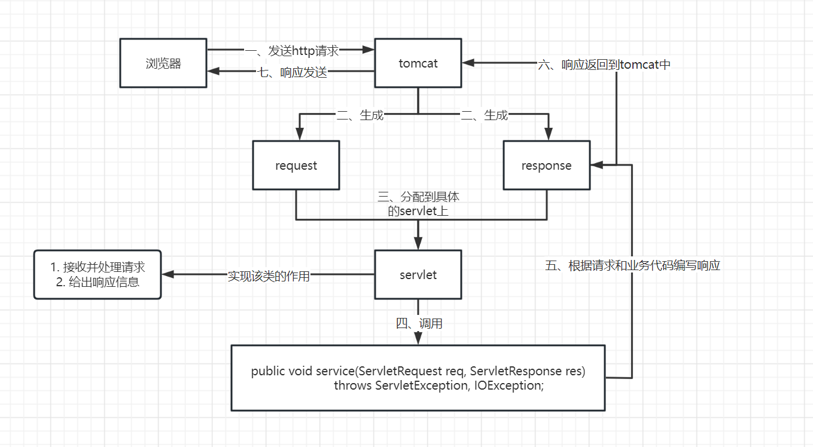
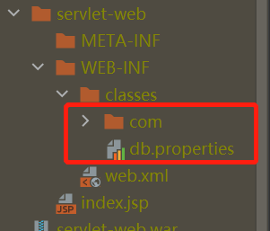

## Servlet简介

- sun公司在API中提供了一种接口叫做`Servlet`，开发一个`Servlet`程序，需要两个步骤
  - 编写一个类，实现`Servlet`接口。
  - 把开发好的java类，放入web服务器中。
- 所有实现了`Servlet`的程序都称为`Servlet`程序。


## 实现

- maven中依赖

```xml
<!-- https://mvnrepository.com/artifact/javax.servlet/javax.servlet-api -->
        <dependency>
            <groupId>javax.servlet</groupId>
            <artifactId>javax.servlet-api</artifactId>
            <version>4.0.1</version>
            <scope>provided</scope>
        </dependency>
```

- java中提供默认抽象类：`HttpServlet`，自己实现Servlet的时候继承该类即可。

- 一般重写`doGet`和`doPost`方法

  ```java
  public class HelloServlet extends HttpServlet {
      @Override
      protected void doGet(HttpServletRequest req, HttpServletResponse resp) throws ServletException, IOException {
          System.out.println("进入get方法");
          ServletOutputStream outputStream = resp.getOutputStream();
          outputStream.write("hello get".getBytes(StandardCharsets.UTF_8));
      }
  
      @Override
      protected void doPost(HttpServletRequest req, HttpServletResponse resp) throws ServletException, IOException {
          System.out.println("进入post方法");
          ServletOutputStream outputStream = resp.getOutputStream();
          outputStream.write("hello post".getBytes(StandardCharsets.UTF_8));
      }
  }
  ```

  

- 注册到webapp/WEB-INF下的web.xml中

``` xml
<!DOCTYPE web-app PUBLIC
 "-//Sun Microsystems, Inc.//DTD Web Application 2.3//EN"
 "http://java.sun.com/dtd/web-app_2_3.dtd" >

<web-app>
  <display-name>Archetype Created Web Application</display-name>

    <!-- 注册servlet -->
  <servlet>
    <servlet-name>hello</servlet-name>
    <servlet-class>com.dwh.servlet.HelloServlet</servlet-class>
  </servlet>

    <!-- servlet的请求路径 -->
  <servlet-mapping>
    <servlet-name>hello</servlet-name>
    <url-pattern>/hello</url-pattern>
  </servlet-mapping>
</web-app>
```


## 原理

- 请求tomcat，servlet的运行原理



- web.xml文件中，`servlet-mapping`说明

  - 一个servlet可以有多个`servlet-mapping`，对应多个请求路径；
  - 一个`servlet-mapping`k可以使用`*`代表通用路径；

  ``` xml
  <!-- 请求/hello/ 后加任意路径均请求到该servlet -->
  <servlet-mapping>
      <servlet-name>hello</servlet-name>
      <url-pattern>/hello/*</url-pattern>
    </servlet-mapping>
  ```

  - 可以指定后缀

  ```xml
  <!-- 可以指定后缀作为请求路径。注意，*前不能路径； -->
  <servlet-mapping>
      <servlet-name>hello</servlet-name>
      <!-- 下面两个都是错误的 -->
      <!-- <url-pattern>/*.do</url-pattern> -->
      <!-- <url-pattern>/hello/*.do</url-pattern> -->
      <url-pattern>*.do</url-pattern>
    </servlet-mapping>
  ```

- 优先级问题

  - 指定的固有映射路径，优先级最高；如果没有固有映射路径，则找通用的；

  ``` xml
  <!-- 
  	第一种情况：访问/hello/s1 进入到hello这个servlet
   	第二种情况：访问/hello 或者/he 等，进入的是error这个servlet
  -->
  <servlet-mapping>
      <servlet-name>hello</servlet-name>
      <url-pattern>/hello/s1</url-pattern>
    </servlet-mapping>
  
  <servlet-mapping>
      <servlet-name>error</servlet-name>
      <url-pattern>/*</url-pattern>
    </servlet-mapping>
  ```

  

## ServletContext

web容器启动的时候，会为每一个web程序创建一个对应的ServletContext对象，代表了当前Web应用。

- 共享数据

  - 同一个web应用程序中，不同servlet之前可以通过ServletContext对象存储数据进行通信同享数据；

  - ``` java
    //放入数据
    ServletContext context = this.getServletContext();
    context.setAttribute("key1", "value");
    ```

  - ``` java
    //取出数据
    ServletContext context = this.getServletContext();
    String value = (String) context.getAttribute("key1");
    ```

- 获取初始化参数

  - web.xml文件可配置一些web应用初始化参数

  - ``` xml
    <!--与<servlet>同级-->
    <context-param>
    	<param-name>url</param-name>
    	<param-value>jdbc:mysql://localhost:8080</param-value>
    </context-param>
  
  - 可以在Servlet中通过`ServletContext`获取
  
  - ``` java
    String url = this.getServletContext().getInitParameter("url");
    outputStream.write(("url" + url).getBytes(StandardCharsets.UTF_8));
    ```
  
- 请求转发

  - 转发是服务器自己处理，浏览器并不知情；

  - ```java
    //该servlet的请求路径为/d1
    ServletContext context = this.getServletContext();
    System.out.println("进入转发");
    context.getRequestDispatcher("/hello").forward(req, resp);
    ```

  - 以上示例转发到/hello请求页面中，/d1的请求状态码为200；

- 获取配置文件信息

  - web工程中，resource的资源文件默认存放在打包后的==WEB-INF下classes文件==中；**即classpath**

  - 

  - servlet中使用代码如下：

  - ``` java
    @Override
    protected void doGet(HttpServletRequest req, HttpServletResponse resp) throws ServletException, IOException {
        ServletContext context = this.getServletContext();
        //这里斜杠/代表当前web应用下
        InputStream in = context.getResourceAsStream("/WEB-INF/classes/db.properties");
    
        Properties prop = new Properties();
        prop.load(in);
        String username = prop.getProperty("username");
        String password = prop.getProperty("password");
    
        resp.getWriter().println("username : " + username);
        resp.getWriter().println("password : " + password);
    }
    ```

  - 注意上面加载路径使用了相对路径，`/`是指相对了当前应用程序包下。

