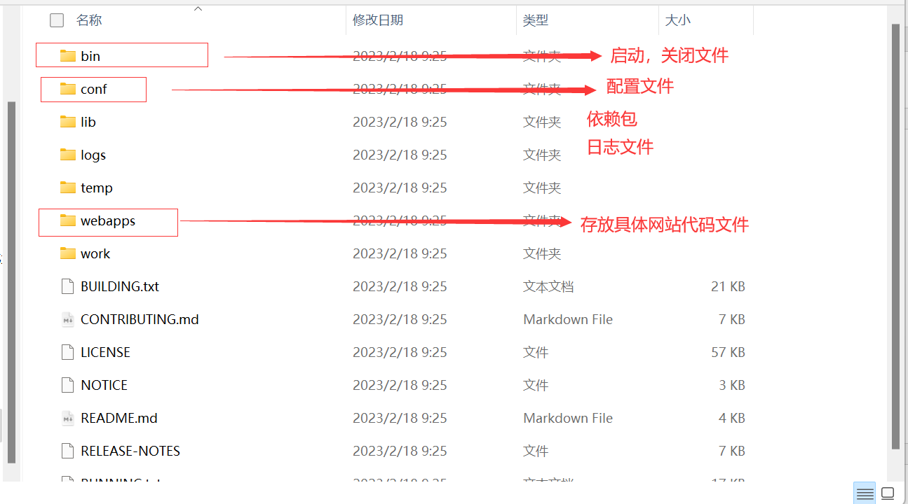

## tomcat启动和配置

- 文件夹信息



- 启动tomcat

  - linux端直接进入Bin目录下，启动`startup.sh`文件即可。
  - windows端则是启动`startup.bat`文件。

  

## tomcat的配置文件

- conf/server.xml

  - 配置tomcat端口。

  ``` xml
  <Connector port="8080" protocol="HTTP/1.1"
             connectionTimeout="20000"
             redirectPort="8443" />
  ```

  - 配置主机dns域名名称（这里可以修改localhost，但是主机的hosts文件也要修改，才能识别域名对应ip）

  ```xml
  <Host name="localhost"  appBase="webapps"
              unpackWARs="true" autoDeploy="true">
  ```

  > 衍生问题：
  >
  > 一个网站如何访问？
  >
  > 在浏览器上输入域名，回车访问。主机会先去hosts文件中查看是否有对应域名相关的ip和端口；本地hosts文件没有，连接dns服务器，在服务器中查找。

- Localhost:8080/examples中有大量源码例子可以自学

## 发布网站

- 将自己的网站应用放到webapps文件夹下即可

``` bash
--webapps: tomcat文件目录
	-Root:	tomcat原先就有的网站应用文件
	-app: 	自己编写的网站应用文件。同时也是网站的目录名
		-WEB-INF
			-calsses: java文件
			-lib:		依赖文件
			-web.xml:	网站配置文件
		-index.html: 默认进入该应用的首页
		-static
			-css....
```

