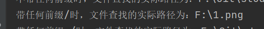
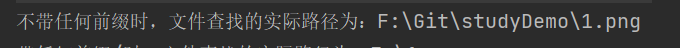
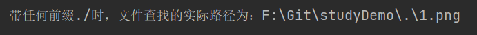
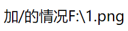
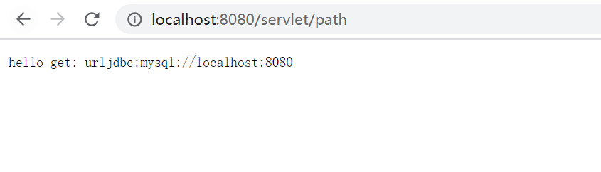
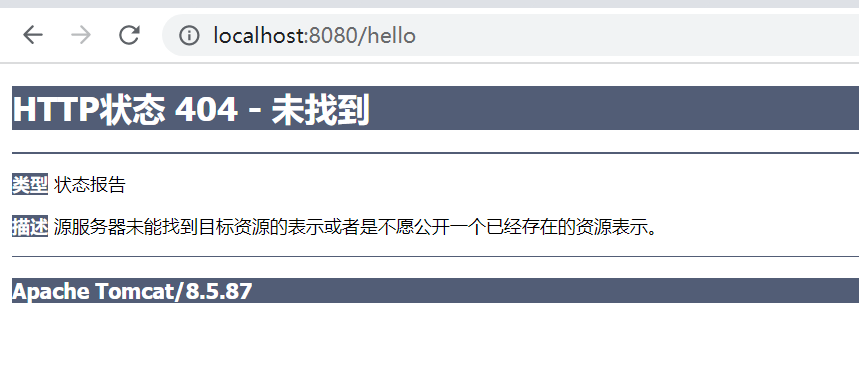

## 总览

- 在java中路径分隔使用**正斜杠 /**，不推荐使用反斜杠\（因为反斜杠需要转义两个反斜杠表示一个正斜杠）。
- 在windows磁盘中用**反斜杠`\`**表示路径的分隔
- 在浏览器中用**正斜杠/**来表示路径的分隔
- 绝对路径在字符串中写全即可

## 普通java程序中

- 第一种：路径开头是斜杠时，程序自动寻找**当前项目所在盘符的根目录**为查找的根目录

  - 示例：

  ``` java
  File f2 = new File("/1.png");
  System.out.println("带前缀/时，文件查找的实际路径为：" + f2.getAbsolutePath());
  ```

  - 

- 第二种：路径不以斜杠开头时，程序查询**当前程序所在目录为根目录**做为查找的根目录

  - 示例：

  ``` java
  File f1 = new File("1.png");
  System.out.println("不带任何前缀时，文件查找的实际路径为：" + f1.getAbsolutePath());
  ```

  - 

- java不支持`./`和`../`等，统一当做第二种情况。

  - 示例：

  ``` java
  File f3 = new File("./1.png");
  System.out.println("带前缀./时，文件查找的实际路径为：" + f3.getAbsolutePath());
  ```

  - 


## web项目的servlet中使用file

- 第一种：开头为斜杠时，和普通java程序一致。

  - 示例：

  ``` java
  File f2 = new File("/1.png");
  resp.getWriter().println("加/的情况" + f2.getAbsolutePath());
  ```

  - 

- 第二种：路径不以斜杠开头时，会自动以**tomcat/bin目录路径**作为查找的根目录

  - 示例：

  ``` java
  File f1 = new File("1.png");
  resp.getWriter().println("不加/的情况" + f1.getAbsolutePath());
  ```

  - 

- 同样的，程序也不支持`./`和`../`


## web项目中读取工程resources目录和webapp目录下文件

``` java
InputStream is = this.getServletContext().getResourceAsStream("/WEB-INF/classes/db.properties");
```


## 转发和重定向时路径

- 转发
  - 由于转发是服务器中执行，所以运行转发操作的是对应web应用，所以在转发使用`/`则代表相对于当前应用访问url的路径
  
  - 如：
  
    - 代码：
  
    ``` java
    //转发
    ServletContext context = this.getServletContext();
    System.out.println("进入转发");
    //进入到 localhost:8080/servlet/hello页面中
    context.getRequestDispatcher("/hello").forward(req, resp);
    ```
  
    - 页面：
  
      
  
- 重定向
  - 重定向是返回给浏览器执行，所以操作时，使用`/`相当于当前`http://ip:port/`后加访问路径。
  
  - 如：
  
    - 代码：
  
    ``` java
    resp.sendRedirect("/hello");
    ```
  
    - 页面：
  
    