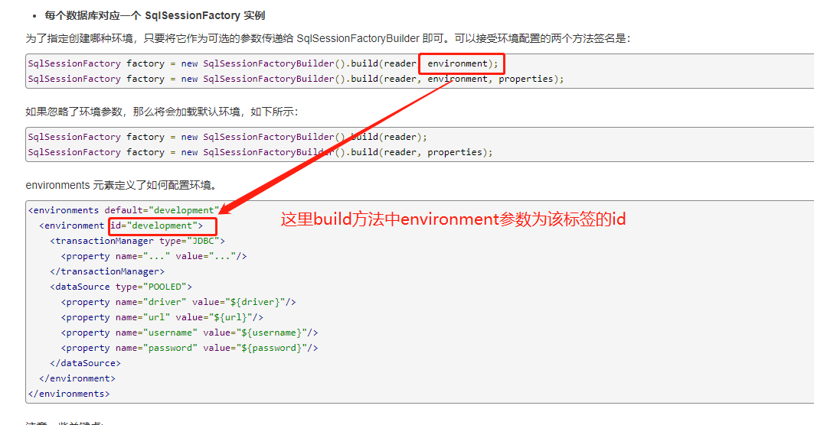
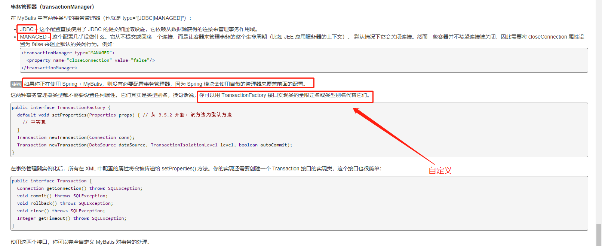
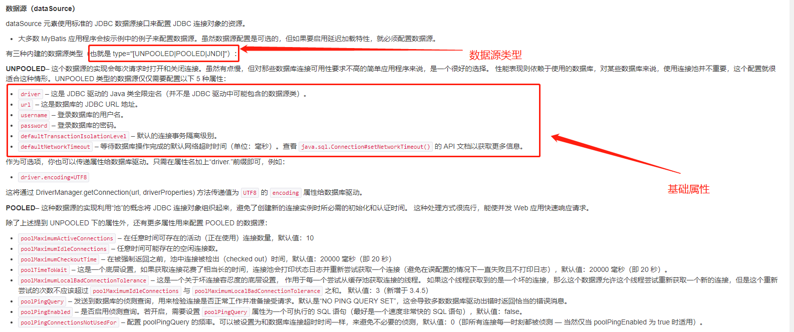
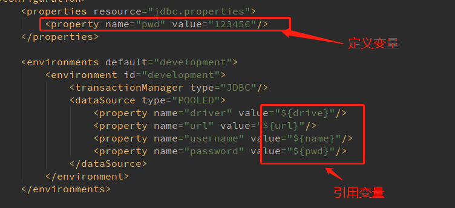
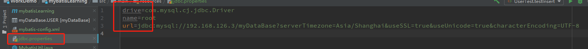
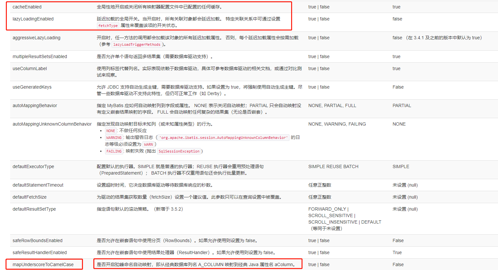
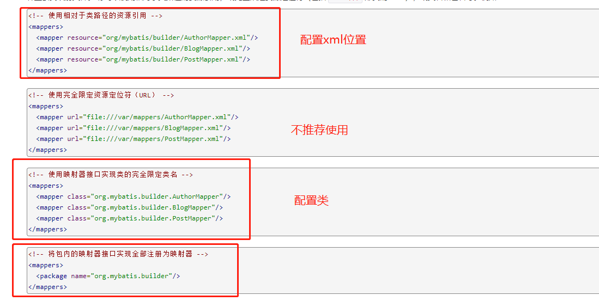

## `mybatis-config`配置文件解析

标签是有顺序的

### 一、`environments`标签--环境配置

1. 通过该标签，mybatis可以配置多个数据库连接环境，但每一个`sqlSessionFactory`实例只能选择一种环境；

   

2. `<transactionManager>`标签--事务管理器（了解）



3. `dataSource标签`--数据源

   

4. mybatis默认事务管理器为`JDBC`，默认数据源类型为`POOLED`；

5. 其中标签的属性都需要通过`property`标签进行声明和定义；

### 二、`properties`标签（加了s的）

1. `porperties`标签可以声明配置该mybatis配置文件全局的属性，也可以声明某属性从外部文件引入；

   

<center>mybatis-config中使用properties标签</center>



<center>外部配置文件jdbc.properties</center>

2. 当外部配置文件和mybatis-config中都使用了同一个配置变量的话，**以外部配置文件变量优先**

### 三、`typeAliases`--别名

```xml
<typeAliases>
    <typeAlias type="com.dwh.entity.User" alias="user"/>
    <package name="com.dwh.entity"/>
</typeAliases>
```

1. 作用：代替java类的全限定名，方便看。

2. 使用package标签可以让mybatis默认扫描该包下的java类，**并默认其包下所有类的别名为类名首字母小写**。
3. 注解：`@Alias("author")`

4. 默认别名：对于java基本数据类型，如：`int`、`long`等，其别名为：`_int`、`_long`即类型名前加下划线；对于**java基本数据类型的包装类型**，如`Integer`，其别名为`int`

### 四、`settings`标签

```xml
<settings>
  <setting name="cacheEnabled" value="true"/>
  <setting name="lazyLoadingEnabled" value="true"/>
  <setting name="multipleResultSetsEnabled" value="true"/>
  <setting name="useColumnLabel" value="true"/>
  <setting name="useGeneratedKeys" value="false"/>
  <setting name="autoMappingBehavior" value="PARTIAL"/>
  <setting name="autoMappingUnknownColumnBehavior" value="WARNING"/>
  <setting name="defaultExecutorType" value="SIMPLE"/>
  <setting name="defaultStatementTimeout" value="25"/>
  <setting name="defaultFetchSize" value="100"/>
  <setting name="safeRowBoundsEnabled" value="false"/>
  <setting name="mapUnderscoreToCamelCase" value="false"/>
  <setting name="localCacheScope" value="SESSION"/>
  <setting name="jdbcTypeForNull" value="OTHER"/>
  <setting name="lazyLoadTriggerMethods" value="equals,clone,hashCode,toString"/>
</settings>
```




<center>仅需要了解这几种配置</center>

### 五、`mapper`标签--映射器



注意：使用class（配置类）的方式注册映射器的要求

* 接口和xml文件必须同名
* 接口和xml文件必须放在同一个包下

