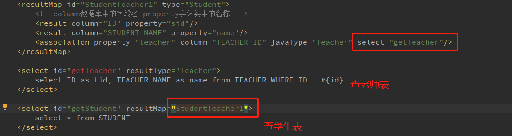
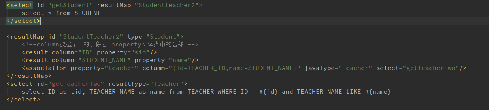
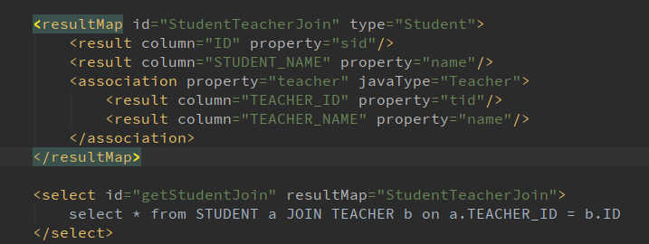

## 复杂查询关系

例如：班主任老师与学生之间的关系，一个班主任老师对多个学生的关系

## 查询多对一的复杂关系或连表查询详细信息

1. 多对一的复杂关系，如查学生对应老师信息，或者连表查询详细信息，在java中其实就是一个类中某一成员变量为一个实体类，如：

   ```java
   @Data
   @Alias("Student")
   public class Student {
       /**
        * 学生名字
        */
       private String name;
   
       /**
        * 学生ID
        */
       private String sid;
   
       /**
        *  一个学生对应一个班主任老师
        */
       private Teacher teacher;
   }
   ```

2. 使用`association`标签对其中实体类的成员变量进行描述其中有两种方式

   * 第一种，使用嵌套select查询，该方法是写两种select的SQL语句，通过`association`标签的`select`属性进行关联

     

     ```xml
     <resultMap id="StudentTeacher1" type="Student">
         <!--column数据库中的字段名 property实体类中的名称 -->
         <result column="ID" property="sid"/>
         <result column="STUDENT_NAME" property="name"/>
         <association property="teacher" column="TEACHER_ID" javaType="Teacher" select="getTeacher"/>
     </resultMap>
     
     <select id="getTeacher" resultType="Teacher">
         select ID as tid, TEACHER_NAME as name from TEACHER WHERE ID = #{id}
     </select>
     
     <select id="getStudent" resultMap="StudentTeacher1">
         select * from STUDENT
     </select>
     ```

     <center>标准版</center>

   下面举例说明其中的`association`标签的`column`属性的含义，以及如何与关联的SQL中的条件进行对应的。

   >`column`属性：数据库中的列名，或者是列的别名。一般情况下，这和传递给 `resultSet.getString(columnName)` 方法的参数一样。 注意：在使用**<u>复合主键</u>**的时候，你可以使用 `column="{prop1=col1,prop2=col2}"` 这样的语法来指定多个传递给嵌套 Select 查询语句的列名。这会使得 `prop1` 和 `prop2` 作为参数对象，被设置为对应嵌套 Select 语句的参数。



```xml
<resultMap id="StudentTeacher2" type="Student">
    <!--column数据库中的字段名 property实体类中的名称 -->
    <result column="ID" property="sid"/>
    <result column="STUDENT_NAME" property="name"/>
    <association property="teacher" column="{id=TEACHER_ID,name=STUDENT_NAME}" javaType="Teacher" select="getTeacherTwo"/>
</resultMap>
<select id="getTeacherTwo" resultType="Teacher">
    select ID as tid, TEACHER_NAME as name from TEACHER WHERE ID = #{id} and TEACHER_NAME LIKE #{name}
</select>
```

* 第二种，按结果嵌套处理

  

  ```xml
  <resultMap id="StudentTeacherJoin" type="Student">
      <result column="ID" property="sid"/>
      <result column="STUDENT_NAME" property="name"/>
      <association property="teacher" javaType="Teacher">
          <result column="TEACHER_ID" property="tid"/>
          <result column="TEACHER_NAME" property="name"/>
      </association>
  </resultMap>
  
  <select id="getStudentJoin" resultMap="StudentTeacherJoin">
      select * from STUDENT a JOIN TEACHER b on a.TEACHER_ID = b.ID
  </select>
  ```

  如果想复用嵌套类型的`resultMap`可以分开定义，如

  ```xml
  <resultMap id="StudentTeacherJoin" type="Student">
      <result column="ID" property="sid"/>
      <result column="STUDENT_NAME" property="name"/>
      <association property="teacher" javaType="Teacher" resultMap="teacher"/>
  </resultMap>
  
  <resultMap id="teacher" type="Teacher">
      <result column="TEACHER_ID" property="tid"/>
      <result column="TEACHER_NAME" property="name"/>
  </resultMap>
  ```

* 两种方法的区别：

  1. 第一种方法被称为`N+1`的方法，执行过程大致为先查询一个结果集，然后根据结果集的每条信息去执行嵌套的SQL语句，虽然实际上mybatis会有机制优化，但实际效率很低。**并且在实验过程中发现该嵌套方法为`left join`模式**，即嵌套子查询没有结果，只影响结果集中对应成员变量的值为空，符合执行过程的逻辑（先查询出主查询语句结果集，再查详细信息）；
  2. 第二种方法可以使用`join`、`left join`、`right join`这三种join语句，比第一种方法更加灵活；或者有别的玩法，如果java定义时，将部分字段封装成某一个类，就可以使用该方法对结果进行映射处理。

3. `association`标签的其他属性说明
   * `property`：为实体类中对应的成员变量名；
   * `javaType`：为需要转换成对应成员变量的实体类类型；
   * `select`：为嵌套SQL的标签ID；
   * `resultMap`：嵌套外接resultMap的ID；

## 查询一对多的关联关系--集合

