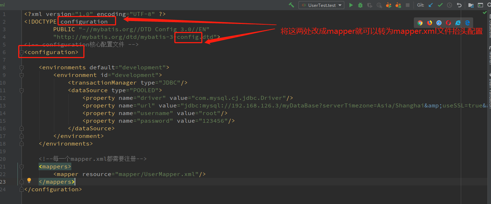
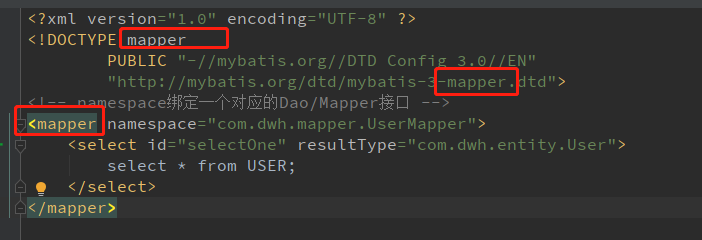

## 配置文件

### 一、environment环境配置

```
<environments default="d1">
    <environment id="d1">
        <transactionManager type="JDBC"/>
        <dataSource type="POOLED">
            <property name="driver" value="com.mysql.jdbc.Driver"/>
            <property name="url" value="jdbc:mysql://192.168.126.3/myDataBase"/>
            <property name="username" value="root"/>
            <property name="password" value="123456"/>
        </dataSource>
    </environment>
    <environment id="d2">
        <transactionManager type="JDBC"/>
        <dataSource type="POOLED">
            <property name="driver" value="{}"/>
            <property name="url" value="{}"/>
            <property name="username" value="{}"/>
            <property name="password" value="{}"/>
        </dataSource>
    </environment>
</environments>
```

使用`<environments>标签`可以配置多套数据库连接配置，通过`default`属性决定使用哪一个数据库连接；

### 二、`mybatis-config.xml`文件和`mapper.xml`文件的文件抬头很相似



<center>mybatis-config.xml文件的配置</center>



<center>mapper.xml文件的配置</center>

### 三、`select`标签

1. 标签属性：

* `resultType`指定方法返回类型；
* `parameterType`指定方法输入参数；基本数据类型不需要声明该标签属性

2. 输入参数写法（与JDBC中sql中的?一样）：`#{}`

### 四、 增、删、改三种操作

都需要提交事务：

``` java
sqlSession.commit();
```

### 五、模糊查询

1. 在java代码设置参数的时候，加上通配符`%`；
2. 在sql中使用`CONCAT(STR1, STR2,....)`拼接字符串；

### 六、解决属性名与字段名不一致问题

1. 使用sql中的`as`关键字创建别名处理；

2. 使用`resultMap`进行结果集映射

   ```xml
   <resultMap id="user1" type="user">
       <!--column数据库中的字段名 property实体类中的名称 -->
       <result column="ID" property="id"/>
   </resultMap>
   ```

### 七、分页

1. 使用limit；
2. 使用rowBounds分页类（不推荐）
3. 使用pageHelper(推荐)

###  八、注解

1. 如：`@Select("")`里面可写sql，这样就不需要写xml文件了；
2. 注解都是通过反射加载，反射解析注解中的sql语句；

3. `@Param("")`写在mapper接口的方法参数上，用于区分多个参数的情况下；基本数据类型和string类型需要加上，引用类型不需要；
4. `${}`与`#{}`的区别：
   * `${}`直接把参数当SQL字符串拼到SQL进去，会有SQL注入的风险；
   * `#{}`是当一个参数传入，会校验对应的映射类型，防止SQL注入；


## <if>标签 

基本判断标签

``` xml
<if test="title != null and title != ''">
    TITLE = #{title}
</if>
```

## <choose> <when>标签

相当于if...else结构

``` xml
<choose>
    <when test="sort = 'ASC'"> ASC </when>
    <otherwise> DESC </otherwise>
</choose>
```

## <where>标签

只会在至少有一个查询条件子句的情况下才会插入条件语句，会自动删除编写中的and以及or字符

``` xml
<where>
    <!--if语句做判断-->
    <if test="title != null and title != ''">
        TITLE = #{title}
    </if>
    <if test="author != null and author != ''">
        AND AUTHOR = #{author}
    </if>
</where>
```

## <set>标签

1. 动态填入set关键字，同时会删除无用的逗号；(但是少写会报错)

2. 可能的情况：执行<set>标签里面的判断时，都没有命中，则没有语句，即SQL中set语句后面为空

## <trim>标签

少用，了解就好

``` xml
<!--自动添加prefix中的字符，自动识别去除suffixOverrides中的字符-->
<trim prefix="set" suffixOverrides=",">
    author = 'admin1',
    <if test="createTime != '' and createTime != null">CREATE_TIME = #{createTime},</if>
    <if test="title != '' and title != null"> TITLE = #{title}</if>
</trim>
```


## <sql>标签

使用<sql>标签进行SQL语句定义，用<include>标签进行引用；


## <foreach>标签

1. 属性：

* collection:表示的是该集合名，如果方法入参是一个map，则会找map中key为collection的value作为集合进行解析；

  > 注意 你可以将一个 List 实例或者数组作为参数对象传给 MyBatis，当你这么做的时候，MyBatis 会自动将它包装在一个 Map 中并以名称为键。List 实例将会以“list”作为键，而数组实例的键将是“array”。
  >
  > 原因是：mybatis对于方法传入的参数列表会转换成map。

* item：表示解析后，集合中的元素的别名；

* open：拼接sql的开头

* close：拼接sql的结尾

* separator:循环之间的分隔符；

* index：当迭代对象为集合List或者数组时，代表当前迭代次数，item属性则为当前迭代获取的元素；当使用字典或者map.entry对象的集合时，index是键，item是值；

参考：

https://www.cnblogs.com/fnlingnzb-learner/p/10566452.html
