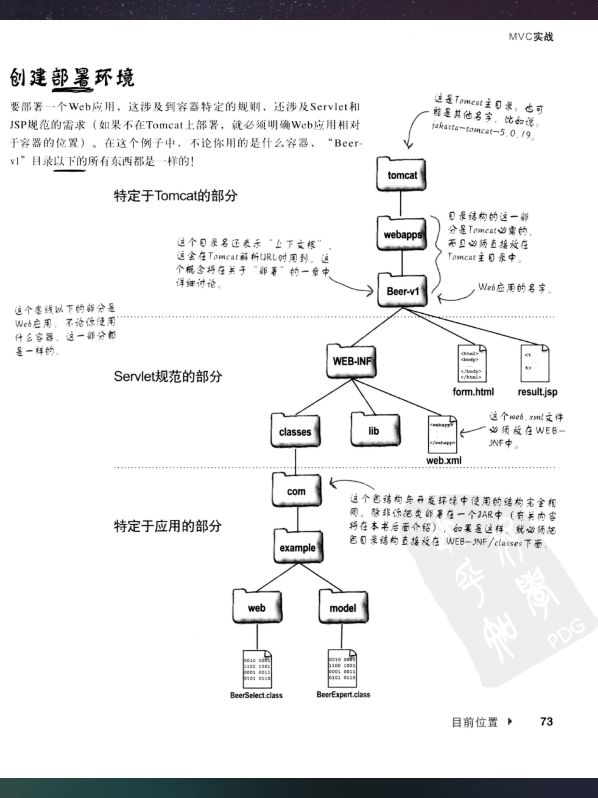

### Apache网站目录结构

1. 根目录(tomcat文件夹)下放静态文件（HTML文件）和服务应用（如：webapps文件夹代表一个java服务应用）
2. webapp文件夹中放不同的web应用，web应用中根据规范约定，分为WEB-INF文件夹（存放应用程序和web.xml文件）和静态页面文件（HTML等）

### web应用体系
流程：请求->web服务器->容器->servlet应用处理数据；
1. web服务器：负责与客户端进行对话，并将数据处理的请求发送给容器，对于获取静态文件的请求则可以直接响应；
2. 容器：负责管理servlet（即业务逻辑）和负责处理与web服务器之间的通信（接收服务器给的请求和给服务器响应）
3. servlet：负责处理业务逻辑，提供对应响应内容；

#### 容器
1. 使用容器的原因：servlet没有main()方法，所以必须使用另外的java应用去控制，这个应用就是容器；
2. Tomcat就是一个容器，作用：当**web服务器应用得到一个指向某个servlet的请求时**，会将这个请求交给对应容器，**容器为该servlet提供对应的HTTP请求和响应并调用其doPost()或doGet()方法**
3. 使用容器的好处：
    * 一：**通信支持**，有了容器，所有servlet与服务器之间的通信需要考虑的协议、监听端口、创建流等步骤都不需要考虑了，全部交给容器去处理，可以更专注于业务代码；
    * 二：**servlet生命周期的管理**：容器控制和管理servlet，让我们无需过多考虑资源管理；
    * 三：**多线程支持**：容器会自动**为每一个请求创建一个新的java线程去运行对应servlet**，虽然要考虑线程同步等问题，但容器创建和管理多个线程处理请求可以让我们少做很多工作；
    * 四：**声明方式实现安全**：通过xml部署描述文件来配置应用程序，实现安全性和方便维护，不需要写在代码中进行重新编译；
    * 五：**支持JSP**
4. 容器处理请求和响应的过程：
    * 容器从web服务器中获取到http请求后，根据请求生成对应的两个对象**HttpServletResponse和HttpServletRequest(http请求对象和http响应对象)**；
    * 为请求的servlet创建或者分配一个线程，并将上面两个对象传入；
    * **调用servlet的service()方法**，然后根据请求的方法分别调用servlet中doGet()或者doPost()方法执行对应的数据处理工作；
    * 处理完成后，一般会将结果放入到HttpServletRequest对象中，然后容器根据该对象生成一个HTTP响应报文发给服务器，服务器发回给客户端；
5. 容器如何找到对应servlet
    * 通过部署描述文件web.xml，该文件是servlet部署到容器时需要创建的，用来告知容器如何运行servlet；
    * 通过两组标签实现servlet的映射
    ```
    //servlet标签用来告诉容器什么应用对应什么servlet类
    <servlet>
        <servlet-name>s1</servlet-name> //内部名，用来做url与class路径之间的映射
        <servlet-class>com.example.xxxServlet</servlet-class> //servlet类的路径
    </servlet>
    
    //告诉容器对应请求查找什么应用
    <servlet-mapping>
        <servlet-name>s1</servlet-name> //对应上面内部名
        <url-pattern>getData</url-pattern>  //客户端的url
    </servlet-mapping>
    ```

### MVC
1. MVC的含义：模型-视图-控制器三种模块组成的一个web应用响应结构；
2. 模型：负责数据处理模块，主要解决与数据库通信的问题和数据处理规则；
3. 视图：前端页面，由要根据用户输入进行改变的动态页面和静态页面组成
4. 控制器：从请求中获取用户输入，并根据数据告知模型和视图两个模块，让这两个模块进行数据处理，然后控制器获取处理结果做出响应；


#### servlet
servlet类的编写实现一般都要继承HttpServlet；

### 参考：
1. First Servelts and JSP第二版