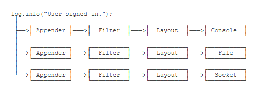

#### 断言
1. 定义：断言是调试程序的一种方式，使用**assert**关键字；格式：
    ```
    public static void main(String[] args){
        int i = -1;
        //此处为断言判断
        assert i > 0;
        System.out.print(i);
    }
    ```
2. 断言是对assert关键字后的表达式进行逻辑判断，如果为真（true）就通过；如果为假（false）则抛出**AssertionError**并退出程序；与抛出异常不同，AssertionError不能被抓获，所以直接退出程序不再执行；
3. **JVM自动关闭断言指令**，遇到assert语句就自动忽略不执行
```
启动JVM时，需要输入-ea(:特定包名或类名)，参数启动断言判断；
```

#### Java.util.Logging
1. 初始化: 
    ```
        Logger logger = Logger.getGlobal();
    ```
2. 使用：
    ```
        logger.info("start process...");
        logger.warning("memory is running out...");
        logger.fine("ignored.");
        logger.severe("process will be terminated...");
    ```
3. 日志等级：
    * SEVERE
    * WARNING
    * INFO
    * CONFIG
    * FINE
    * FINER
    * FINEST
4. 日志等级默认是INFO，INFO级别以下的不会被打印；
5. 局限性：
    * 该日志系统只在jvm启动时读取配置文件并完成初始化操作，一旦开始运行main()方法，则无法修改配置；
    * 需要在启动时传递参数：**-Djava.util.logging.config.file=<config-file-name>**

#### Commons Logging
1. Commons Logging是一个日志模块，需要通过配置文件指定挂接的日志系统，相当于一个接口；
2. 使用Log的两步：一、通过**LogFactory类**生成log对象；二、使用Log对象的实例方法打日志；
    ```
        //获取实例
        Log Log = LogFactory.getLog(getClass());
    ```
3. 获取Log实例时使用getClass()，可以让子类也直接使用日志的实例；
4. 日志等级（默认为INFO）：
    * FATAL
    * ERROR
    * WARNING
    * INFO
    * DEBUG
    * TRACE

#### Log4j
1. 一个日志系统的实现，可以通过配置，通过框架将不同的日志打印到不同的载体上，如：控制台console、文件file等；
    
    * filter过滤不同级别的日志；layout格式化日志信息，如：自动添加日期时间等信息；
2. 将其xml文件放在classpath下即可，其具体xml属性标准看别处；

#### SLF4J和Logback
1. 与Commons Logging、Log4j一样，对应日志接口和日志系统实现；
2. 相比于Log4j，SLF4J允许使用**占位符**来对应一些需要写在日志中的变量，而前者是直接的字符拼接；