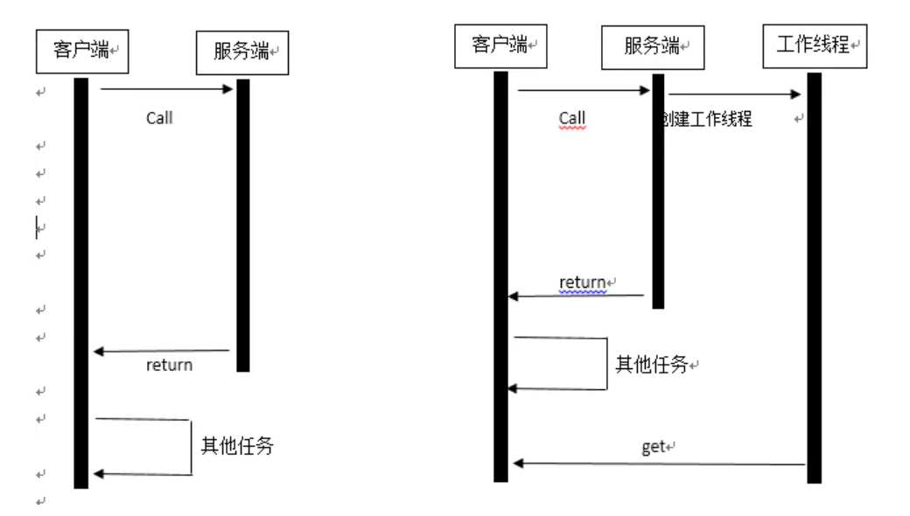

## Future模式

1. 介绍：就是将异步线程处理的工作进行包装，不需要立即返回处理后的数据，当需要的时候再通过get获取；
2. 时序图，实际上就是一个异步执行并回调获取响应模式。



## java中实现Future模式--Future类

```java
public interface Future<V> {

    /**
     * 用来取消任务，取消成功则返回true，取消失败则返回false。
     * mayInterruptIfRunning参数表示是否允许取消正在执行却没有执行完毕的任务，设为true，则表示可以取消正在执行过程中的任务。
     * 如果任务已完成，则无论mayInterruptIfRunning为true还是false，此方法都返回false，即如果取消已经完成的任务会返回false；
     * 如果任务正在执行，若mayInterruptIfRunning设置为true，则返回true，若mayInterruptIfRunning设置为false，则返回false；
     * 如果任务还没有执行，则无论mayInterruptIfRunning为true还是false，肯定返回true。
     * 补充：
     	当mayInterruptIfRunning为ture的时候，Future包装的异步线程如果正在执行，则会将该线程的interrupted（中断）标识为ture，而不是直接中断线程（jdk是不会主动中断线程，都是通过interrupted标识而已，sleep，wait方法等会判断该标识，如果为true则会抛出InterruptedException才导致线程中断。）
     */
    boolean cancel(boolean mayInterruptIfRunning);

    /**
     * 表示任务是否被取消成功，如果在任务正常完成前被取消成功，则返回true
     */
    boolean isCancelled();

    /**
     * 表示任务是否已经完成，若任务完成，则返回true
     */
    boolean isDone();

    /**
     * 获取执行结果，如果最终结果还没得出该方法会产生阻塞，直到任务执行完毕返回结果
     */
    V get() throws InterruptedException, ExecutionException;

    /**
     * 获取执行结果，如果在指定时间内，还没获取到结果，则抛出TimeoutException
     */
    V get(long timeout, TimeUnit unit) throws InterruptedException, ExecutionException, TimeoutException;
}
```

==补充==

> `cancal`方法中的参数：
>
> ​	当``mayInterruptIfRunning`为`ture`的时候，Future包装的异步线程如果正在执行，则会将该线程的interrupted（中断）标识为`ture`，而不是直接中断线程（**`jdk`是不会主动中断线程，都是通过interrupted标识而已，sleep，wait方法等会判断该标识，如果为true则会抛出`InterruptedException`才导致线程中断。**）


## FutureTask类

1. 是Future的具体实现类，继承关系：

   > `FutureTask <- RunnableFuture <- Runnable、Future`

2. 具体使用方式：

   ```java
   public static void main(String[] args) {
           //future使用
           //先创建线程池
           ExecutorService executorService = Executors.newCachedThreadPool();
       	//使用Future包装一个runnable实现类（异步线程任务）
           FutureTask<Integer> task = new FutureTask<>(()->100);
           //提交线程到线程池执行
       	executorService.submit(task);
           executorService.shutdown();
       	task.get();
       }
   ```

   3. `FutureTask`种传统方式的缺点在于，针对线程结果获取以及处理需要主线程执行；也就是说需要调用`Get()`方法，阻塞主线程等待异步任务返回结果。

   4. 解决等待结果返回阻塞方法：

      - 使用别的工具类比如Netty等对Future进行功能扩展的工具类。

      - 使用`jdk1.8`中的`CompletableFuture`;