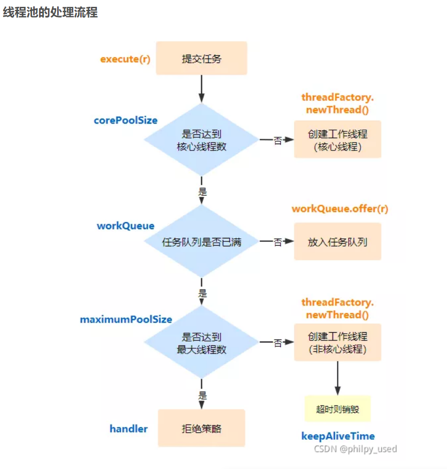

## Executor框架

- java多线程程序将多个任务分配到线程池中，通过线程池分配对应线程执行不同的任务。
- 单个java线程被一对一映射为本地操作系统线程，启动一个java线程即生成一个本地系统线程。

### 一、Executor框架架构

- 任务：实现了`callable`接口或者`runnable`接口的程序
- 任务的执行：
  - 任务执行机制核心：`Excutor`接口；定义将任务的提交和执行分离开。
  - 实现类：`ThreadPoolExcutor` 和 `ScheduledThreadPoolExcutor`; 
  - `ThreadPoolExcutor` ：线程池核心实现类，执行被提交的任务；
  -  `ScheduledThreadPoolExcutor`：延迟执行或者定时执行任务线程池；
- 异步计算结果（线程任务操作）：`Future`接口以及其实现类：`FutureTask`

### 二、执行流程

- 一是通过一个实现了`Runnable`或者`Callable`接口的类将需要执行的任务操作写入，形成任务类，并生成其实例；
- 二是将第一步中的任务实例，提交给实现`Excutor`接口实例（`ThreadPoolExcutor` 和 `ScheduledThreadPoolExcutor`）执行；使用其`submit`方法
- `ExecutorService.submit`会返回一个Future接口对象（即`FutureTask`），主线程可通过该对象等待获取对应任务完成后的结果(`get`方法)或取消任务执行(`cancel`方法)；
- `FutureTask`实现了Runnable接口，所以我们可以自定义实现该对象，再交给线程池执行

### 三、ThreadPoolExecutor线程池

1. 由以下四个组件构成

- `corePool`：核心线程池大小；
- `maximunPool`：最大线程池大小；
- `BlockingQueue`：暂存任务的工作队列；
- `RejectedExecutionHandler`：当线程池队列满的时候（打到最大线程池大小并且队列饱和时）或者线程池临时关闭时执行的，针对任务的策略；

2. 使用构造函数时的七大参数
   - 除了以上四种以外，还有以下三种
   -  **keepAliveTime**：**超时释放时间**。
   - **TimeUnit unit**：**超时释放时间的单位**。（枚举类`TimeUnit`的常量）
   - **ThreadFactory threadFactory**：**线程工厂**。（执行程序创建新线程时使用的工厂）

#### 四种拒绝策略

- AbortPolicy：抛出RejectedExecutionException异常
- DiscardPolicy：丢掉任务，不抛异常
- DiscardOldestPolicy：不抛异常，尝试去和最早的去竞争，竞争失败再丢掉任务
- CallerRunsPolicy：哪来的回哪里（将被拒绝的任务任务返回给execute()方法的调用线程中运行）；



#### `execute()`和`submit()`的区别

- `execute()`方法是`Executor`接口的唯一方法，`submit()`方法是`ExecutorService`的，一共有三个重载。
- `execute()`方法只能接收`Runnable`接口的实现类作为参数，`submit()`方法可以接收`Runnable`和`Callable`接口的实现类作为参数。
- `submit()`方法可以通过返回的`Future`对象判断、控制任务执行情况，并获取返回值。
- `execute()`方法无法处理异常，只会抛出，`submit()`方法可以通过返回结果的Future对象的`get()`方法对异常进行处理。

#### 关闭线程池

> 可以通过调用线程池的`shutdown()`或`shutdownNow()`方法来关闭线程池。它们的原理是遍历线程池中的工作线程，然后逐个调用线程的`interrupt()`方法来中断线程，所以无法响应中断的任务可能永远无法终止。
>
> shutdown()只是将线程池的状态设置为SHUTWDOWN状态，正在执行的任务会继续执行下去，没有被执行的则中断。而shutdownNow()则是将线程池的状态设置为STOP，正在执行的任务则被停止，没被执行任务的则返回。（shutdown()不着急，shutdownNow()很着急）

### 四、`Executors`工具类

- `Executors.callable(Runnable task)或Executors.callable(Runnable task, Object resule)`可将Runnable对象转成Callable对象；
- 创建三种类型线程池：

  - FixedThreadPool：无界限线程池。
  - SigleThreadExecutor：与FixedThreadPool类似，都使用无界队列但是线程数为1；**串行执行队列**；
  - CachedThreadPool：无限增加线程数的线程池。

#### FixedThreadPool详解

- 该线程池特殊在于使用了**无界等待队列**；LinkedBlockingQueue作为线程池的工作队列（队列的容量为Integer.MAX_VALUE）

- 执行流程：
  - 当任务不超过corePoolSize(核心线程数)时，增加任务则新增线程执行；
  - 当到达核心线程数时，会将新增的线程任务放入无界队列中；
  - 因为任务队列等效无界，所以maximumPoolSize和keepAliveTime的设置均无意义；
- 默认创建时线程，FixedThreadPool的corePoolSize和maximumPoolSize都被设置成入参nThreads，而eepAliveTime设置为0L。
- 该线程池不会拒绝任务加入；

#### SigleThreadExecutor详解

- 与上面一致都使用LinkedBlockingQueue作为线程池的工作队列，但是corePoolSize和maximumPoolSize默认设置为1；
- 所以该线程池中任务都是串行执行；

#### CachedThreadPool详解

- 特点：等待队列设置为空；maximumPoolSize被设置为Integer.MAX_VALUE，即maximumPool是无界的；corePoolSize被设置为0，即corePool为空；
- **如果主线程提交任务的速度高于maximumPool中线程处理任务的速度时，CachedThreadPool会不断创建新线程。极端情况下，CachedThreadPool会因为创建过多线程而耗尽CPU和内存资源**。
- 等待队列使用的是SynchronousQueue做实现，是一个没有容量的阻塞队列；每一次提交任务都必须将任务交由一个线程执行（线程池空闲线程或者创建新线程）；

### 五、不使用Executors来创建线程原因

- 一是FixedThreadPool和SigleThreadExecutor使用无界队列，可能会堆积大量请求（待执行的任务）导致内存溢出;
- 二是CachedThreadPool无限制线程数，可能导致服务器资源耗尽；


### 六、ScheduledThreadPoolExecutor

- 用于给定延迟之后执行任务，或者定期执行任务；

- 有三种调度任务的方式

  - **schedule(runnable, 时间数字, 时间单位)**：延迟多久执行一次。举例：

    ```java
    ScheduledThreadPoolExecutor scheduled = new ScheduledThreadPoolExecutor(10);
    System.out.println(LocalDateTime.now());
    scheduled.schedule(new Runnable() {
        @Override
        public void run() {
            System.out.println(LocalDateTime.now());
        }
    }, 4, TimeUnit.SECONDS);
    ```

  - **scheduledAtFixedRate(runnable, 延迟时间n, 间隔时间m, 时间单位)**：在时间n后延迟执行任务，并每隔时间m执行一次任务；

  - **scheduleWithFixedDelay(runnable, 延迟时间n, 间隔时间m, 时间单位)**：与第二种类似，但是两个任务之间相隔时间计算为：上一次任务执行时间+间隔时间m;

- `ScheduledThreadPoolExecutor`有四种构造器，用来指定核心线程数、线程工厂、拒绝策略；

  > 注意这里没有指定队列以及最大线程数，因为该线程池默认最大线程数为Integer.MAX_VALUE（无限大），队列使用`DelayedWorkQueue`是一个无界队列。

- ScheduledThreadPoolExecutor将待执行任务封装成一个`ScheduledFutureTask`对象，该类是内部类；

#### ScheduledFutureTask-定时任务对象

- 有3个成员变量
  - `time`：表示这个任务将要被执行的具体时间
  - `sequenceNumber`：表示这个任务被添加到ScheduledThreadPoolExecutor中的序号
  - `period`：表示任务执行的间隔周期
- 该对象实例通过ScheduledThreadPoolExecutor.schedule()方法生成到线程池中；
- 在执行前队列里，会先排序；先比较time，time小的在前；相同时比较sequenceNumber，也是小的在前。（即执行时间前的先执行；相同执行时间则先提交的先执行）；
- 定时线程池的运行逻辑为：
  - 先通过队列DelayedWorkQueue的task()方法获取到一个time大于等于当前时间任务（到期或过期执行的任务）；
  - 调用对应ScheduledFutureTask任务的run方法执行；
  - 执行完后调用`ScheduledFutureTask`对象的`setNextRunTime()`方法修改`ScheduledFutureTask`的`time`变量为下次将要被执行的时间
  - 调用`ScheduledFutureTask`对象的`reExecutePeriodic()`方法将修改`time`之后的`ScheduledFutureTask`放回`DelayedWorkQueue`中

## 参考

1. Java并发编程之 Excutor：https://blog.csdn.net/qq_43613793/article/details/120583263?ops_request_misc=&request_id=&biz_id=102&utm_term=excutor%20java&utm_medium=distribute.pc_search_result.none-task-blog-2~all~sobaiduweb~default-0-120583263.142^v46^pc_rank_34_queryrelevant25&spm=1018.2226.3001.4187
2. Excutor框架：https://blog.csdn.net/weixin_30332241/article/details/95169460?ops_request_misc=%257B%2522request%255Fid%2522%253A%2522166286995716800186587711%2522%252C%2522scm%2522%253A%252220140713.130102334..%2522%257D&request_id=166286995716800186587711&biz_id=0&utm_medium=distribute.pc_search_result.none-task-blog-2~all~baidu_landing_v2~default-2-95169460-null-null.142^v47^pc_rank_34_default_23,201^v3^control_2&utm_term=executor%E6%A1%86%E6%9E%B6&spm=1018.2226.3001.4187