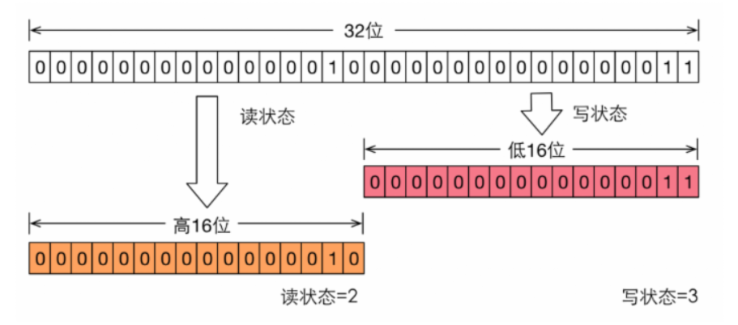
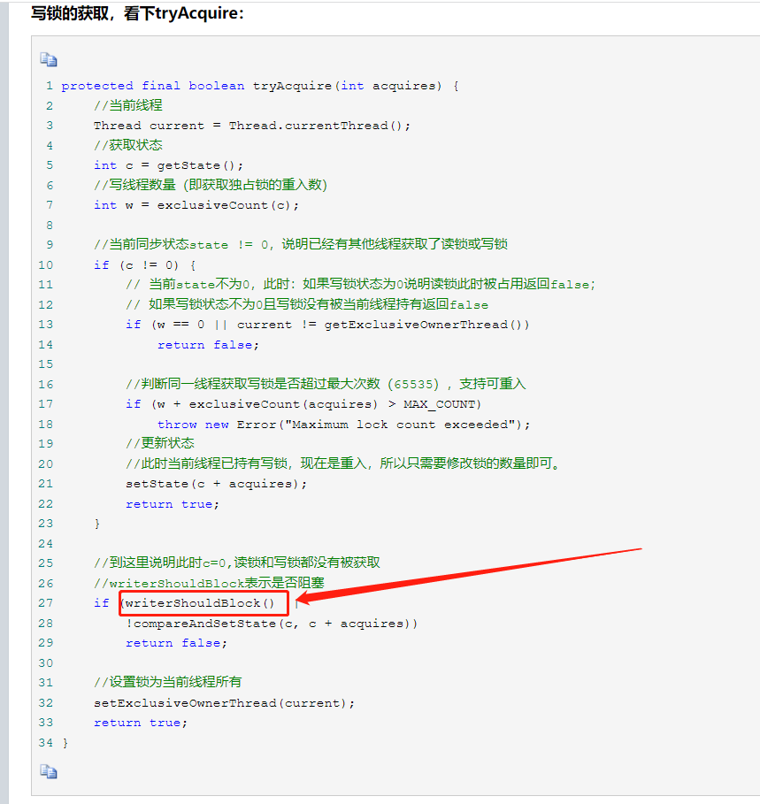

## 一、读写锁--`ReentrantReadWriteLock`

1. 包含两个锁：==读锁==（共享锁）和==写锁==（排它锁）；
2. 三个特性：
   * 公平选择性：可以选择策略：公平和非公平（默认）的获取锁的方式，吞吐量是非公平比公平快；
   * 可重入性：读锁和写锁都支持线程重入；
   * 锁降级：即写锁可以降级为读锁，读锁不能升级为写锁；

## 二、公平选择性

1. 公平策略：多个申请获取锁的线程通过申请锁的顺序获取锁，即使用队列获取锁；
2. 非公平策略：是指多个线程获取锁的顺序，并不是按照申请锁的顺序，有可能申请的线程比先申请的线程优先获取锁，在高并发环境下，有可能造成优先级翻转，或者饥饿的线程（也就是某个线程一直得不到锁）

## 三、可重入性

​	指当一个线程获取到锁A之后，在线程执行过程中再一次请求获取锁A，仍可以获取到；不会出现自己阻塞自己情况。

## 四、读写锁的机制与原理

1. 当前锁对象的锁状态`State`实现：

   

   * 通过一个整型变量维护，该整形变量4个字节，32位bit，`高16位`记录读状态，`低16位`记录写状态。
   * 程序获取写状态：`State & ox0000FFFF`，状态码和十六进制0000FFFF（即二进制高16位全是0，低16位全是1）做并操作，去掉高位数值；
   * 程序判断写锁是否被获取：`State > 0`，当状态码大于0的时候写锁被获取；
   * 程序获取读状态：`State >>> 16`，状态码右移16位，无符号位补0；
   * 程序判断读锁：`(State >>> 16) > 0`；

2. `ReentrantReadWriteLock`除了记录锁的状态，还会记录获取锁的线程号，所以在判断写锁和读锁的时候都会判断当前线程是否为记录中获取锁的现场，这样就保证了重入性；

3. 在获取锁的时候有一个判断：

   

   * `writerShouldBlock()`方法是判断是否阻塞，是否阻塞的原因或者根据是当前锁对象LOCK的策略（公平锁还是非公平锁）；
   * 公平策略下，会判断当前线程是否为等待队列头部（是否有等待时间更长的线程），根据结果决定阻塞；
   * 非公平策略下一般不会，因为等待线程之间不考虑先后。

## 参考资料

1. https://www.cnblogs.com/xiaoxi/p/9140541.html

