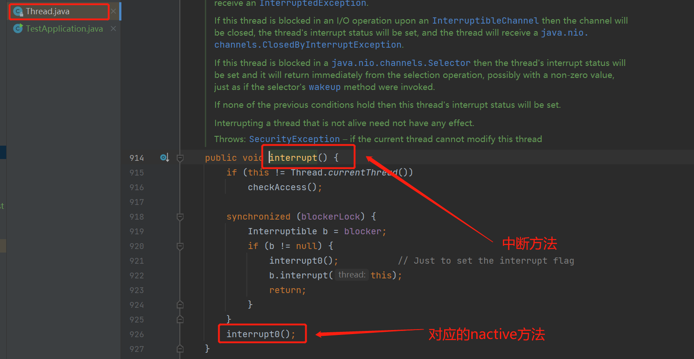
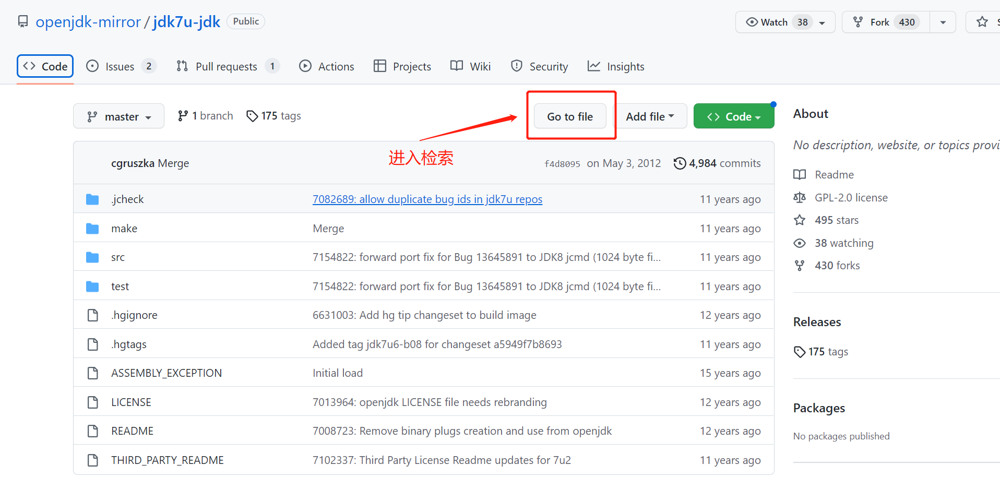
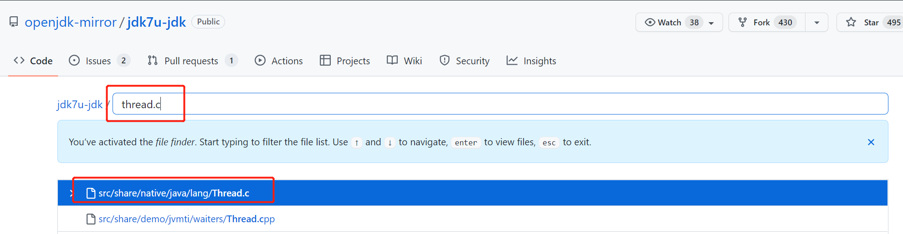
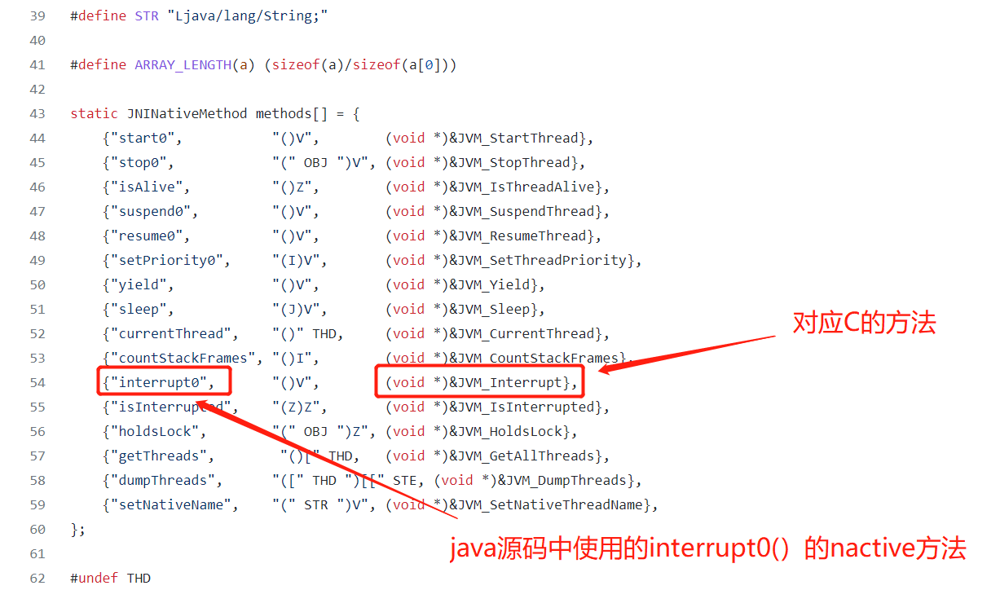
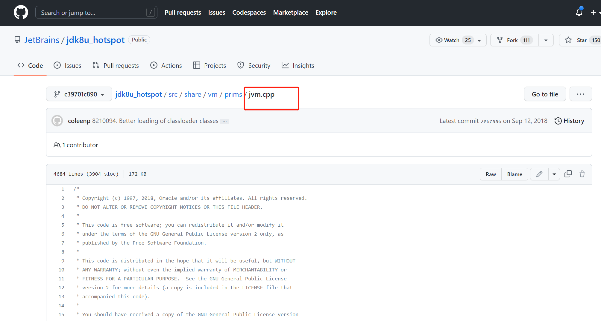

1. 在openJDK官网或者github上面找到如jdk7u-jdk的jdk项目；
2. 在该项目中搜索对应的native方法

例如这里我们查找`Thread.interrupt`方法

比如我这里想搜索tread的执行源码，则找到对应`.c`文件

找到对应C语言的方法之后，可以去`jdk8u_hotspot`等jdk_hotspot项目中查找对应的

找到当中的`jvm.cpp`文件查找对应的方法