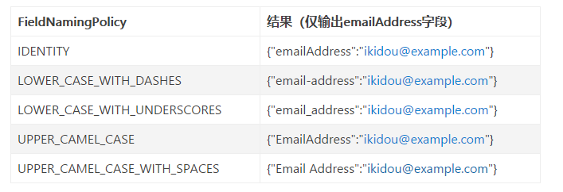

### 基于Gson 2.4版本
#### 基本使用
1. 使用new Gson()创建Gson实例对象，然后调用**fromJson(str, obj.class)将字符串转成对应实体类**，**toJson(obj)将对象转换成字符串**；
2. **默认情况下不导出值为：Null的键**

#### 泛型
1. 使用fromJson()的时候，如果需要转成带泛型的类时，可以使用TypeToken来实现泛型控制；
2. 使用方法如下：
```
//对typeToken赋予泛型
List<String> stringList = gson.fromJson(jsonArray, new TypeToken<List<String>>() {}.getType());
```
注意：因为TypeToken的构造方法是protected修饰的,所以上面才会写成new TypeToken<List<String>>() {}.getType() 而不是 new TypeToken<List<String>>().getType()；

#### GsonBuilder
1. 使用GsonBuilder创建一个对应的gson实例对象，可以设置更多定制化的序列化规则；
2. 具体使用方法是在new GsonBuilder()后调用其方法设定一些序列化规则；
    ```
    //使用builder创建GSON过程
    Gson gson = new GsonBuilder()
                //调用的一些方法进行设置
                .....
                .create();
    ```
    * 使用.serializeNulls()方法，设定值为：Null的字段也可以被序列化；
    * 设置输出日期时间格式：.setDateFormat("yyyy-MM-dd")
    * 禁止内部类序列化：.disableInnerClassSerialization()
    * 与注解Expose一起使用：.excludeFieldsWithoutExposeAnnotation()
    * 基于访问控制修饰符：.excludeFieldsWithModifiers(....),填入：Modifier.FINAL, Modifier.STATIC等代表public/static/final这些控制符的变量；
3. 自定义规则，可以自己指定具体的定制化规则：
    * **ExclusionStrategy接口**，可以通过实现其两个方法，改变序列化和反序列化时不同字段的序列化规则以及针对不同类，进行定制化设计；
    * 使用GsonBuilder().addSerializationExclusionStrategy(ExclusionStrategy e)和addDeserializationExclusionStrategy(ExclusionStrategy e)分别对序列化和反序列化进行规则指定；（**具体就是第一点：实现ExclusionStrategy接口的两个方法**）
4. POJO与JSON的字段映射规则，除了@SerializedName注解之外其他处理方法
    * 使用GsonBuilder的setFieldNamingPolicy和setFieldNamingStrategy 两个方法以及**FieldNamingStrategy接口（与上面有所不同）**
    * GsonBuilder.setFieldNamingPolicy 方法与Gson提供的另一个枚举类FieldNamingPolicy配合使用，该枚举类提供了5种实现方式分别为：
    
    **五种类型实际上是将字段进行大小写、中间使用什么进行分割连接这样，看英文命名理解**；
    * 自定义实现：GsonBuilder.setFieldNamingStrategy(new FieldNamingStrategy() {.....})对字段进行定制
    * **注意：@SerializedName注解拥有最高优先级！所以有该注解的字段使用上面的方法均无效！**


#### 注解
##### @SerializedName
1. 注解在实体类的字段上，用来提供备选属性名。如：字段名为：emailAddress，可使用该注解将其对应json的key名改为email；
2. 两个属性
    * value = ""：主选备注名；**序列化的时候以此为key；**
    * alternate = {"",""}：备选备注名，在**反序列化的时候**可以识别出字符串中key为备选备注名的键值对；
    ```
    class User{
        @SerializedName(value = "emailAddress", alternate = {"email", "email_address"})
        public String emailAddress;

        public static void main(String[] args){
            Gson gson = new Gson();
            //这里出现了三种备注名，取最后出现的那个的值
            String json = "{\"name\":\"怪盗kidou\",\"age\":24,\"emailAddress\":\"ikidou_1@example.com\",\"email\":\"ikidou_2@example.com\",\"email_address\":\"ikidou_3@example.com\"}";
            User user = gson.fromJson(json, User.class);
            //输出email_address备注名对应的值：ikidou_3@example.com
            System.out.println(user.emailAddress); 
        }
    }
    ```
##### @Expose注解
1. 使用该注解可以将某些选择的字段不进行序列化；**但是要结合GsonBuilder使用，并且使用.excludeFieldsWithoutExposeAnnotation()！！**
2. **注意：如果使用了该注解，则所有需要序列化的字段都要使用该注解**；
3. 第二点的原因：该注解有两个属性：deserialize与serialize对应反序列化与序列化； 

##### @Since与@Until
1. GsonBuilder.setVersion(Double)配合使用。
2. 两个标签是用来控制版本的，属性均是一个，而且是一个double类型的值；
3. 对于标记上这两个注解的，当setVersion(Double)中设置的参数大于since注解的字段与小于Until的字段被输出；

参考文章：
1. 你真的会用Gson吗?Gson使用指南（一） https://www.jianshu.com/p/e740196225a4