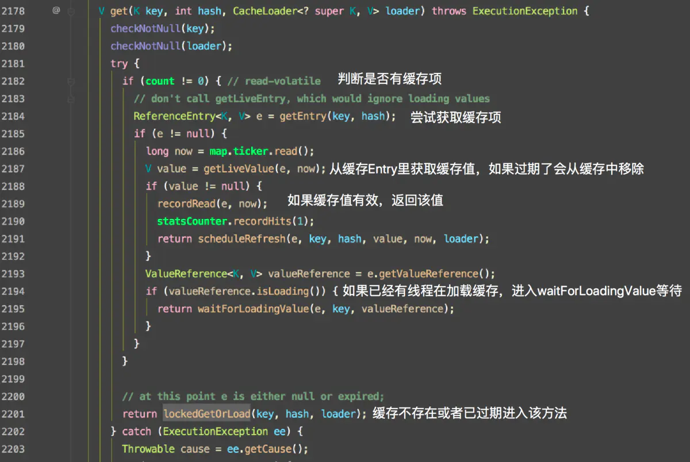

### `LoadingCache`类

1. 暂时理解的设计理念是：在处理查询数据操作较多时，为了提高系统性能，使用缓存将数据存放到内存中，缓存实际上是加快应用和数据源之间访问的东西；对该缓存我们又针对不同的应用场景制定不同的策略去维护缓存，从而维护使用缓存加快系统性能的优势，例如：定时刷新缓存（缓存内容过期）、实时更新缓存内容等策略；
2. 根据面向对象的设计思路，我们针对上文就有了好几种对象，如：缓存本体、加载缓存的策略、移除缓存的策略等等；然后`LocadingCache`便将这些对象封装起来；例如：本体的cache就是代表缓存本体的实例化，移除通知`removalListener`就是代表移除缓存的策略的实例化，加载缓存内容的`CacheLoader`就是加载缓存的策略的实例化；

3. `LoadingCache`类里面包含两种策略的抽象化（即编写成类的形式），一是：移除缓存元素时的监听策略`RemovalListener`；二是：加载缓存策略`CacheLoader`


#### 获取、加载缓存的方法

> 引用自https://www.jianshu.com/p/daee10efb566

1. LoadingCache缓存加载机制：当缓存不存在或者过期的情况下，LoadingCache只会允许一个请求去加载缓存，其他并发请求会被阻塞；

2. 机制解读：

   1. 首先从`cache.get("anyKey")`获取一个缓存开始，实际上调用的是`localCache.getOrLoad(key)方法`该方法是线程同步的，实现了`ConcurrentMap`接口；

   2. 继续解读，则会看到调用该方法获取

      

   3. 上诉方法中，先看`waitForLoadingValue`方法，即等待别的线程加载缓存；首先`valueReference.isLoading()`判断是否有线程在加载缓存是获取了`ValueReference`（应该是代表对应key的缓存），后面`waitForLoadingValue`方法里又使用了`ValueReference`中的`SettableFuture类实例`去控制并发和锁的问题；看源码，估计是对每个缓存元素都上锁；

### `RemovalListener`类

> 引用自https://blog.csdn.net/zhangjikuan/article/details/76408578

1. 执行数据移除监听回调工作；

2. 在回调方法中，可以获取移除缓存的信息，key、value以及移除原因

   ``` java
   new RemovalListener<String, String>() {
       @Override
       public void onRemoval(RemovalNotification<String, String> rn) {
           //执行移除逻辑
           rn.getKey();   //缓存的key值
           rn.getValue(); //缓存的value值
           rn.getCause(); //缓存移除原因
       }
   }

3. 可以通过缓存移除原因，进行回调处理，如：只在主动删除数据时执行回调操作等；

   ``` java
   public enum RemovalCause {
       /**
       * 这里面写了哪些方法的执行被定义为该移除缓存原因
      * The entry was manually removed by the user. This can result from the user invoking {@link
      * Cache#invalidate}, {@link Cache#invalidateAll(Iterable)}, {@link Cache#invalidateAll()}, {@link
      * Map#remove}, {@link ConcurrentMap#remove}, or {@link Iterator#remove}.
      */
     EXPLICIT {
       @Override
       boolean wasEvicted() {
         return false;
       }
     },
   
     /**
      * The entry itself was not actually removed, but its value was replaced by the user. This can
      * result from the user invoking {@link Cache#put}, {@link LoadingCache#refresh}, {@link Map#put},
      * {@link Map#putAll}, {@link ConcurrentMap#replace(Object, Object)}, or {@link
      * ConcurrentMap#replace(Object, Object, Object)}.
      */
     REPLACED {
       @Override
       boolean wasEvicted() {
         return false;
       }
     },
   
     /**
      * The entry was removed automatically because its key or value was garbage-collected. This can
      * occur when using {@link CacheBuilder#weakKeys}, {@link CacheBuilder#weakValues}, or {@link
      * CacheBuilder#softValues}.
      */
     COLLECTED {
       @Override
       boolean wasEvicted() {
         return true;
       }
     },
   
     /**
      * The entry's expiration timestamp has passed. This can occur when using {@link
      * CacheBuilder#expireAfterWrite} or {@link CacheBuilder#expireAfterAccess}.
      */
     EXPIRED {
       @Override
       boolean wasEvicted() {
         return true;
       }
     },
   
     /**
      * The entry was evicted due to size constraints. This can occur when using {@link
      * CacheBuilder#maximumSize} or {@link CacheBuilder#maximumWeight}.
      */
     SIZE {
       @Override
       boolean wasEvicted() {
         return true;
       }
     };
   
       private RemovalCause() {
       }
   
       abstract boolean wasEvicted();
   }
   ```

   4. 默认情况下监听器的方法是同步调用的，即某个线程访问缓存时如果触发了移除操作，则必须等待监听器执行方法完毕；

   5. 可以使用异步监听，使用`RemovalListeners.asynchronous(RemovalListener, Executor)`获取一个异步监听器

      ``` java
      // 创建一个监听器  
      private static class MyRemovalListener implements RemovalListener<Integer, Integer> {  
          @Override  
          public void onRemoval(RemovalNotification<Integer, Integer> notification) {  
              String tips = String.format("key=%s,value=%s,reason=%s", notification.getKey(), notification.getValue(), notification.getCause());  
              System.out.println(tips);  
          }  
      }  
      public static void main(String[] args) {  
        
              RemovalListener<Integer, Integer> async = RemovalListeners.asynchronous(new MyRemovalListener(), Executors.newSingleThreadExecutor());  
              // 创建一个带有RemovalListener监听的缓存  
              final Cache<Integer, Integer> cache = CacheBuilder.newBuilder().removalListener(async).build();  
              cache.put(1, 1);  
              cache.put(2, 2);  
        
              System.out.println("main...begin.");  
              cache.invalidate(1);// main线程立刻返回  
              System.out.println("main...over.");  
          }
      ```

      6. 监听器每个缓存只有一个，是共享资源，会有并发问题？
      7. 监听器中抛出异常会被guava抛弃，不会中断JVM，即程序运行；

