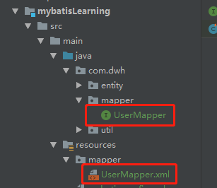
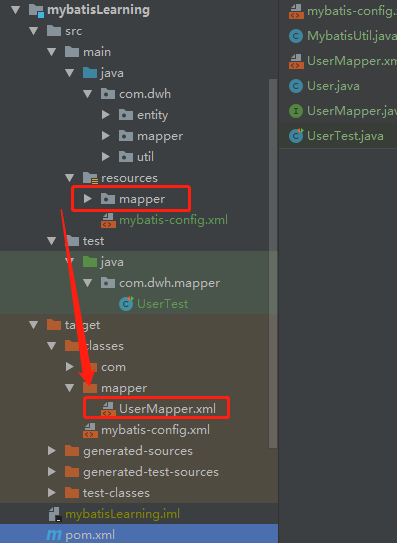
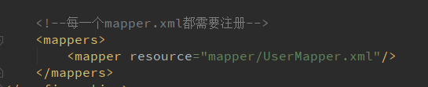

## 步骤

### 一、构建数据库

### 二、引入maven依赖

``` xml
 <!-- https://mvnrepository.com/artifact/mysql/mysql-connector-java -->
<!-- mysql驱动 -->
        <dependency>
            <groupId>mysql</groupId>
            <artifactId>mysql-connector-java</artifactId>
            <version>8.0.25</version>
        </dependency>
        <!-- https://mvnrepository.com/artifact/junit/junit -->
<!-- 测试用 -->
        <dependency>
            <groupId>junit</groupId>
            <artifactId>junit</artifactId>
            <version>4.13.2</version>
            <scope>test</scope>
        </dependency>


        <!-- https://mvnrepository.com/artifact/org.mybatis/mybatis -->
<!-- mybatis包 -->
        <dependency>
            <groupId>org.mybatis</groupId>
            <artifactId>mybatis</artifactId>
            <version>3.5.6</version>
        </dependency>
```

### 三、创建mybatis-config配置文件

```xml
<?xml version="1.0" encoding="UTF-8" ?>
<!DOCTYPE configuration
        PUBLIC "-//mybatis.org//DTD Config 3.0//EN"
        "http://mybatis.org/dtd/mybatis-3-config.dtd">
<!-- configuration核心配置文件 -->
<configuration>

    <environments default="development">
        <environment id="development">
            <transactionManager type="JDBC"/>
            <dataSource type="POOLED">
                <property name="driver" value="com.mysql.cj.jdbc.Driver"/>
                <property name="url" value="jdbc:mysql://192.168.126.3/myDataBase?serverTimezone=Asia/Shanghai&amp;useSSL=true&amp;useUnicode=true&amp;characterEncoding=UTF-8"/>
                <property name="username" value="root"/>
                <property name="password" value="123456"/>
            </dataSource>
        </environment>
    </environments>

    <!--每一个mapper.xml都需要注册-->
    <mappers>
        <mapper resource="mapper/UserMapper.xml"/>
    </mappers>
</configuration>
```

### 四、创建mapper接口类以及Mapper.xml文件



## 问题

1. #### 利用JDBC连接MySQL时提示“08001”错误

   原因：Mysql使用的时区问题，在连接字符串中需要配置ServerTimezone属性，可以用UTC、Hongkong、Asiz/Shanghai等。

   如：dbc:mysql://localhost:3306/MyDB?serverTimezone=Asia/Shanghai

2. config.xml文件中需要对特殊字符进行转义，如`&`需要转义成`&amp;`的形式；

3. 如果mapper.xml等资源文件放置在`java`文件夹下时，在`maven`工程中会报找不到对应的xml资源文件，原因：这是因为`maven`工程构建时对于资源文件、配置文件的路径会默认为resource下；

   maven打包：

   

   xml中mapper注册：

   

   解决方案：在maven配置的pom.xml中添加build标签指定资源文件位置

   ```xml
   <build>
       <resources>
           <resource>
               <directory>src/main/resources</directory>
               <includes>
                   <include>**/*.xml</include>
                   <include>**/*.properties</include>
               </includes>
               <filtering>true</filtering>
           </resource>
           <!--手动配置使java文件夹下的资源文件可以被发现-->
           <resource>
               <directory>src/main/java</directory>
               <includes>
                   <include>**/*.properties</include>
                   <include>**/*.xml</include>
               </includes>
               <filtering>true</filtering>
           </resource>
       </resources>
   </build>
   ```

