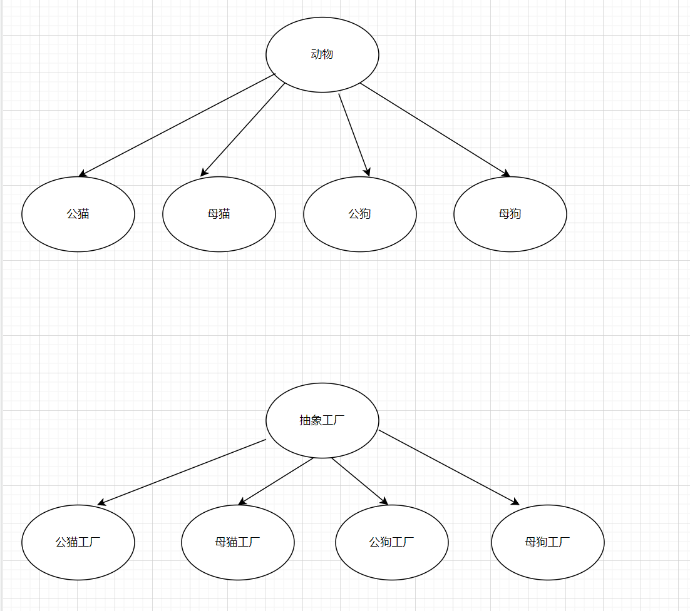
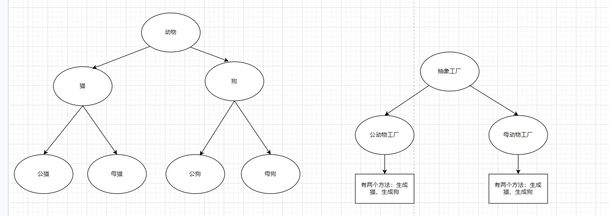

身为写某个服务代码的为服务提供者，使用或调用某个服务的人为使用者。

## 一、简易/静态工厂模式

提供一个具体工厂方法，让使用者通过输入具体类型获取对应产品。

1. 本质--提供一种服务，让使用者通过输入产品类型获取对应产品实例；
2. 使用场景：需要提供获取有相同或相似功能的一批产品或服务时使用。
3. 作用：将`类创建`和`具体类使用`分开，因为使用者只关注获取到具体类之后做什么，而具体类的创建则是提供者需要处理的；
4. 静态工厂模式的设计步骤：
   * 对需要提供的，有相似功能的一批产品进行抽象，抽象出一个父类；
   * 提供一个统一工厂类；
   * 对外提供方法为根据产品类型返回具体产品实例（引用为父类引用）。

```java
//A是具体产品A1、A2的父类
class A{}
class A1 extends A{}
class A2 extends A{}

//工厂类,作用--根据输入类型返回具体产品
class factory{
    public static A get(String type){
        switch type{
            case 1 : return new A1(){}; break;
            case 2 : return new A2(){}; break;
            default: return null;
        }
    }
}
```

## 二、工厂方法模式

定义很多个工厂类，让使用者根据需要调用具体工厂类。

1. 本质：通过对一批产品（具体对象）中，拥有的一系列实际作用相似的功能进行抽象，统一成同一中接口服务提供给外部；
2. 使用场景：
   * 有多个同类产品，彼此有多个相似功能，但相似功能可能方法名，入参等有所不同时，可以考虑使用工厂方法模式。
   * 简易工厂模式的场景也可以使用工厂方法模式，改变一下思路，就是提供者将每一个产品都通过一个具体的工厂实现类去完成创建，使用者则需要自己根据需要调用不同的具体工厂类；
3. 作用：针对不同但功能相近产品，提供统一的操作方法，以及封装了产品创建的步骤；
4. 设计步骤：
   * 对不同产品中的功能进行抽象，抽象出一个父类工厂方法；
   * 实现各种子类工厂方法，在子类工厂中需要完成创建具体产品，适配调用具体产品具体功能；

``` java
//产品A和B都有存放、取出两种方法
class A{
    set(String n1);
    put();
}

class B{
    //B的方法名和入参与A有所不同
    setByType(String n1, String type);
    put(String type);
}

//通用工厂类，用于统一调用A和B的方法功能入口
class Factory{
    set(String n1, String type);
    put(String type);
}

//具体实现的工厂A和工厂B就是用于适配A和B的方法调用的差异
class FactoryA extends Factory{
    private A info;
    set(String n1, String type){
        info.set(n1);
    }
    put(String type){
        info.put();
    }
}

class FactoryB extends Factory{
    private B info;
    set(String n1, String type){
        info.setByType(n1, type);
    }
    put(String type){
        info.put(type);
    }
}
```


## 抽象工厂模式

​	用于优化工厂方法模式下，产品越来越多导致工厂实现类越来越多的情况。具体思考方向为：将产品进行多一层抽象，将第二层抽象标准下同类的产品放到同一个工厂实现类中创建与实现；

​	如：

* 现有宠物店需要卖出猫和狗，两者都是动物（第一层抽象，抽象标准为种族），这时候工厂实现类只需要两个，猫的工厂和狗的工厂；
* 如果现在需要区分公猫、母猫，公狗、母狗，则工厂就变成了四个；如果我们不想工厂太多，则对产品（猫、狗）进行第二次抽象，以性别作为标准；
* 此时工厂按第二次抽象的标准重新定义，新的具体实现的工厂类转变为==生产公的动物的工厂==以及==生成母的动物的工厂==；



简易工厂或者工厂方法下创建的实体类以及工厂类；



抽象工厂方法下的实体类以及工厂类；