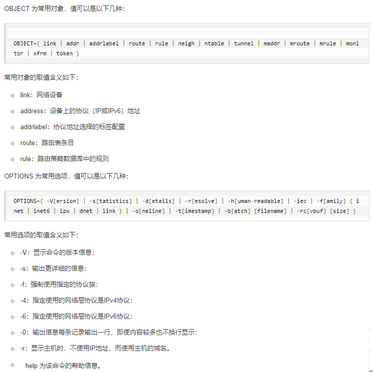

#### ip命令
1. 显示或设置网络设备，是ifconfig代替与加强版
2. 语法：
    ```
    ip [ OPTIONS ] OBJECT { COMMAND | help }
    ```
    
3. 常用：
    * ip link show(或者list)：显示网络设备运行状态信息；
    * ip rout show(或者list)：显示路由表信息；
    * ip address show(或者list):显示设备上的ipv4或v6的地址；
    