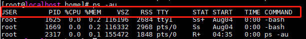
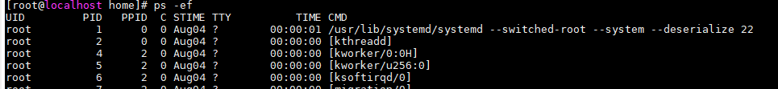

#### PS命令
1. 显示当前进程(process)的状态；
2. 语法： ps [参数]
3. 常用参数：
    * -A：列出所有进程的简略信息；
    * -au：显示较详细的信息；
    * -aux：显示所有包含其他使用者的行程；
4. 输入指令之后显示的各数值含义：
    
    * USER: 行程拥有者
    * PID: 程序ID
    * %CPU: 占用的 CPU 使用率
    * %MEM: 占用的记忆体使用率
    * VSZ: 占用的虚拟记忆体大小
    * RSS: 占用的记忆体大小
    * TTY: 终端的次要装置号码 (minor device number of tty)
    * STAT: 该行程的状态:
        1. D: 无法中断的休眠状态 (通常 IO 的进程)
        2. R: 正在执行中
        3. S: 静止状态
        4. T: 暂停执行
        5. Z: 不存在但暂时无法消除
        6. W: 没有足够的记忆体分页可分配
        7. <: 高优先序的行程
        8. N: 低优先序的行程
        9. L: 有记忆体分页分配并锁在记忆体内 (实时系统或捱A I/O)
    * START: 行程开始时间
    * TIME: 执行的时间
    * COMMAND:所执行的指令
5. 查看**所有进程**的信息：-ef
    * 相关指数为：
    
    * UID： 说明该程序被谁拥有
    * PID：就是指该程序的 ID
    * PPID： 就是指该程序父级程序的 ID
    * C： 指的是 CPU 使用的百分比
    * STIME： 程序的启动日期
    * TTY： 指的是登录终端
    * TIME : 指程序使用掉 CPU 的时间
    * CMD： 下达的指令