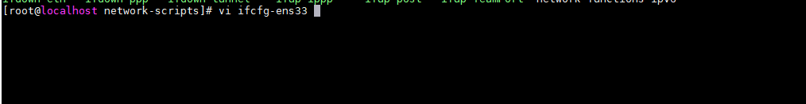
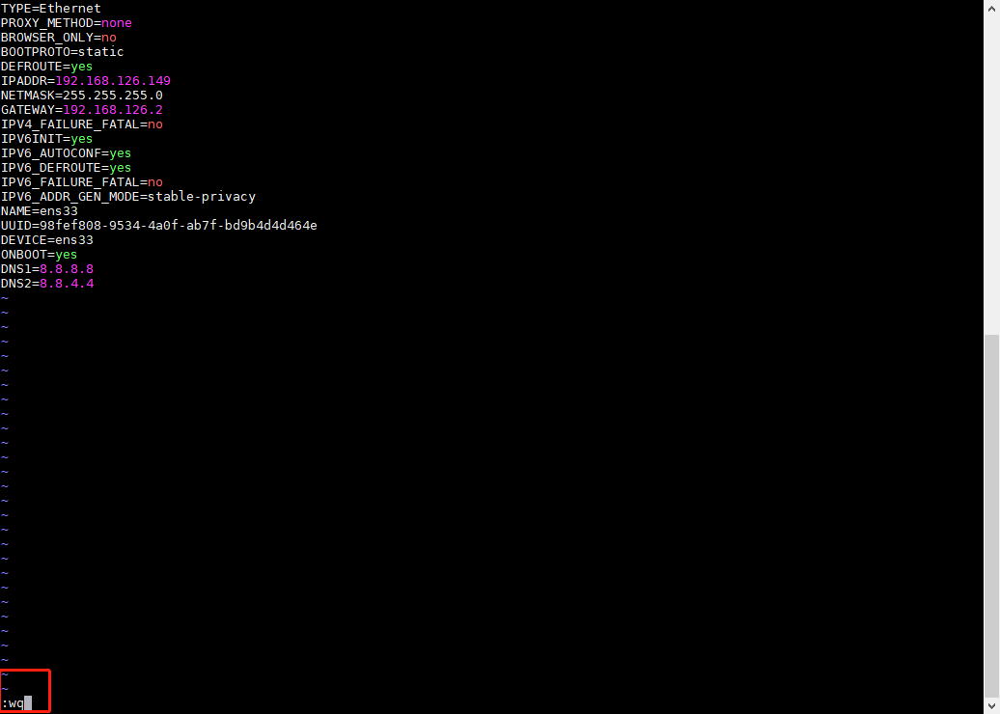

### vi/vim编辑文本

有三种模式：命令模式、输入模式、底线命令模式；

#### 命令模式
1. 使用vi指令打开一个文本文件的时候就会进入命令模式；
2. 该模式下，**输入的每个字符都会被系统当做命令进行解析**；
3. 常用的命令：
    * i ：切换到输入模式，进入编辑文本阶段；
    * x : 删除当前光标所在的字符；
    * ：（冒号），切换到底线命令模式；

#### 底线命令模式

1. 即在文本最下方输入命令的模式；
2. 基本的指令有：
    * q ：退出vi编辑程序；
    * w ：保存文件；
3. 按ESC键退出该模式；
4. 扩展：
    * set number或者set nu可以显示行号；

#### 输入模式
1. 即进入文本编辑模式；
2. 