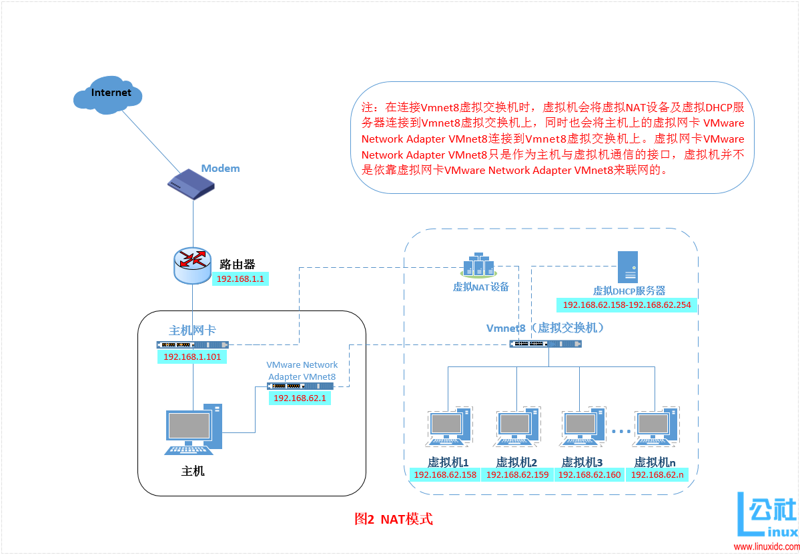
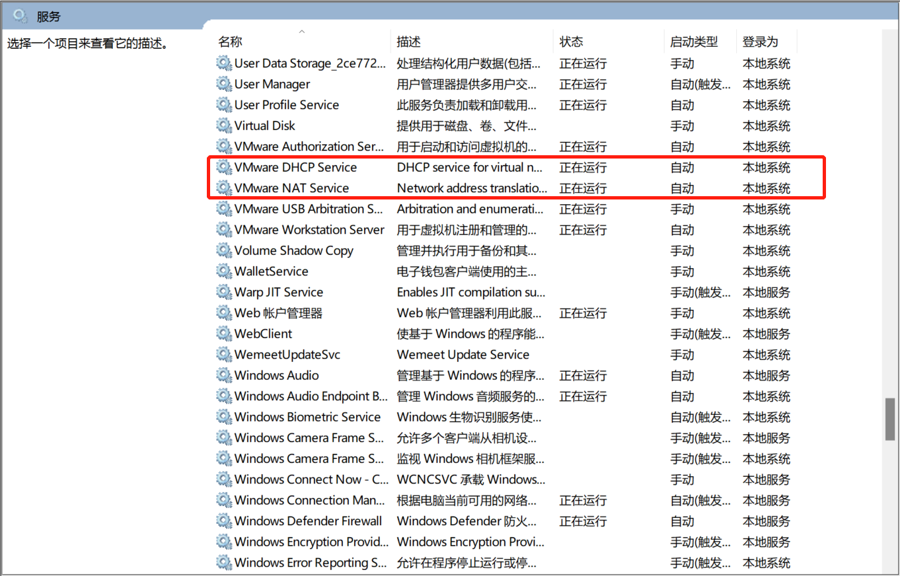
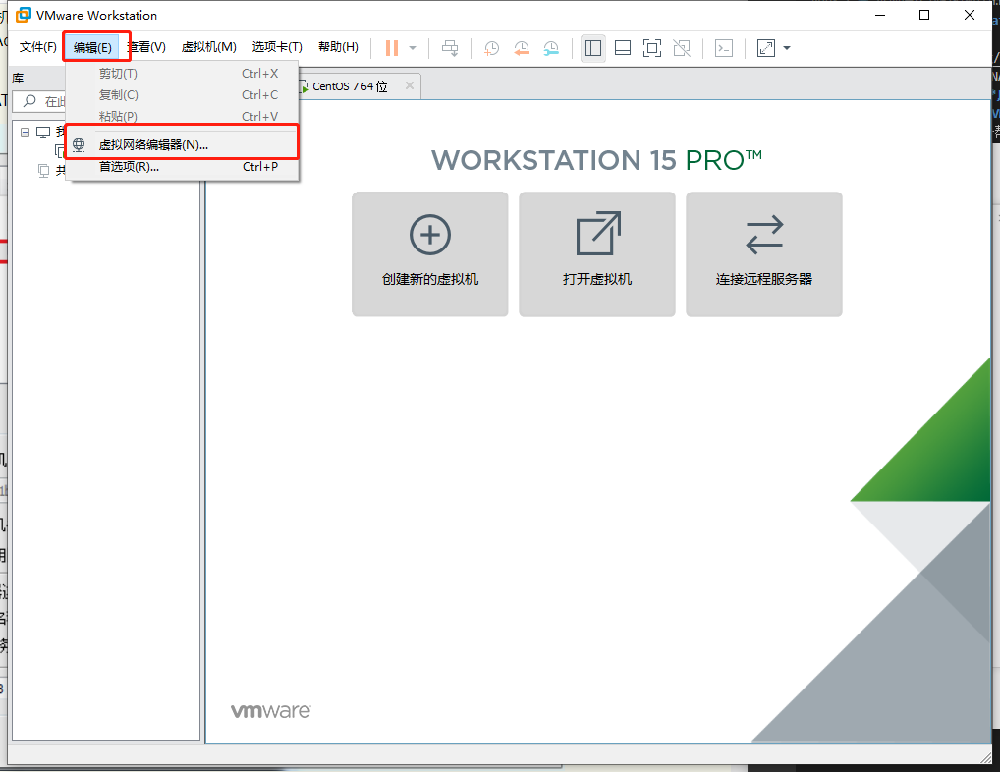
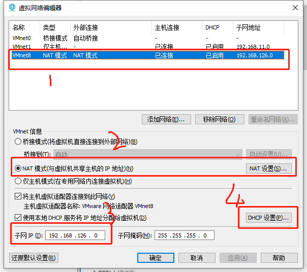
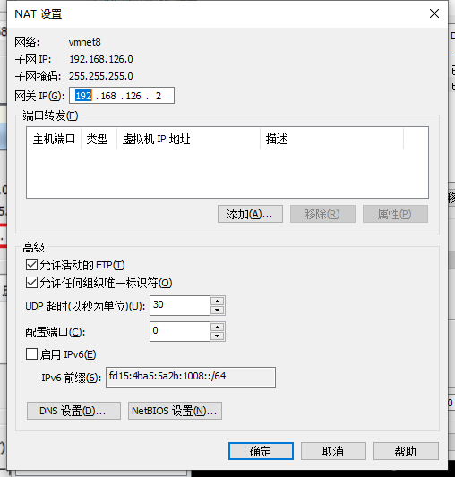
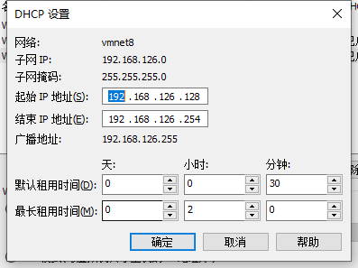
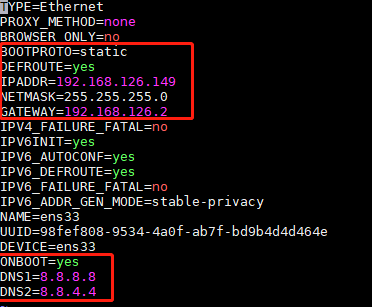
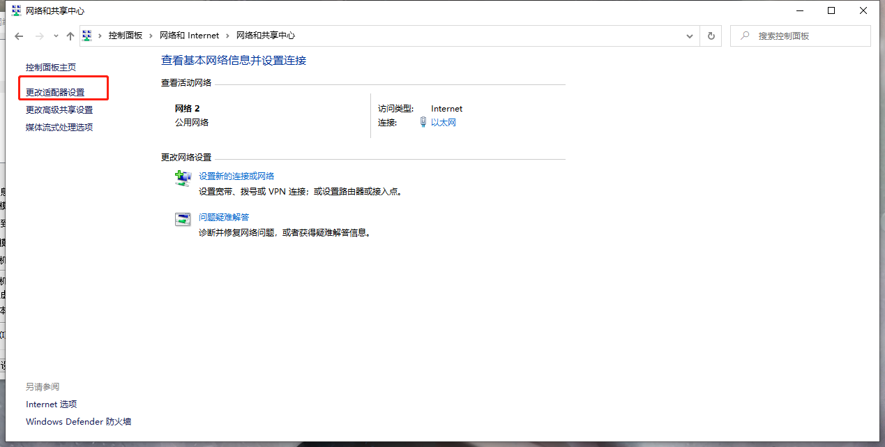
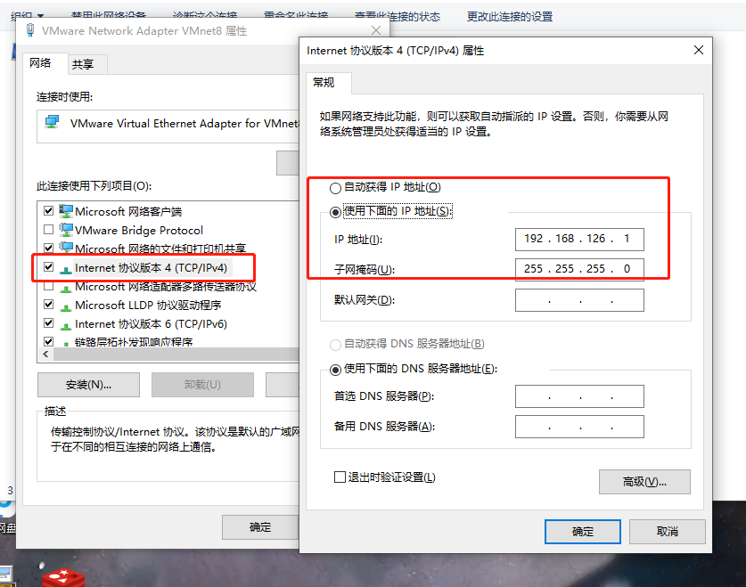
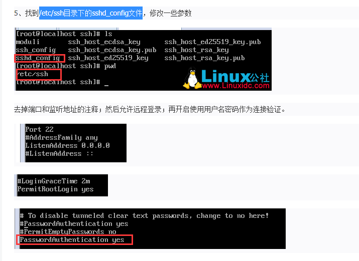

### VMware Workstation NAT联网模式
#### 基本概念

1. NAT模式借助虚拟NAT设备和虚拟DHCP服务器，是虚拟机可以联网；
2. 在图中可以看到**虚拟NAT设备与主机网卡相连**，通过虚拟交换机与DHCP服务器相连，就能实现联网，那为什么还需要**虚拟网卡VMware Network Adapter VMnet8**？
3. 实际上虚拟网卡是帮助主机与虚拟机实现连接的；

#### 开启服务

首先应优先确保电脑中相关虚拟机的网络服务已开启。



#### 实际操作-VMware Workstation

1. 在VMware Workstation的编辑选项中选择虚拟网络编辑器，编辑虚拟交换机，NAT设备与DHCP服务器的信息；
    
2. 进入设置界面
    
    * 第一步选择NAT模式进行进一步设置；
    * 第二步是设置3中的子网IP（一般会有默认，可以自己设置），该IP即规定所有VMware Workstation下虚拟机的子网区域。
    * 第三步，进入NAT设置虚拟NAT
    
    **重点获取其网关地址，后面设置虚拟机中信息需用到**；
    * 第四步，点击DHCP设置，查看IP地址范围
    
    **虚拟机所设置的IP地址将不能超出这个范围**；
3. 在VMware Workstation中配置
    .png)
    .png)

#### 实际操作-Linux中设置
1. 进入/etc/sysconfig/network-scripts路径下；使用vi指令，对其中的ifcfg-ens*（该文件星号*代指数字，每个linux系统可能命名不同）文件进行修改；
    
2. 图中各参数代表含义
    * ONBOOT：是指系统启动时是否激活网卡，默认为no，设置为yes，表示开机启动时激活网卡。
    * BOOTPROTO：网络分配方式，设置为statis静态，方便连接系统
    * IPPADDR：手动指定ip地址，要在DHCP的IP范围中。
    * NETMASK：子网掩码。
    * GATEWAY：网关ip，与NAT的网关一致。
    * dns：DNS；
3. 输入 **service network restart** 命令重启网络配置即可；

#### 实际操作-本机
1. 点击网络和共享中心；
    
2. 点击更改适配器设置，点击其中的VMware Network Adapter VMnet8，点击属性，设置其IPV4的地址
    
    * 其中固定其IP地址在我们虚拟机的子网中（一般写1）；
3. 可以在本机的cmd与虚拟机中互相ping，看是否能联通；

#### 使用ssh连接到虚拟机
1. 首先需要查看虚拟机中的ssh设置；
    * 使用命令：**rpm -qa | grep ssh**可查看**是否安装了SSH**；
    * 修改/etc/ssh目录下的sshd_config文件的配置；
    
2. 开启sshd服务，使用命令**service sshd start**，可通过**ps -ef|grep ssh**查看是否开启成功；或者查看22端口是否被监听，**netstat -an | grep 22**
3. 关闭防火墙：
```
    1、关闭防火墙：sudo systemctl stop firewalld.service

　　2、关闭开机启动：sudo systemctl disable firewalld.service
```

##### 参考：
```
SSH连接：
https://blog.csdn.net/boke7265/article/details/80348143?utm_medium=distribute.pc_relevant.none-task-blog-BlogCommendFromMachineLearnPai2-1.nonecase&depth_1-utm_source=distribute.pc_relevant.none-task-blog-BlogCommendFromMachineLearnPai2-1.nonecase
NAT连接：
https://blog.csdn.net/demo_gsl/article/details/95215372?biz_id=102&utm_term=%E5%A6%82%E4%BD%95%E8%BF%9E%E6%8E%A5%E8%87%AA%E5%B7%B1%E7%9A%84%E8%99%9A%E6%8B%9F%E6%9C%BA&utm_medium=distribute.pc_search_result.none-task-blog-2~all~sobaiduweb~default-6-95215372&spm=1018.2118.3001.4187
NAT原理：
https://www.cnblogs.com/stone94/articles/11165127.html
```