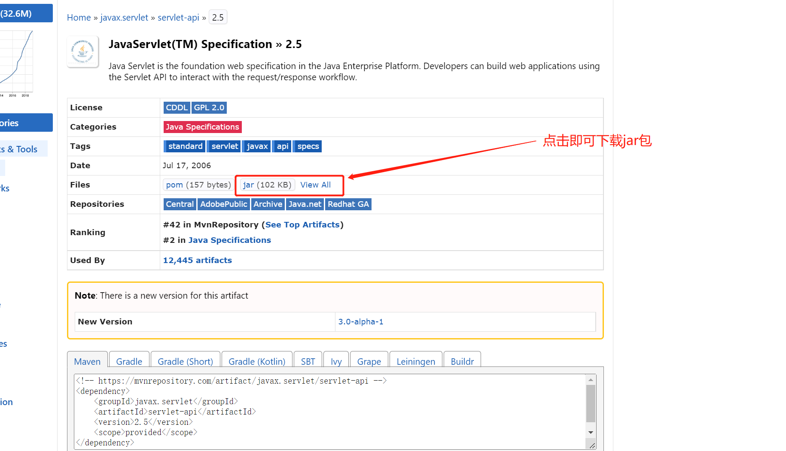

## maven导包失败原因

- 原因：本地仓库中没有对应jar包。
- 排查方式：到本地maven仓库文件夹中，根据依赖路径查找到对应的文件夹看是否有对应jar包文件。如果没有就会显示失败

## 解决方案

- 更换jar包版本
- 更换maven配置的`setting.xml`文件中镜像地址；
- 从maven仓库网站`https://mvnrepository.com/`中找到对应jar包，下载之后，直接丢入本地maven仓库文件夹中。

