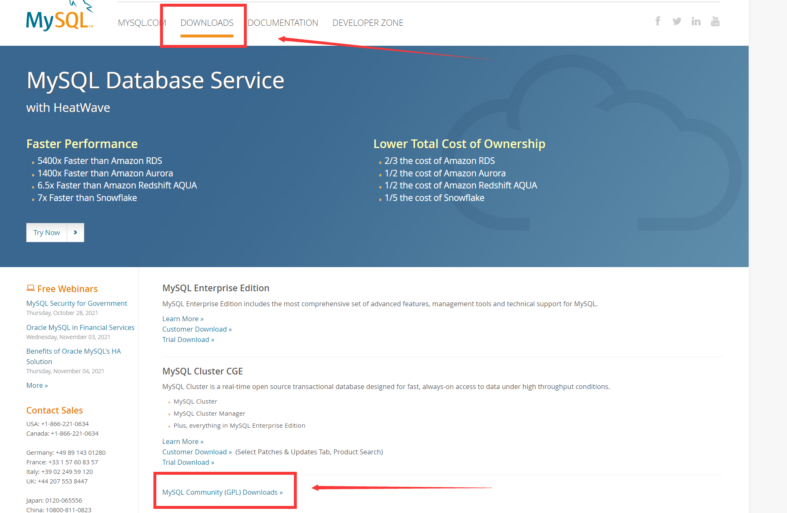
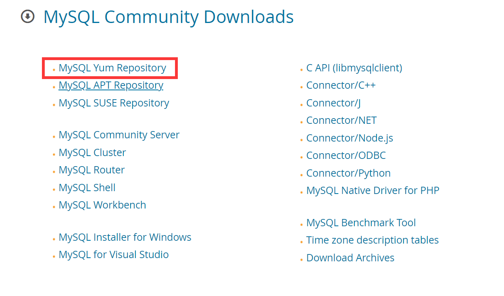
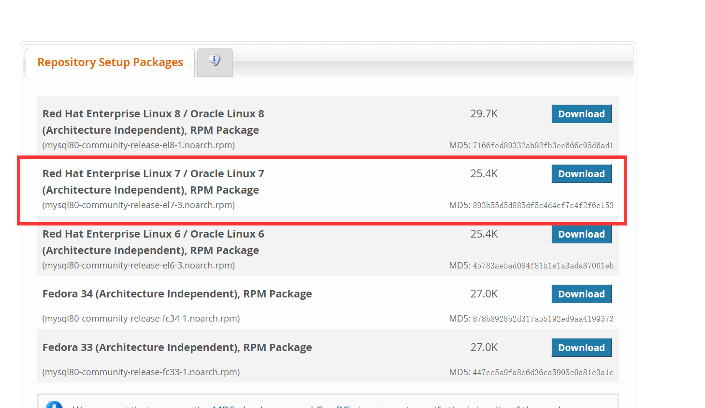
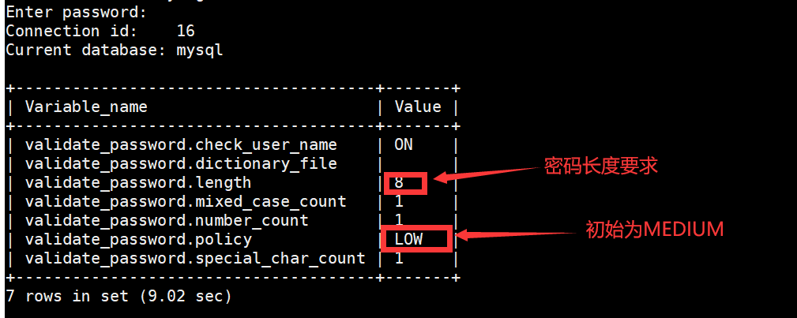
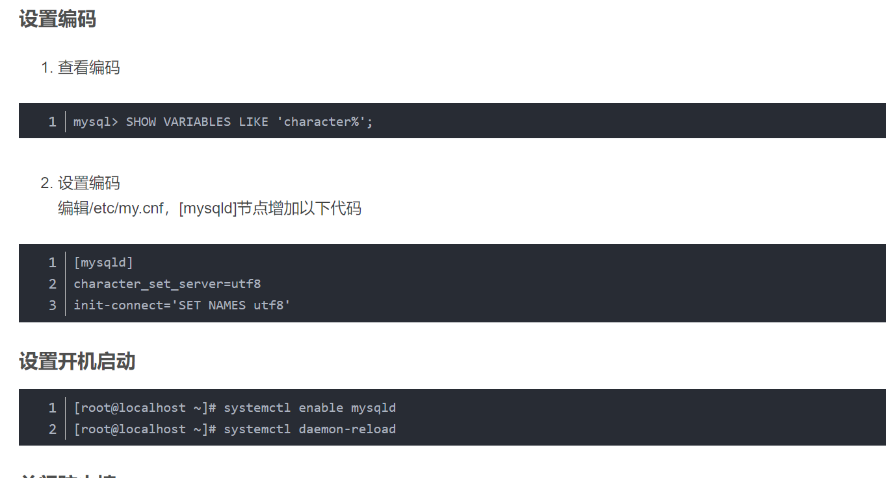
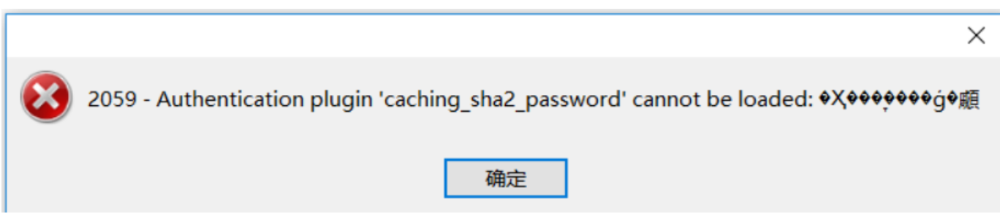

## 在linux上安装mysql

### 一、使用Yum安装

1. 在CentOs linux7下安装，从官网上下载

   

   

   

   下载该文件然后上传到linux主机上。

   2. 输入指令下载

      ``` shell
      wget https://dev.mysql.com/get/mysql80-community-release-el7-3.noarch.rpm
      ```
      
   3. 安装mysql源

      ``` shell
      sudo rpm -Uvh mysql80-community-release-el7-3.noarch.rpm
      ```

   4. 检查是否安装成功

      ``` shell
      yum repolist enabled | grep "mysql.*-community.*"
      ```

   5. 安装mysql

   ``` shell
   sudo yum install mysql-community-server
   ```

   6. 启动Mysql

   ``` shell
   ## 启动
   systemctl start mysqld.service
   ## 查看状态
   systemctl status mysqld.service
   ## 停止
   systemctl stop mysqld.service
   ## 重启
   systemctl restart mysqld.service
   ```

   7. 查看初始密码

      ``` shell
      [root@localhost ~]# grep 'temporary password' /var/log/mysqld.log
      2020-12-06T07:32:41.399112Z 6 [Note] [MY-010454] [Server] A temporary password is generated for root@localhost: Nd<-p!Fxt6A8
      ```

   8. 登录以及修改密码

      ``` shell
      ## 登录指令
      mysql -uroot -p
      ## 然后输入上面的初始密码即可登录
      ```

      * 由于默认密码策略比较复杂，一般要求有字母小写、大写、特殊字符、数字组成（参考初始密码）；

      * 通过==`SHOW VARIABLES LIKE 'validate_password%';`==可查询密码策略；

        

      * 通过命令==`set global validate_password.policy=LOW;`==修改密码等级限制，我们就可以设置简单密码了；

   9. 需要修改登录允许的主机记录为%

      ``` mysql
      mysql> update user set host = '%' where user = 'root';
      ```

   10. 特别设置

       

       ``` shell
       mysql> SHOW VARIABLES LIKE 'character%';
       ### 编码配置
       [mysqld]
       character_set_server=utf8
       init-connect='SET NAMES utf8'
       ## 开机启动
       [root@localhost ~]# systemctl enable mysqld
       [root@localhost ~]# systemctl daemon-reload
       ```

   11. 关闭防火墙

       ``` shell
       # firewall防火墙
       	systemctl status firewalld
       	# 查看转态
       	firewall-cmd --state
       	# 开启
       	service firewalld start
       	# 重启
       	service firewalld restart
       	# 关闭
       	service firewalld stop
       	#注意分清楚linux的版本 命令会有所不同
       	#查看防火墙规则
       	firewall-cmd --list-all 
       ```

   12. 使用Navicat连接报错时

       

       * 原因：mysql8 之前的版本中加密规则是mysql_native_password,而在mysql8之后,加密规则是caching_sha2_password

       * 操作：

         ```
         #更改加密方式
         mysql> ALTER USER 'root'@'%' IDENTIFIED BY 'password' PASSWORD EXPIRE NEVER;
         Query OK, 0 rows affected (0.01 sec)
         #更新用户密码
         mysql> ALTER USER 'root'@'%' IDENTIFIED WITH mysql_native_password BY '密码';
         Query OK, 0 rows affected (0.01 sec)
         
         mysql> flush privileges;
         Query OK, 0 rows affected (0.00 sec)
         ```

         

### 参考

https://blog.csdn.net/qq_41510551/article/details/110731610
https://www.cnblogs.com/wangwangfei/p/13717651.html


