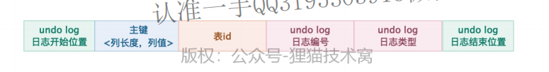

> 用于回滚已执行的SQL语句结果。

## undo log结构

1. 这条`undo log`日志的开始位置
2. 主键各列长度和值
   - 针对操作的表，其主键（可能有多个，联合主键）的具体列名、长度以及值；
   - 没有设置主键也会有默认`row_id`作为隐藏主键；
3. 表id：记录操作哪张表
4. `undo log`日志编号
   - 每个事务中，`undo log`的编号从0开始一次递增；
5. `undo log`日志类型：INSERT操作的日志类型为：`TRX_UNDO_INSERT_REC`;
6. 这条日志的结束位置

