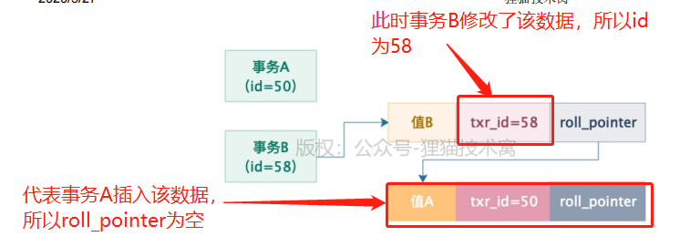
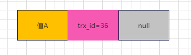
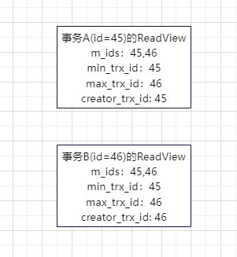
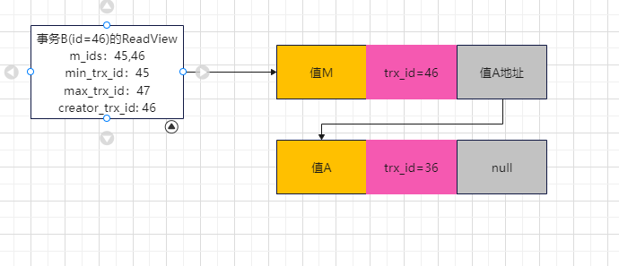
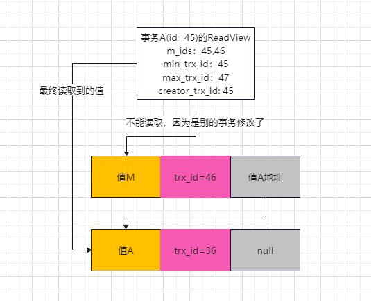
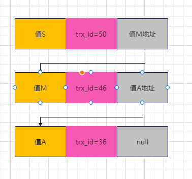

## undo log 版本链

1. 每条数据都带有两个隐藏字段：
   - `trx_id`：最近一次更新该数据的事务ID
   - `roll_pointer`：指向更新该事务之前生成的undo log指针；
2. 示例：

## `ReadView`机制

1. 执行一个事务的时候，就会生成一个`ReadView`；
2. `ReadView`的结构：
   - `m_ids`：一个列表，记录生成该`ReadView`时，有哪些事务ID在`mysql`中还没提交；
   - `min_trx_id`：`m_ids`中最小的事务ID；
   - `max_trx_id`：记录生成该`ReadView`时，`mysql`中下一个要生成的事务ID，即最大事务ID；
   - `creator_trx_id`：当前事务ID；

3. 举例说明

- 现有一个数据如下：

  

- 现有事务A（id=45）和B（id=46）在同一时间发起执行，其`readView`结构如下：

- **情景一：正常事务访问事务发起前已存在的数据**；
  - 如该例中，事务A访问数据。先把数据中的trx_id和自己`ReadView`中的`min_trx_id`进行对比，事务A的`min`更大，说明该数据在本事务发起前就已经存在并完成修改，可直接读取

- **情景二：事务发起后，有另一个事务修改了访问数据**；（m_ids中另一事务修改了值）

  - 比如事务B修改了数据，修改后如下：

    

  - 此时事务A再去访问数据时，先比较数据trx_id是否是在自己`min_trx_id`与`max_trx_id`之间，如果是，则会判断是否是在`m_ids`中，判断是否和自己同时发起执行的事务；
  - 比较后发现值M的`trx_id`在自己的`m_ids`列表中，此时说明该数据是在自己事务开启后被别的事务修改的，该值不能读取。只能沿着`undo log`版本链读取之前的值。

  

- **情景三：事务发起后，有另一个事务修改了访问数据**；（比max_trx_id大）

  - 如果此时有一个事务C（id = 50）修改了数据，此时数据为：

    

  - 此时事务A再去读取数据，发现`trx_id`比自己的`max_trx_id`还要大，说明该条数据已被别的事务修改，自己不能读取，只能顺着undo log版本链推，读取值A。

4. 总结：事务开启后，访问数据时会通过：
   - 第一：判断是否和当前事务ID相同，相同说明是自己修改的，可以读取。
   - 第二：判断数据的`trx_id`是否在自己`readView`中的`[min_trx_id, max_trx_id)`区间中，判断数据是否在本事务开启前提交修改，可读取的。
     - 小于说明在之前，可读取；
     - 大于说明在事务开启后，被别的新事务提交修改，不可读取；
     - 之间需要进入下一步判断；
   - 第三：判断数据的`trx_id`是否在自己`readView`中`m_ids`里列表中，判断是否可读；
     - 在，则说明是本事务开启时还在执行的事务提交的，这也是不能读取的。
     - 不在，说明事务开启时已经提交了，所以是可以读取的。

## 实现RC级别

在事务每次进行读取操作时，都重新生成一个`ReadView`这样就可以保障一致读取到已提交的数据；

## 实现RR级别

事务开启后，每次进行读取操作都使用同一个`ReadView`，这样就能实现可重复读。同时也可根据上述原理，避免幻读（新插入的数据相当于情景三）