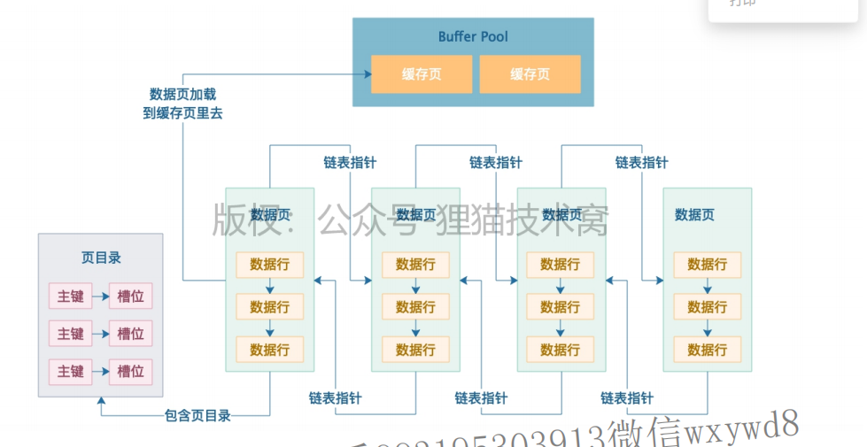
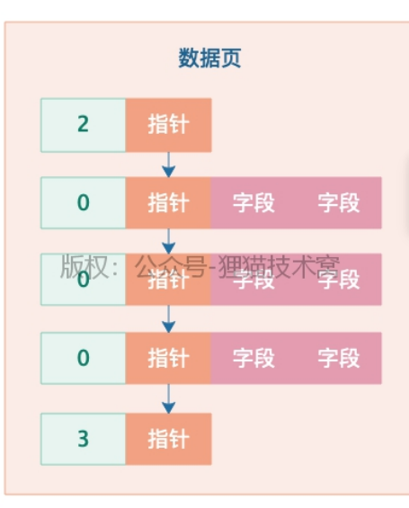

## 数据页结构存储

- 表空间的数据页之间是通过双向链表连接的。
- 单个数据页包含一个页目录，将数据页中存储行数据的位置划分成一个个槽位，页目录负责记录每一个行数据与槽位之间的关系。
- 具体如下图

- 查询一个数据不使用索引的情况下，就是从头将磁盘中表空间的第一个数据页加载到内存中，遍历查询，如果没找到就根据数据页链表继续查询。这就是全表扫描。

## 页分裂

- 一个数据页中，存储大致为（第6篇笔记中数据头中部分内容）：

- 一行数据开头是`行类型`说明
  - 为2说明是数据页中主键最小的一行行数据；
  - 为0就是普通行数据；
  - 为3说明是最大的一行；
- 当一个表空间涉及到多个数据页，并使用自定义增加的主键时，插入一个新数据时就有可能会出现前一个数据页中某条数据的主键大小比新插入的数据大，这时候就不能将新数据插入到后一个数据页中。因为使用主键索引的关键就在于**数据页中数据都是按顺序排序的**，所以此时就需要**重新排序，即页分裂过程**；

如上图中，需要将id=4和6的行数据放入数据页A中，将9和10的放入数据页B中，这就是页分裂（**实际上就是重排序的过程**）；