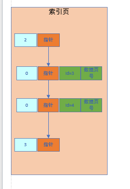

## 数据页结构存储

- 表空间的数据页之间是通过双向链表连接的。
- 单个数据页包含一个页目录，将数据页中存储行数据的位置划分成一个个槽位，页目录负责记录每一个行数据与槽位之间的关系。
- 具体如下图


- 查询一个数据不使用索引的情况下，就是从头将磁盘中表空间的第一个数据页加载到内存中，遍历查询，如果没找到就根据数据页链表继续查询。这就是全表扫描。

## 页分裂

- 一个数据页中，存储大致为（第6篇笔记中数据头中部分内容）：


- 一行数据开头是`行类型`说明
  - 为2说明是数据页中主键最小的一行行数据；
  - 为0就是普通行数据；
  - 为3说明是最大的一行；
- 当一个表空间涉及到多个数据页，并使用自定义增加的主键时，插入一个新数据时就有可能会出现前一个数据页中某条数据的主键大小比新插入的数据大，这时候就不能将新数据插入到后一个数据页中。因为使用主键索引的关键就在于**数据页中数据都是按顺序排序的**，所以此时就需要**重新排序，即页分裂过程**；


如上图中，需要将id=4和6的行数据放入数据页A中，将9和10的放入数据页B中，这就是页分裂（**实际上就是重排序的过程**）；

## 索引页

- 实际上**索引数据是单独存储在独立的数据页**中；

#### 1.主键索引页-聚簇索引

- 主键索引页中仅保存一个数据页中**最小的主键ID**以及这个**数据页的指针**。

  

- 当表数据量大，上述索引页增多之后，就需要抽出上层方便根据id遍历查询到对应索引页再找到数据页，如下图：


- 有层级之后，由上到下逐层向下查找对应索引页；由此便形成了一颗B+树；

- 由于索引页中有指针指向对应数据页，所以实际上数据页就是整个B+树的叶子结点。所有索引页+数据页组成的B+树就是聚簇索引。
- 最底层的索引页之间是有相互指针组成链表的。如下图
- 

#### 2.其他字段组成索引

- 以主键以外的其他字段构建索引树时，和聚簇索引类似，但是仅存放主键的值以及索引字段的值。


- 根据这个索引查找数据的过程如下：
  - 先通过索引字段在对应索引B+树中查找到对应索引页，获取对应数据的主键ID；
  - **回表查询**：通过上面查到的主键ID，到聚簇索引树中根据主键查询到对应的数据页；
- 因为要进行两次索引树的查询，所以主键以外的索引称为二级索引。
- 如果有多个字段共同构成一个索引，原理也是类似，不过在形成索引树的时候，举例对`name+age`两个字段构建索引，索引页中数据排序先按`name`字段的大小进行排序，相同时再按`age`排序。


## 多索引的缺点

- 由于维护B+树索引是需要索引页，页与页之间、页内的数据都是有序的，在增删改操作的时候，是需要对应索引页中数据进行调整挪移的。
- 每一个索引就是一颗单独的b+树，过多的索引，会对空间存储占用有很大压力。


## 索引使用匹配规则

- 等值匹配规则：
  - 当查询条件中查询的字段包含表索引中所有字段，并且都是基于等号的。
  - 这时候即使**查询语句中字段顺序与定义的索引中字段顺序不一致也没关系**，优化器会自动优化成按索引的字段顺序查询

- 最左侧列匹配规则

  - 当查询语句中查询条件仅包含部分联合索引字段时，需要包含最左侧字段才会使用该联合索引。

    ```
    联合索引：index(name, age, high)
    查询条件：
    	where name=.. and age = ..  可以使用到联合索引
    	where age = .. and high = .. 不能使用到联合索引
    ```

- 最左前缀匹配原则

  - 当查询条件中使用了`like`进行模糊查询的时候，必须是使用右模糊，例如：`like 李%`；因为索引中，存储字段值只能是通过右模糊去进行范围查询的。

- 范围查找规则

  - 如果where语句中有范围查询，那只有对联合索引里，最左侧列进行查询的查询条件会使用到索引。

    ```
    联合索引:index(name, age, high)
    查询条件：
    	where name > '1' and age < '10'
    	这里只有name这个查询条件使用索引，age这个不使用索引
    ```

- 等值匹配+范围匹配规则

  - 就是对联合索引的左侧字段进行精确等值查询，右侧后面的字段进行范围查询

  ```
  联合索引:index(name, age, high)
  查询条件：
  	where name = '1' and age < '10' and high > 10
  	这里name字段先通过索引精确定位，然后age使用索引进行范围查询到一波数据，但是high不能使用索引。
  ```


## 在order by中使用索引增加效率

- `order By`中字段都按照索引定义的字段顺序进行编写
- 其中字段要一起倒序，或者正序排序才能使用索引
- 感觉只能是只有`order by`的时候才能使用索引。例如：`select * from table order by a, b, c`


## 在group by中使用索引

- 与`order by`类似，也是按索引定义的字段顺序进行分组才能使用索引。
- 原理：**利用索引针对数据进行排序的特性，节省查询出数据之后在内存中重新排序、执行聚合等操作的时间**