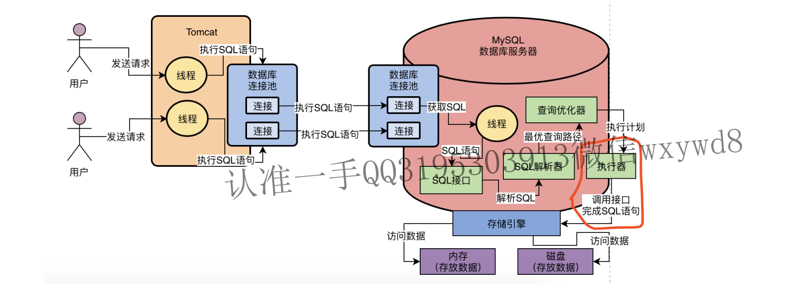

# MySQL执行组件

## 一、MySQLl驱动

​	mysql提供给各类程序用于对mysql服务端发起和建立网络连接的工具；在==**程序端使用**==；

## 二、MySQL数据库连接池

 1. 程序的数据库连接池：==在程序端==，用于管理程序发起mysql请求的网络连接；

 2. **MySQL服务端的数据库连接池**：==在MySQL服务端==,用于管理各类系统发送过来的连接请求；

    

	3. 网络连接处理请求的时候，必须分配一个线程去处理，由一个线程监听和读取请求；线程读取请求之后需要通过==SQL接口==交给MySQL内部程序去执行SQL语句；

## 三、 SQL接口（执行入口）

1. 是一套执行SQL语句的接口，专门用于执行发送给MySQL的增删改查的语句；
2. 在工作流程中的位置：==MySQL的工作线程==接收到请求的SQL语句之后，调用SQL接口执行SQL语句；

## 四、查询解析器（执行前准备）

​	SQL解析器：相当于编译器，将SQL语句根据语法转换成`MYSQL`可执行的指令；

## 五、查询优化器（执行前准备）

​	将SQL语句的执行步骤进行最佳优化，==指定执行计划==，如：

```
    select r1, r2, r3 from user where r1 = 1;
    执行该sql语句的步骤有多种，如：
    第一种先找出r1=1的记录，再获取对应记录的r1,r2,r3字段的值返回；
    第二种先查出所有记录的r1,r2,r3的字段值，然后根据r1=1进行筛选；
    查询优化器的作用就是通过将SQL执行步骤进行排序优化，获取最佳最快的执行方式
```

## 六、执行器

​	负责根据优化器给出的执行计划步骤调用`mysql`的存储引擎的接口

## 七、存储引擎

​	负责访问存储在内存与硬盘中的数据，做查询、更新==存在内存或者硬盘==的数据等操作；



总结：

- 服务器请求访问mysql；
- mysql服务器接收到请求后生成线程A处理该请求；
- **开启**：线程A根据请求，通过调用本机服务器中的mysql服务的==执行接口==，传入请求中的SQL语句，**开启**mysql相关服务；
- **转换**：正式执行SQL语句前，==执行接口==会去调用==SQL解释器==将SQL语句根据语法**转换**成`MYSQL`可执行的指令；
- **优化**：==SQL解释器==解析完成后，会将指令发送到==查询优化器==，将SQL指令进行最优查询路径排序**优化**；
- **执行**：优化完成后，交给==执行器==将指令按执行计划步骤**执行**；
- **访问**：==执行器==调用mysql服务中最底层的存储引擎的接口去访问服务器硬盘中的数据完成执行计划；

