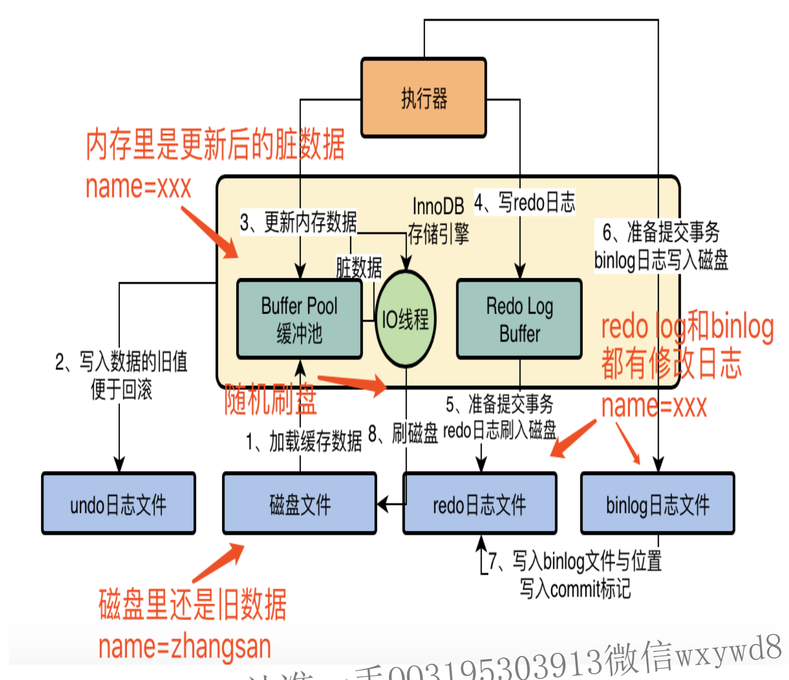

## InnoDB存储引擎的更新操作

#### 第一步（提交事务前）

==加载数据到内存==：`mysql`服务器内存中会有`mysql`的`缓冲池`，更新数据前需要如果对应数据不存在缓冲池中，则需要从硬盘中加载数据，**并对对应数据加上独占锁**；

#### 第二步（**提交事务前**）

==写undo日志==：将更新的新值写入到undo日志文件中，方便**回滚数据**的需要；

#### 第三步（**提交事务前**）

==更新缓冲池中的数据==，执行这步之后，由于**内存中的数据和磁盘中的数据并不一致**，所以内存中的新数据称为**脏数据**；

#### 第四步（**提交事务前**）

==写Redo Log Buffer==：首先需要知道两个概念

* `redo log日志`：`InnoDB`存储引擎**专有**的记录==数据修改操作==的日志；
* `Redo Log Buffer`-->是`redo log日志`在内存中的缓冲；
* 写`redo log日志`是需要先写入`redo log buffer`，即**先写内存中，再按策略更新到磁盘中的文件里**；
* `redo log`将内存刷入磁盘的策略；通过配置`innodb_flush_log_at_trx_commit`的值确认；
  * `等于0`：提交事务时不会将日志刷入磁盘中，可能会导致丢失数据操作记录；后续按定时刷入。
  * `等于1`：提交事务时必须将日志输入磁盘中，**只要事务提交成功，则磁盘中redo log一定刷新了**；
  * `等于2`：提交事务时，会将日志写入到`os cache`缓存（同样在内存中）中，随后某一时刻再写入；
  * 一般选择等于1的策略，确保提交事务之后，操作记录不丢失；

#### 第五步（提交事务时）：

==刷入redo log日志==：将`redo log日志`**根据策略**刷入磁盘中；

#### 第六步（提交事务时）：

==写binlog日志==：提交事务的同时，将`binlog日志`写入磁盘中的日志文件中；

* `binlog日志`是`mysql`服务自己的日志文件，而`redo log日志`是`InnoDB引擎`特有的；
* `binlog日志`称为**归档日志**，偏逻辑性，内容为：**对表中某一数据进行了什么操作，操作后的值为xxx**；而`redo log日志`偏物理性质，内容为：**对哪个数据页进行什么操作**，更注重在重做时提供操作指引；
* `binlog日志`刷盘策略：通过`sysnc_binlog`参数控制，默认为0
  * 为0时，先进入`os cache`内容缓存中，再刷入磁盘文件；
  * 为1时，则在提交事务时，强制将日志文件内容刷入磁盘中；

#### 第七步（事务提交后）：

==将commit标记写入redo log日志中==：将更新对应的`redo log日志`的文件名称以及`binlog日志`在文件中的位置写入到`redo log日志`中，并在其后写入一个`commit标记`；最后的这个commit标记是**事务成功提交**的标志；

> 事务提交之后，缓存池中的数据并没有直接更新到磁盘中，而是会有一个后台IO程序随机将脏数据刷新到磁盘中；如果此时mysql宕机也没关系，重启之后会根据**redo日志恢复之前的修改**，把修改重新恢复到内存中，再等待IO线程刷新到硬盘中；

- `Mysql`系统自带日志：`undo log`（负责回滚），`binlog`（负责记录事务）；
- `Innodb`引擎生成的日志文件：`redo log`（主要为恢复事务提供指引）；
- `redo log`有三种刷新到磁盘的策略，而`binlog`是两种；
- `os cache`是日志缓存区，`redo log`以及`binlog`都有策略会选择该缓存区先缓存日志，后续IO随机刷新入磁盘中。
- 如果事务还没执行，`Mysql`服务奔溃了，怎么办？此时`redo log`以及`binlog`都是**不会刷新到磁盘中**，因为他们最多都是**提交事务时才写入磁盘**，此时肯定是会丢失该操作，`mysql`恢复也不会恢复该记录（因为事务未提交）。没关系，我们程序会收到执行报错的信息，就知道语句执行有误，可从业务上重新执行。
