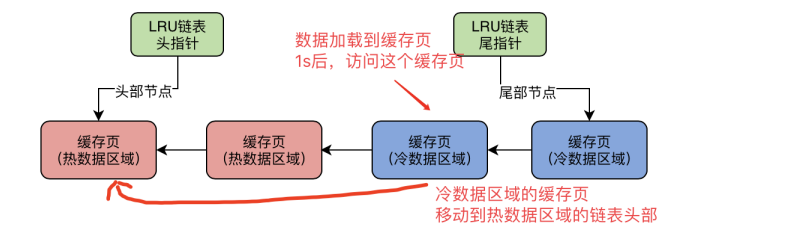

### 一、 缓存命中率

​	数据页进入到Buffer Pool的缓存页之后，接下来的请求需要访问该缓存页的概率；用来评价缓存页的利用率高低。

### 二、 LRU链表

1. **作用**：

   `Buffer Pool`需要及时将flush链表中缓存页数据刷新到硬盘中才有空闲的缓存页提供给后面的访问进行操作；这时就需要`LRU`链表来记录哪些缓存页经常被访问以及很少被访问，从而安排利用率低的缓存页==优先==刷新到硬盘中并释放出来。

2. **工作原理**：

   * 也是由数据描述块的两个指针组成双向链表实现的。

   * 链表头部一定是最近被访问最多的缓存页，链表尾部为最近最少被访问的缓存页

   * 一是在新的数据页读取到缓存页时，会将这个新被使用的缓存页放入到`LRU`链表的头部；
   * 二是在访问或修改了某一个缓存页，则会将这个缓存页放到`LRU`链表头部。

### 三、简单LRU链表的弊端

1. `Mysql`的预读取机制会导致过多利用率低的数据页缓存到`Buffer Pool`中，导致原有`LRU链表`中经常访问的缓存页在某个时间点放到链尾，然后被回收；
2. `Mysql`的全表扫描（select查询不加条件限制）导致过多数据加载到`Buffer Pool`中，导致类似与第一点一样的结果。
3. 触发预读取机制的场景：
   * `mysql`的配置文件中有`innodb_read_ahead_threshold`参数，默认值为56,；作用是，当顺序读取一个**区**（`mysql`存储的物理概念）的文件数量超过这个阈值时，就会触发预读取机制，将相邻区中所有数据页都加载到缓存页中。
   * 配置文件中有参数`innodb_random_read_ahead`，默认值为`OFF`，控制如果`Buffer Pool`中缓存了同一个区的13个连续的数据页，且这些数据页经常被访问，则会触发预读取机制，将这个区其他数据页加载到缓存中。

4. 预读取机制的意义：提升性能，因为顺序读取同一个区某几个数据页之后，可能会继续顺序读取接下来的数据页，所以预读取减少IO操作；

### 四、冷热分离的LRU链表

1. 实际实现的`LRU`链表是分成两部分，一是热数据，二是冷数据；通过`innodb_old_blocks_pct参数`控制冷热比例，默认是37，即37%为冷数据；

2. **数据页记载到缓存页时**：当数据页第一次加载到缓存页时，会将该缓存页放入到冷链的头部；

3. **冷链数据移动到热链**：`MySQL`制定了一个规则，当该缓存页放入冷链头部==1秒==之后，如果有请求访问该缓存页，则将该缓存页移动到热链头部；

   

4. 一般预读取机制以及全表扫描加载的缓存页放入到冷链中之后，在1秒内会访问以及操作结束，所以不会放入到热链中。

5. **热链数据到冷链中**：实际上热链和冷链是连在一起的，热链在前冷链在后，所以热链数据时间久了之后也会被推到冷链中。

### 五、刷新缓存机制

1. **情形一**：`Mysql`通过一个后台程序将数据定时的从`LRU链表`的末端（即冷链末端）将数据刷入磁盘中，`free链表`增加，`LRU链表`和`Flush链表`减少；
2. **情形二**：同时情形一中的后台程序也会在空闲时，将`flush链表`中的缓存页（同时也是`LRU链表中的缓存页`）刷入磁盘中。避免`LRU链表中`**热链**的缓存页一直不刷新到磁盘中。
3. **情形三**：`Free链表`为空，这时在加载新数据页到缓存页中时，会触发情形一的操作。