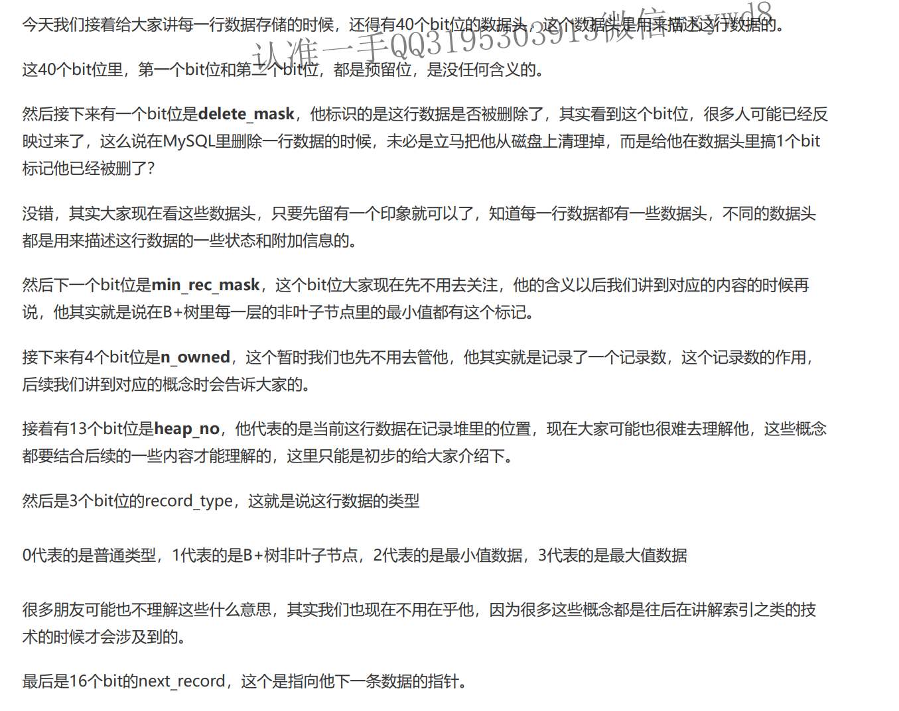
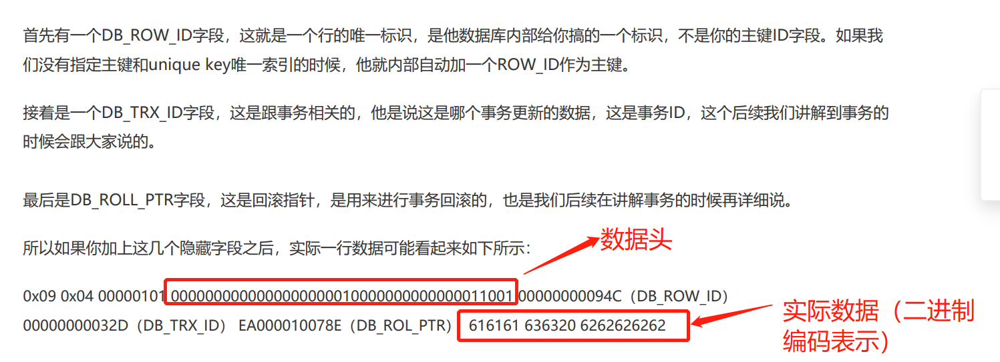

## 一、物理存储空间概念

1. 表空间、数据区、数据页

2. 内存执行数据操作的意义：磁盘随机读写效率慢，IO频繁，对高并发请求处理能力差；

3. 使用数据页读写的意义：

   数据页包含多行数据，而一次SQL语句操作可能不止对一行数据进行操作，所以数据页可以减少读写多行数据的次数从而增加效率；

## 二、一行数据的存储方式

1. **行格式**的概念：一个表的每一行数据如何存储；在定义表或修改表的时候可以进行定义，例如下面定义`COMPACT`格式：

   ```sql
   CREATE TABLE table_name (columns) ROW_FORMAT=COMPACT
   ALTER TABLE table_name ROW_FORMAT=COMPACT
   ```

   > 以下学习均以COMPACT行格式为准（其余的也差不多），大概格式类似如下：
   >
   > 变长字段的长度列表，null值列表，数据头，column01的值，column02的值，column0n的值......

2. `mysql`的物理存储中，同一张表的==多行数据都是紧挨着存储==的；

### ==下面只学习了变长字符串字段类型情况，其他类型（如：整型等）未涉及==

## 三、变长字符串类型存储

1. **背景**：由于多行数据都是紧挨着存储的特性，当一张表定义有变长字符串（字符实际长度按实际值决定）与定长字符串交互出现时，单纯顺序读取时无法分清实际存储某个字符的长度。

2. **方案**：在实际值存储前引入变长字段的长度描述。

3. **实现**：根据实际值的长度，使用十六进制记录长度；

   如，定义一个变长字段`MSG` 类型为：`VARCHAR(10)`，有一行数据该`MSG`字段的值为`Hello`，这里实际字段值长度为5，所以存储时为：`0x05 null值列表 数据头 Hello 其他字段的值....`;

4. **当有多个变长字段时**：

   变长字段列表按定义时的顺序==倒序==存储实际的`字段值长度`;如：

   ```
   一行数据有VARCHAR(10) VARCHAR(5) VARCHAR(20) CHAR(1) CHAR(1)，一共5个字段，其中三个是变长字段，此时假设一行数据是这样的：
   	hello hi hao a a
   在磁盘中存储为：
   	0x03 0x02 0x05 null值列表 头字段 hello hi hao a a
   ```

## 四、NULL值的存储方式

1. 使用==bit位==存储；以表定义中允许为`Null`的字段组成==Null值列表==，当具体某条记录中，某个字段为NULL时，`Null值列表`中对应字段为1，==为0代表不为Null==。==逆序存放==。

2. 举例：

   * 有一表定义如下：

     ```sql
     CREATE TABLE customer (
     name VARCHAR(10) NOT NULL,
     address VARCHAR(20),
     gender CHAR(1),
     job VARCHAR(30),
     school VARCHAR(50)
     ) ROW_FORMAT=COMPACT;
     ```

     

   * 有以下一行记录：

   | name | address | gender | job  | school     |
   | ---- | ------- | ------ | ---- | ---------- |
   | jack | null    | m      | null | xxx_school |

   * 其中name定义为`Not Null`，其他字段允许为`Null`，所以其`Null值列表`有四个字段（address、gender、job、school）；且除了gender外均为变长列表。

   * 该记录的Null值列表为：`0101`（逆序存放）;而且实际存储中，该列表是按一个字节(8Bit)存储，需要==高位补0==，所以实际为：`00000101`

   * 结合上文变长字段，实际该记录完整记录格式类似：

     ```
     0x09 0x04 00000101 头信息 column1=value1 column2=value2 ... columnN=valueN
     ```

   * 疑问：类似开头`name`字段定义为`NOT NULL`，如果定义时夹杂在允许为Null的字段中，那存储的时候，如何根据`null值序列`区分出来？
   * 思考：应该是还需要进行额外判断分析的，不过讲解中没有这么深入，简单理解即可；而且除了字符串类型，别的类型也没有介绍存储方式，所以只是简单理解即可。

## 五、数据头（有40位bit，简单了解）



| 预留位 | delete_mate | min_rec_mask | n_owned | heap_no | record_type | next_record |
| ------ | ----------- | ------------ | ------- | ------- | ----------- | ----------- |
| 2位    | 1位         | 1位          | 4位     | 13位    | 3位         | 16位        |

## 六、隐藏字段

在数据头后、实际数据前会存有几个隐藏字段：


