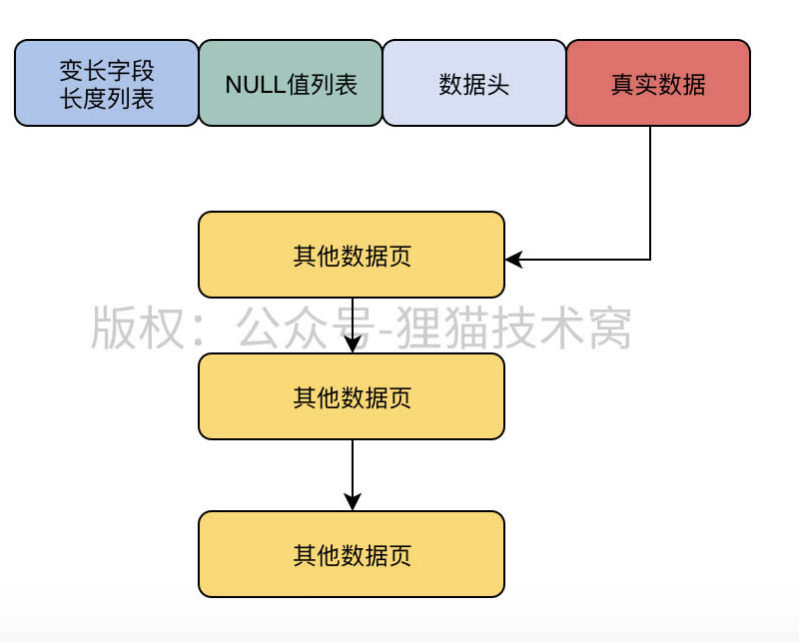

## 行溢出

1. 背景：`mysql`是以数据页为单位存储数据的，一个数据才`16KB`大小，如果有某一个字段某一行数据的大小大于`16KB`，那一个数据页是放不下该行数据的；

2. 处理方式：同样是在一个数据页中存放该行数据，但是针对==占用空间大的字段==仅包含其一部分数据，同时包含一个`20个字节的指针`，指向其他数据页，其他数据页之间通过链表连接，这样就将一个特大字段值分担到多个数据页中存储。

   

   