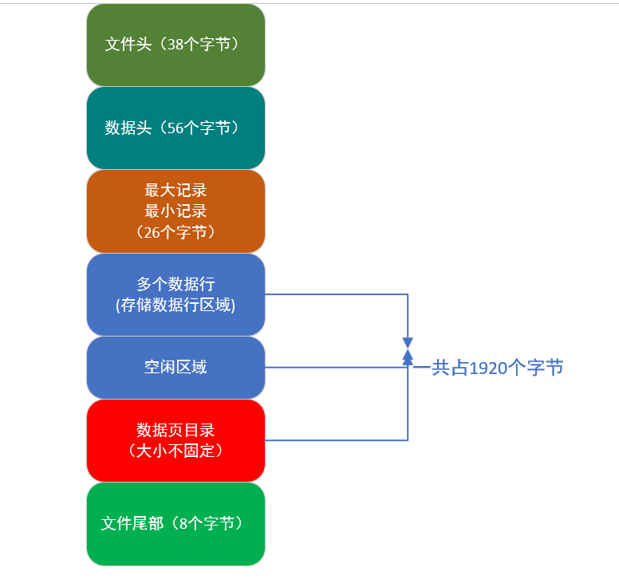

## 一、硬盘存储数据的一些概念

1. **表空间**：在`mysql`中定义的表，在磁盘中都对应一个物理数据文件：`表名ibd`；所谓表空间对应的就是这个磁盘数据文件。
2. **数据区**（`extent`）：在表空间中存储大量的数据页，不方便管理，所以引入数据区的概念，实际上数据区就是对应连续的**64个数据页**；
3. 表空间、数据区、数据页之间的关系：一个表空间包含多个数据区，将**256个数据区**分为一组（`1MB`的空间大小）；一个数据区中包含64个数据页；
4. 表空间的第一组中第一个数据区的前3个数据页存放固定的数据，主要是一些描述性数据，比如存放表空间和这组数据区的一些属性等。

## 二、 数据页的结构

1. 一个数据页有`16KB大小`，但`16KB`的空间不都是用来存放大量数据行，还需要存放一些特殊信息结构；
2. 大体上，数据页由：文件头、数据页头、最小记录和最大记录、多个数据行、空闲空间、数据页目录、文件尾部这些模块组成；

