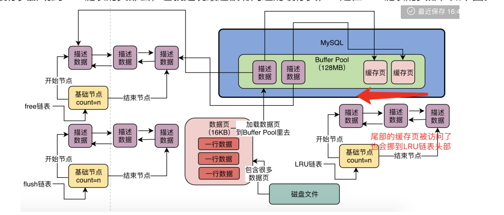

# MySql的Buffer Pool

### 作用：缓存磁盘的真实数据，执行数据库的增删改查等操作的主要区域

### 配置

1. 通过`innodb_buffer_pool_size = xxxxx`进行大小配置，默认情况下是`128MB`（2的7次方）

## 一、buffer pool中的数据组成

### 数据页：mysql抽象出来的数据单位

1. 一个数据页中存放很多行数据；当需要更新或者查询时，就会找到对应数据所在数据页，将整个数据页加载到内存buffer pool中；
2. 默认情况下，一个数据页大小为`16KB`，磁盘和buffer pool中存放的大小一致；
3. `buffer pool`中存放的数据页称为：`缓存页`；

### 描述数据块

1. 每一个`缓存页`对应一个描述数据块，用来描述缓存页的信息；
2. 描述信息包含数据页所属表空间、编号、在`buffer pool`中的地址等信息；
3. 描述数据块大概相当于缓存页5%左右大小，即800个字节左右；所以`buffer pool`实际上会大一些，因为还需要存放缓存页的描述信息；

## 二、初始化

1. 根据设置的`buffer pool`大小，向操作系统申请稍大一些的内存空间（存放描述数据块）；

2. 根据16KB缓存页以及800字节左右描述文件大小，划分buffer pool中空间；

   

## 三、Free链表

1. 作用：记录哪些缓存页是空闲的；
2. 是一个双向链表数据结构，每一个节点存放空闲的缓存页对应的`描述数据块`的地址；每个节点都会连接自己前后节点；
3. 实际上`free链表`不是独立存储的，具体实现为：`描述数据块`中有两个指针（`free_pre`和`free_next`）
4. 有一个基础节点，该节点引用链表的头节点和尾节点，**记录了链表中有多少个节点，即多少个空闲缓存页**；（别的节点都为描述数据块）
5. 加载新数据页的过程：从`free链表`中获取一个空闲数据描述块，将磁盘中的数据页加载到其对应的缓存页空间中，并写入描述数据到该数据描述块中，然后从free链表中去除。
6. 增删改查操作过程：查看数据页是否有被缓存-->有则从内存中获取，没有则走第5步中的加载流程；
7. 判断数据页是否被缓存方法：数据库中有一个`哈希表数据结构`，用表空间和+数据页号作为key，缓存页地址作为value；所以判断方法为通过key到哈希表查一下；（**怎么通过sql语句获取到对应数据的表空间+数据页号？**）

## 四、Flush链表

1. 脏数据：由于mysql执行增删改查的操作都在内存中，所以加载在内存中的数据在执行更新操作之后会和硬盘数据不一致，这时候内存缓存页中数据就被称为脏数据；
2. 我们需要将脏数据刷新到硬盘中，如何去记录哪些缓存页是被修改了，需要被刷新的？这时候就需要用到`Flush链表`；
3. `Flush`链表本质上也是类似`Free链表`通过缓存页的描述数据块中的两个指针，组成双向链表；
4. 同理，也会有一个基础节点。

## 五、缓存命中率

​	某一数据放入内存缓存中后，被访问的概率称为缓存命中率；缓存命中率越高，说明不需要访问磁盘；

## 六、 LRU链表

1. 有了`flush链表`之后，我们知道了哪些缓存页需要被刷入磁盘中，但是不知道**优先刷入那块缓存页**；一般缓存命中率越低的缓存页优先刷入磁盘中（因为很少访问）；
2. 为了实现记录缓存页命中率高低，我们使用`LRU链表`（Least Recently Used最近很少使用）；
3. `LRU链表`的实现与其他两个链表类似；当有缓存页的数据被访问时，就会将对应的数据描述块移到`LRU链表`的头部；当需要回收空闲缓存页资源时，则会将LRU链表

