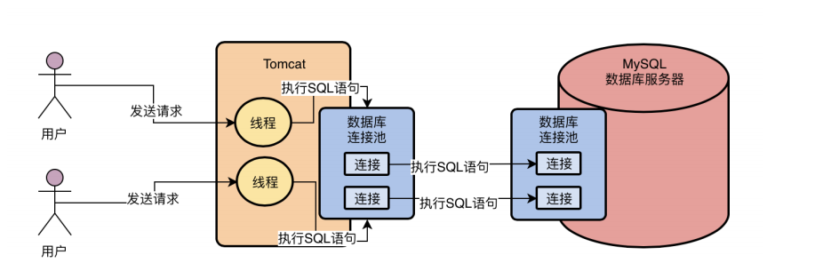

## MySQL执行组件

#### 一、MySQLl驱动

​	mysql提供给各类程序用于对mysql服务端发起和建立网络连接的工具；在==**程序端使用**==；

### 二、MySQL数据库连接池

 1. 程序的数据库连接池：==在程序端==，用于管理程序发起mysql请求的网络连接；

 2. **MySQL服务端的数据库连接池**：==在MySQL服务端==,用于管理各类系统发送过来的连接请求；

    

	3. 网络连接处理请求的时候，必须分配一个线程去处理，由一个线程监听和读取请求；线程读取请求之后需要通过==SQL接口==交给MySQL内部程序去执行SQL语句；

#### 三、 SQL接口（执行入口）

	1. 是一套执行SQL语句的接口，专门用于执行发送给MySQL的增删改查的语句；
	2. 在工作流程中的位置：==MySQL的工作线程==接收到请求的SQL语句之后，调用SQL接口执行SQL语句；

#### 四、查询解析器（执行前准备）

​	SQL解析器：相当于编译器，将SQL语句根据语法转换成`MYSQL`可执行的指令；

#### 五、查询优化器（执行前准备）

​	将SQL语句的执行步骤进行最佳优化，==指定执行计划==，如：

```
    select r1, r2, r3 from user where r1 = 1;
    执行该sql语句的步骤有多种，如：
    第一种先找出r1=1的记录，再获取对应记录的r1,r2,r3字段的值返回；
    第二种先查出所有记录的r1,r2,r3的字段值，然后根据r1=1进行筛选；
    查询优化器的作用就是通过将SQL执行步骤进行排序优化，获取最佳最快的执行方式
```

#### 六、执行器

​	根据执行步骤调用`mysql`的存储引擎

#### 七、存储引擎

​	访问存储在内存与硬盘中的数据；


## InnoDB存储引擎的更新操作

1. 第一步（**提交事务前**）：`mysql`服务器内存中会有mysql的`缓冲池`，更新数据前需要如果对应数据不存在缓冲池中，则需要从硬盘中加载数据，**并对对应数据加上独占锁**
2. 第二步（**提交事务前**）：`undo日志`：将更新的新值写入到undo日志文件中，方便回滚数据的需要；
3. 第三步（**提交事务前**）：`更新缓冲池中的数据`，执行这步之后，由于**内存中的数据和磁盘中的数据并不一致**，所以内存中的新数据称为`脏数据`
4. 第四步（**提交事务前**）：`写redo log`；首先需要知道两个概念
   * `redo log日志`-->InnoDB存储引擎专有的记录数据修改操作的日志；
   * `Redo Log Buffer`-->是`redo log日志`在内存中的缓冲；
   * 写redo log日志是需要先写入`redo log buffer`，即内存中再更新到磁盘中的`redo log`文件里；
   * redo log将内存刷入磁盘的策略；通过配置`innodb_flush_log_at_trx_commit`的值确认；
     * `等于0`：提交事务时不会将日志刷入磁盘中，可能会导致丢失数据操作记录；
     * `等于1`：提交事务时必须将日志输入磁盘中，**只要事务提交成功，则磁盘中redo log一定刷新了**；
     * `等于2`：提交事务时，会将日志写入到`os cache`缓存（同样在内存中）中，随后某一时刻再写入；
     * 一般选择等于1的策略，确保提交事务之后，操作记录不丢失；
5. 第五步（提交事务时）：提交事务的同时，将`redo log日志`根据策略刷入磁盘中；
6. 第六步（提交事务时）：提交事务的同时，将`binlog日志`写入磁盘中的日志文件中；
   * `binlog日志`是mysql服务自己的日志文件，而`redo log日志`是`InnoDB引擎`特有的；
   * `binlog日志`称为归档日志，偏逻辑性，内容为：**对表中某一数据进行了什么操作，操作后的值为xxx**；而`redo log日志`偏物理性质，内容为：**对哪个数据页进行什么操作**，更朱总为重做时提供操作指引；
   * `binlog日志`刷盘策略：通过`sysnc_binlog`参数控制，默认为0
     * 为0时，想进入`os cache`内容缓存中，再刷入磁盘文件；
     * 为1时，则在提交事务时，强制将日志文件内容刷入磁盘中；

7. 第七步（事务提交后）：将更新对应的`redo log日志`的文件名称以及`binlog日志`在文件中的位置写入到`redo log日志`中，并在其后写入一个`commit标记`；最后的这个commit标记是事务成功提交的标志；
8. 事务提交之后，缓存池中的数据并没有直接更新到磁盘中，而是会有一个后台IO程序随机将脏数据刷新到磁盘中；如果此时mysql宕机也没关系，重启之后会根据**redo日志恢复之前的修改**；（所以数据刷到磁盘中应该还会有一次记录）；


