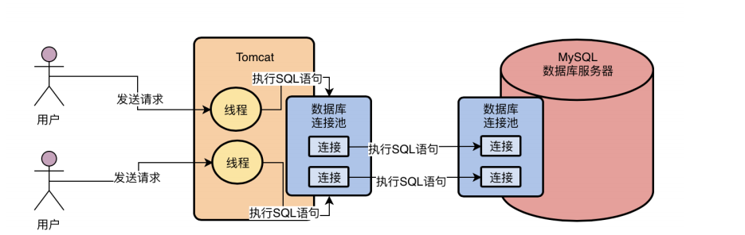

# MySQL执行组件

## 一、MySQLl驱动

​	mysql提供给各类程序用于对mysql服务端发起和建立网络连接的工具；在==**程序端使用**==；

## 二、MySQL数据库连接池

 1. 程序的数据库连接池：==在程序端==，用于管理程序发起mysql请求的网络连接；

 2. **MySQL服务端的数据库连接池**：==在MySQL服务端==,用于管理各类系统发送过来的连接请求；

    

	3. 网络连接处理请求的时候，必须分配一个线程去处理，由一个线程监听和读取请求；线程读取请求之后需要通过==SQL接口==交给MySQL内部程序去执行SQL语句；

## 三、 SQL接口（执行入口）

1. 是一套执行SQL语句的接口，专门用于执行发送给MySQL的增删改查的语句；
2. 在工作流程中的位置：==MySQL的工作线程==接收到请求的SQL语句之后，调用SQL接口执行SQL语句；

## 四、查询解析器（执行前准备）

​	SQL解析器：相当于编译器，将SQL语句根据语法转换成`MYSQL`可执行的指令；

## 五、查询优化器（执行前准备）

​	将SQL语句的执行步骤进行最佳优化，==指定执行计划==，如：

```
    select r1, r2, r3 from user where r1 = 1;
    执行该sql语句的步骤有多种，如：
    第一种先找出r1=1的记录，再获取对应记录的r1,r2,r3字段的值返回；
    第二种先查出所有记录的r1,r2,r3的字段值，然后根据r1=1进行筛选；
    查询优化器的作用就是通过将SQL执行步骤进行排序优化，获取最佳最快的执行方式
```

## 六、执行器

​	负责根据优化器给出的执行计划步骤调用`mysql`的存储引擎的接口

## 七、存储引擎

​	负责访问存储在内存与硬盘中的数据，做查询、更新==存在内存或者硬盘==的数据等操作；


