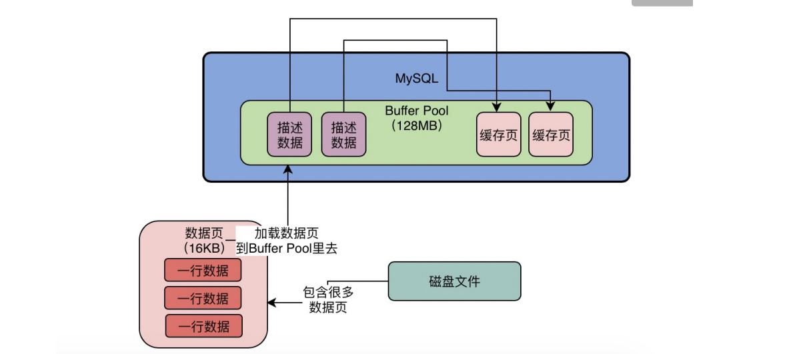

## 一、 认识Buffer Pool

​	是mysql的内存组件，缓存了磁盘上的真实数据，数据库的增删改查操作主要是针对该缓存数据执行的。

## 二、 Buffer Pool的数据存储

#### 数据页与缓存页

1. mysql将放在`磁盘`中的数据抽象成一个个==数据页==存储，在`Buffer Pool`中则称为==缓存页==。
2. 一个数据页中存放很多行数据；当需要更新或者查询时，就会找到对应数据所在数据页，将整个数据页加载到内存buffer pool中；
3. 默认情况下，一个数据页大小为`16KB`，磁盘和buffer pool中存放的大小一致；

#### 描述数据块

1. 每一个`缓存页`对应一个描述数据块，用来描述缓存页的信息；
2. 描述信息包含数据页所属表空间、编号、在`buffer pool`中的地址等信息；
3. 描述数据块大概相当于缓存页5%左右大小，即800个字节左右；所以`buffer pool`实际上会大一些，因为还需要存放缓存页的描述信息；

`Buffer Pool`中描述数据块一般都是放在最前面，缓存页放在最后面。

