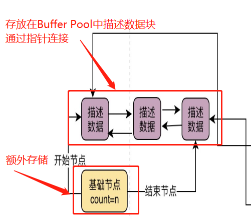

### 一、 Free链表

1. **作用**：用于标记Buffer Pool中是否还有空的缓存页。

2. **组成**：
   
   * 由Buffer Pool中的数据描述块组成，是一个双向链表，并且额外有一个节点记录链表的头指针、尾指针以及链表长度；
   * 本质上，数据描述块中存在两个指针`free_next` 和 `free_pre`，所以free链表实际实现中不会额外占用新的内存空间，只有额外的记录节点（负责记录头尾指针的）才需要在buffer pool空间外存储。
   
   

3.  **加载**：

   * **加载数据页到缓存页**：先从free链表中获取一个空闲缓存页的描述数据块，再找到对应的缓存页——>把对应数据页读取到该缓存页，修改描述数据块中信息（写入描述信息），再把该描述数据块从free链表中移除；
   * **如何判断数据页有没有被缓存**：额外会有一个哈希表数据结构，通过==“表空间号+数据页号”==作为`key`，缓存页地址作为`value`**存放缓存页与数据页的关系**；
   * **表空间**：mysql中有两种表空间概念，逻辑概念的表空间为平时创建的table表，物理概念的表空间是由具体存储在硬盘上的多个存储文件组成，这些数据文件又是由一个个个数据页组成的。这里讲的表空间为物理概念上的。
   * 疑问：怎么通过sql语句获取到对应数据的表空间+数据页号？（存储引擎？）

   

### 二、 Flush链表

1. **作用**：记录哪些缓存页需要刷入硬盘中；
2. **组成**：与`free链表`同理，都是通过描述数据块中的两个指针`flush_pre`和`flush_next`组成双向链表，并由一个基础节点记录头尾指针以及链表长度；