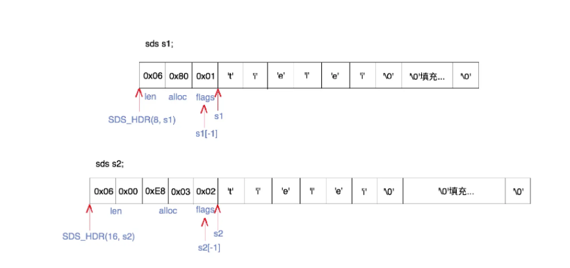

## Redis--sds数据结构

1. 概念总结：

   * `sds数据结构`可以理解为Redis中String类型的基本实现方式；==二进制安全==，兼容C语言中的String类型；

2. 二进制安全、兼容C语言中String类的原因：

   * 由于==redis是基于C语言实现==的，所以数据类型定义实际上是使用C语言进行封装；

   * C语言中String类型实际上是通过`CHAR`数组实现的，数组末尾通过存储`\0`来判断是否为数组末尾；这样是存储不了二进制的，因为C语言通过数据存放`0`的位置判断数组是否结束；

   * sds实际也是定义了一个`char`数组，只是通过`header`额外的数据结构确认数组长度，代替了C语言中通过`0`存放位置。所以能保证二进制安全的同时也能兼容C语言中String类；

     ``` c
     //C语言定义数组方式、定义一个字符指针
     char *a;
     //sds的定义也是一样的
     typedef char *sds;
     ```

3. `header`数据结构

   * 一共有5种类型的header，为了使不同长度的字符串可以使用不同大小的header，从而节省内存；
   * 通过sdsReqType方法选择使用哪种`header`；
     * 长度在0和2^5^-1之间，选用SDS_TYPE_5类型的header。
     * 长度在2^5^和2^8^-1之间，选用SDS_TYPE_8类型的header。
     * 长度在2^8^和2^16^-1之间，选用SDS_TYPE_16类型的header。
     * 长度在2^16^和2^32^-1之间，选用SDS_TYPE_32类型的header。
     * 长度大于2^32^的，选用SDS_TYPE_64类型的header。能表示的最大长度为2^64^-1。
   * 除了SDS_TYPE_5以外，其他4个都包含3个字段：
     * len：字符串长度；（不包含NULL结束符）
     * alloc：字符串的最大容量；（不包含字符数组后多余的字节，该多余字节是用于方便扩容的）
     * flags：总是占用一个字节。其中的最低3个bit用来表示header的类型。

4. 整个sds数据结构为==内存相邻的两部分组成（header + 字符数组）==

   * 其中字符数组的真实大小为==最大容量+1个字节==；原因：允许不重新分配内存的前提下让字符串数据做有限扩展，多出的字节使用0填充；真正的字符串后，使用`NULL结束符`，即`\0`字符，为了与C语言中的字符串兼容；

   * 如何获取header的类型·

     1. 会有一个指针指向字符串开头，如下图的s1和s2；
     2. 由于header与字符串在内存存储时地址是相邻的，所以固定想低地址方向偏移一个字节时，则可获取到`header`中的`flags`部分，通过`flags`可知道是什么类型的header，从而获取到header的开头指针，访问header；

   * 实际结构图

     

## 参考

https://juejin.cn/post/6844903433716105224#heading-4