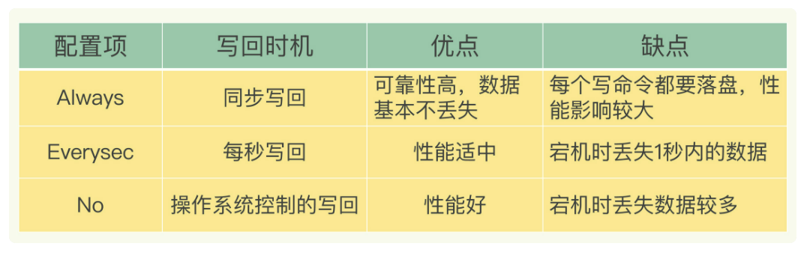
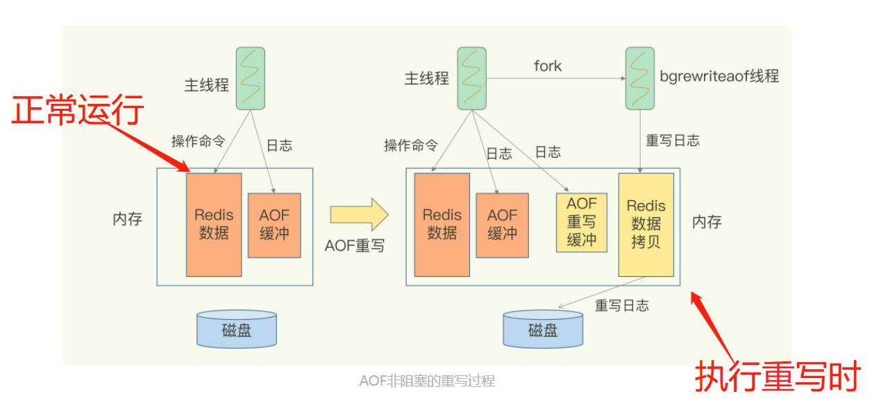

## Redis持久化 -- AOF日志

### 一、介绍AOF日志的思路

从如何使用AOF日志，什么时间写AOF日志，持久化到磁盘的策略；

到如何AOF日志的维护

### 二、如何使用AOF日志

1. AOF日志是记录Redis操作的日志；是在Redis操作完成，并将数据写入到内存之后==再记录操作的日志==（写后日志）；

2. AOF日志记录方式：将命令、键、值三样分别进行记录（**略懂即可**）

   

   如上图中，将`set`（命令）、`testkey`(键)、`testvalue`(值)分开保存；开头的`*3`代表命令有三个部分；后面`$+数字`的组合代表每个部分占用多少字节；

   3. ==写后日志的好处==：
      * 不会阻塞当前写操作；
      * 不需要校验操作指令的合法性，因为先执行成功了才记录指令，所以避免了额外开销；

   4. 风险：
      * 给下一个操作带来阻塞风险，因为可能当前写日志操作慢；
      * 还没记录命令就宕机了，导致操作结果丢失；
   5. 为了减轻风险，对什么时候持久化日志到磁盘（将日志写到磁盘上的日志文件中）上需要选择策略。

### 三、持久化日志文件的写回策略

1. `Always`：同步写回，每个命令执行完就立马将日志写回到文件中；

2. `Everysec`：每秒写回，即命令执行完后，现将日志写到`缓冲区中`，隔一秒写入磁盘；

3. `No`：操作系统控制写回，即先写到`缓冲区`，由操作系统决定什么时候写到磁盘；

4. 需要根据需求决定策略

   

### 四、AOF日志的维护

1. 由于日志是以文件形式保存，当操作越多日志写入文件越多时，AOF日志文件过大会带来风险
   * 一是文件系统对文件会有大小限制；
   * 二是文件越大，后续追加和读写效率降低；
   * 三是在调用日志恢复系统时，文件大，执行命令多，则恢复过程慢；
2. 这时候需要==重写机制==。

### 五、重写机制

1. 重写机制--Redis根据当前Redis内存数据，==创建一个新的AOF日志文件==，即读取库中所有键值对，然后用写入命令的形式记录库中键值对；
2. ==重写不会导致阻塞==。与主线程不同，重写工作将会交给后台线程`bgrewriteaof`完成；
3. 什么时候会触发重写？（讲义中没有提及）
   * 手动执行`bgrewriteaof`触发；
   * 在redis.conf文件中配置重写条件
4. 重写过程--`一个拷贝，两处日志`
   * 一个拷贝是指，当重写触发执行时，主线程会将当前时刻的内存复制一份出来提供给重写线程；
   * 两处日志是指，当重写执行时，主线程仍可执行操作，从重写开始到结束这段时间新产生的操作日志（AOF）将会同时记录多一份给重写线程，线程可根据该日志将新的操作写入，所以有两份日志；（第一处日志是原来的AOF日志，第二处日志是新的AOF重写日志）
5. 重写结束后，将会把新的AOF日志文件替换旧的AOF日志；

### 课后问题

1. 重写前，主线程fork重写子线程时，拷贝主线程的内存信息是拷贝其页表，即虚实映射关系，不会拷贝物理内存。这样就不会产生太大的内存开销；
2. AOF的全称为（Append Only File）表示==文件只追加读写==；Redis日志写日志的方式都是以追加写文件方式；

3. **AOF重写过程中有没有其他潜在的阻塞风险**

   * 一是开始重写前需要创建重写子线程，内核需要==创建用于管理子线程的相关数据结构==--进程控制块（PCB）；还需要将主线程中==内存的内容拷贝==，具体拷贝其页表；创建和拷贝均由内核处理，所以会阻塞主线程；实际耗时与主线程的内存大小有关；
   * 二是重写子线程会与主线程==共享内存==；当主线程需要大量扩容时，则可能会阻塞

4. **AOF重写为什么不共享使用AOF本身日志**

   > 因为都使用同一个AOF文件，则会竞争文件系统的锁，对性能进行影响；